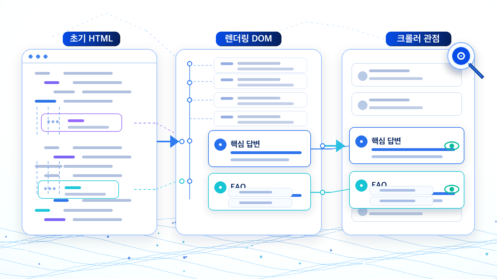
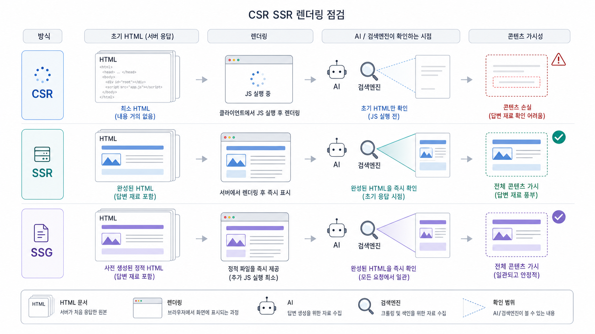

## CSR/SSR 렌더링과 GEO 크롤링 리스크



CSR/SSR 렌더링 이슈는 “프론트엔드 구현 방식”에서 끝나지 않습니다. AI와 검색엔진이 페이지를 읽는 시점에 핵심 답변, 표, 링크가 보이는지가 GEO 성과와 연결됩니다.

사용자는 화면에서 내용을 보지만, 크롤러나 AI 브라우징 환경은 초기 HTML, 렌더링 후 DOM, 내부 링크를 다르게 볼 수 있습니다. 그래서 실제 화면만 보고 “문제없다”고 판단하면 안 됩니다.

[TOC]

## CSR/SSR/SSG를 간단히 구분한다

| 방식 | 읽는 관점에서의 특징 |
|---|---|
| CSR | JavaScript 실행 뒤 본문이 채워질 수 있음 |
| SSR | 서버가 완성된 HTML을 먼저 내려줌 |
| SSG | 빌드 시점에 정적 HTML을 만들어 둠 |

GEO에서는 어떤 방식이 무조건 좋다고 말하기보다 핵심 답변과 링크가 크롤러가 읽을 수 있는 상태로 제공되는지를 봅니다.

## 무엇을 비교해야 하나

핵심 URL에서 세 가지를 비교합니다.

1. 브라우저에서 보이는 화면
2. 페이지 소스의 초기 HTML
3. 렌더링 후 DOM

브라우저 화면에는 본문이 보이는데 초기 HTML에는 빈 div만 있다면, 중요한 답변 문장을 서버 렌더링 또는 정적 HTML에 포함할지 검토해야 합니다. 특히 용어 정의, 제품 설명, 리포트 예시, 가격/기능 비교처럼 citation 후보가 되어야 하는 문장은 더 보수적으로 봅니다.



*화면에 보이는 콘텐츠와 크롤러가 읽는 콘텐츠가 다르면 source/citation 후보가 약해질 수 있다.*

## 콘텐츠 손실로 번역한다

개발팀에는 “CSR이라서 문제”라고 말하기보다 어떤 콘텐츠가 어느 단계에서 사라지는지 전달해야 합니다.

```text
문제 URL: /ko/geo-report
사용자 화면: 리포트 지표 설명이 보임
초기 HTML: 지표 설명과 내부 링크가 없음
렌더링 후 DOM: JavaScript 실행 뒤 보임
GEO 영향: citation 후보 문장이 초기 HTML에서 약함
요청: 핵심 정의/지표/내부 링크를 서버 렌더링 또는 정적 HTML에 포함 검토
```

## 먼저 볼 체크포인트

- 핵심 답변 문장이 초기 HTML에 있는가
- 내부 링크가 실제 href로 존재하는가
- FAQ/표가 렌더링 뒤에만 생기지 않는가
- noindex, canonical, robots meta가 렌더링 단계별로 달라지지 않는가
- 모바일에서 중요한 본문이 접히거나 제거되지 않는가

## HaloX 사이트 진단과 연결하기

테크니컬 GEO는 개발 체크리스트가 아니라 “AI가 발견하고, 읽고, 해석하고, 인용할 수 있는가”를 확인하는 작업입니다. HaloX 기준으로는 `사이트 진단`에서 접근성/메타/schema/렌더링 이슈를 먼저 보고, `인용 추적`에서 실제 citation 후보 URL이 빠지는지 확인합니다.

| 점검 축 | 확인할 것 | 실행 티켓 예시 |
|---|---|---|
| 발견 | sitemap, robots, canonical, 상태 코드 | 핵심 URL 색인/접근성 점검 |
| 읽기 | 초기 HTML, 렌더링 후 DOM, 본문/표/FAQ 노출 | CSR 의존 구간 SSR/정적 본문 보강 |
| 해석 | title, meta, heading, schema, 내부 링크 | Organization/FAQ/Product schema 정리 |
| 인용 | citation 후보 URL의 대표성 | 중복 URL/리디렉션/canonical 정리 |

## 보고서에 남길 문장

```text
현재 문제는 콘텐츠 품질만의 문제가 아니라 AI와 검색엔진이 핵심 URL을 안정적으로 발견/해석하는 조건의 문제입니다. 사이트 진단 이슈를 먼저 닫은 뒤 같은 질문셋으로 citation 변화를 다시 봅니다.
```

## 정리 양식

```text
URL:
확인한 질문:
사용자 화면의 핵심 내용:
초기 HTML에서 보이는 내용:
렌더링 후 DOM에서 보이는 내용:
사라지는 답변/링크:
개발 요청:
재점검 날짜:
```

## 다음 흐름

렌더링을 확인했다면 [llms.txt와 사이트 이전 리스크 관리](https://wikidocs.net/346355)에서 AI용 안내 파일과 URL 이전 리스크를 구분해 봅니다.
