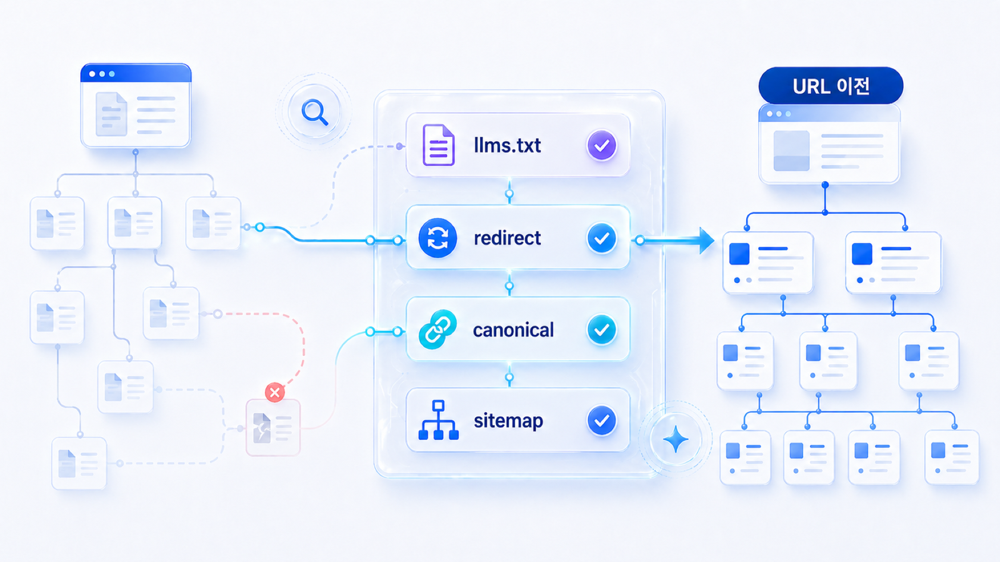

## llms.txt와 사이트 이전 리스크 관리



llms.txt는 AI 시스템에 중요한 문서 경로를 안내하는 보조 파일입니다. 하지만 사이트 이전, redirect, canonical, sitemap 문제가 정리되지 않으면 llms.txt만으로는 GEO가 해결되지 않습니다.

사이트 개편과 URL 변경은 기존 답변 근거(source)와 화면 인용(citation)을 흔들 수 있습니다. 기술 변경 전후로 같은 질문셋을 다시 측정해야 합니다. 특히 블로그, 글로서리, 뉴스룸, 제품 문서, 캠페인 랜딩 페이지처럼 AI 답변의 근거가 되는 URL은 이전 계획에 반드시 포함해야 합니다.

[TOC]

## llms.txt는 어떻게 생겼나

llms.txt는 아직 모든 플랫폼에서 같은 방식으로 처리된다고 단정할 수 있는 표준은 아닙니다. 그래서 “AI가 반드시 읽는다”가 아니라 “중요 문서와 정책을 사람이 봐도 이해되는 목차로 정리한다”는 관점으로 접근하는 편이 안전합니다.

```text
Site: HaloX GEO Guide

Core pages
- https://haloxlabs.ai/ko/glossary/generative-engine-optimization
- https://haloxlabs.ai/ko/blog/what-is-geo-optimization
- https://haloxlabs.ai/ko/blog/schema-markup-practical

Product pages
- https://haloxlabs.ai/ko/product/ai-search-visibility

Policies
- https://haloxlabs.ai/ko/privacy
- https://haloxlabs.ai/ko/contact
```

좋은 llms.txt는 모든 URL을 쓸어 담는 파일이 아닙니다. AI가 먼저 읽어야 할 대표 정의, 제품 설명, 정책, 문서 허브를 선별한 안내판입니다.

## llms.txt는 무엇을 해결하고 무엇을 해결하지 못하나

| 항목 | llms.txt가 돕는 것 | 별도로 점검할 것 |
|---|---|---|
| 핵심 문서 안내 | AI가 우선 읽을 문서 목록을 제시 | sitemap, 내부 링크, robots 접근성 |
| 주제별 허브 | 제품/용어/가이드 경로를 묶음 | 실제 페이지의 본문 품질과 schema |
| 사이트 이전 | 새 핵심 URL 목록을 안내 | 301 redirect, canonical, 구 URL 정리 |
| 콘텐츠 우선순위 | 중요한 글을 선별 | 얇은 페이지/중복 페이지 제거 |

## llms.txt에 넣기 전에 고를 문서

| 문서 유형 | 넣을 만한 조건 | 제외할 조건 |
|---|---|---|
| 대표 개념 글 | 브랜드가 쓰는 용어 정의가 명확함 | 짧은 공지/이벤트성 글 |
| 제품/서비스 설명 | 대상 고객, 기능, 가격/도입 조건이 최신 | 오래된 포지셔닝 페이지 |
| 비교/FAQ 문서 | 반복 질문에 대한 공식 답변이 있음 | 본문보다 schema만 많은 페이지 |
| 정책/문의 문서 | 연락/보안/개인정보/환불 기준이 공개됨 | 내부 운영용 문서 |
| 뉴스룸/팩트시트 | 회사명/대표/제품명/수상/투자 정보가 최신 | 외부 기사 복사본 |


## 사이트 이전에서 자주 생기는 문제

| 문제 | GEO 리스크 | 대응 |
|---|---|---|
| 구 URL이 404로 떨어짐 | 기존 citation/source가 끊김 | 301 redirect와 새 URL 매핑 |
| canonical이 구 URL을 가리킴 | 대표 URL 혼선 | canonical 일괄 검수 |
| sitemap이 늦게 갱신됨 | 새 문서 발견 지연 | 배포 직후 sitemap 재생성 |
| llms.txt가 과거 경로를 유지 | AI 안내 경로 오류 | 핵심 문서 20개부터 재정리 |
| 내부 링크가 구 구조에 남음 | 크롤러 탐색 흐름 약화 | 허브/관련 글 링크 보정 |

## 사례로 이해하기

캠페인 URL 인용 추적 사례에서는 URL이 짧은 기간에 만들어지고 사라집니다. 캠페인 종료 뒤 랜딩 페이지를 닫아버리면 AI 답변에 남아 있던 citation이 깨질 수 있습니다. 종료 후에도 요약/결과/공식 안내 페이지로 redirect해야 source 안정성을 유지할 수 있습니다.

GEO 지식 베이스를 개편하는 사례에서는 글로서리와 블로그 URL 구조가 바뀌기 쉽습니다. 이때 llms.txt에는 새 경로만 넣고, sitemap과 canonical, 내부 링크에는 구 경로가 남아 있으면 AI가 어느 URL을 신뢰해야 할지 헷갈립니다.

## HaloX로 확인할 수 있는 지점

| 기능 흐름 | 설명 방식 |
|---|---|
| Before/after measurement | 사이트 이전 전후 같은 질문셋을 비교한다 |
| 화면 인용 URL 추적 | 구 URL과 신 URL 중 무엇이 화면 인용되는지 본다 |
| 답변 근거 안정성 | 이전 뒤 source가 흔들리는 질문군을 찾는다 |
| Technical action report | redirect/canonical/sitemap/llms.txt 수정 항목을 나눈다 |

## 실습 워크시트

| 입력 항목 | 작성 기준 |
|---|---|
| 변경 항목 | 도메인/URL/문서 구조/언어/캠페인 종료 |
| AI 접근 파일 | robots/sitemap/llms.txt |
| 리다이렉트 | 301/302/누락/체인 발생 |
| canonical | 새 대표 URL로 정리됐는가 |
| 리스크 | 오래된 출처/중복/누락/깨진 citation |
| 대응 | 수정/모니터링/재측정 |

## 정리 양식

```text
이전 전 URL / 이전 후 URL / redirect 상태 / canonical 상태 / sitemap 반영 / llms.txt 반영 / 핵심 페이지 10개 / 재측정 질문
```

## 작성 예시

예시는 `llms.txt와 사이트 이전 리스크 관리`를 가상의 사이트에 적용한 것입니다. 실제 점검에서는 URL, 증상, 개발 담당자, 수정 우선순위를 함께 남깁니다.

| 입력 항목 | 작성 예시 |
|---|---|
| 변경 항목 | 블로그 URL 구조 변경 |
| AI 접근 파일 | sitemap은 갱신, llms.txt는 미반영 |
| 리다이렉트 | 구 URL에서 신 URL로 301 처리 |
| canonical | 일부 글이 구 URL canonical을 유지 |
| 리스크 | AI 답변이 오래된 URL을 citation으로 남길 수 있음 |
| 대응 | 핵심 GEO 글 10개를 llms.txt와 내부 링크 허브에 다시 반영한다 |

## 완료 기준

- 이전 전/후 URL 매핑이 있습니다.
- redirect, canonical, sitemap, llms.txt를 따로 점검했습니다.
- 기존 답변 근거(source)와 화면 인용(citation)이 흔들릴 질문셋을 정했습니다.
- 수정 후 재측정 날짜가 있습니다.

## 참고 링크 패키지

이 실습은 HaloX의 [llms.txt 완전 가이드](https://haloxlabs.ai/ko/blog/llms-txt-setup-guide), [사이트 이전 SEO 체크리스트](https://haloxlabs.ai/ko/blog/website-migration-seo-checklist)를 함께 보면 좋습니다.

llms.txt만으로 크롤링/색인 문제가 해결되지는 않습니다. 사이트 이전과 접근성 점검은 Google의 [robots.txt 소개](https://developers.google.com/search/docs/crawling-indexing/robots/intro)와 [sitemap 개요](https://developers.google.com/search/docs/crawling-indexing/sitemaps/overview)를 함께 확인해야 합니다.

## 흔한 질문

**Q. llms.txt만 만들면 AI가 우리 콘텐츠를 잘 읽나요?**

아닙니다. llms.txt는 안내판입니다. robots, sitemap, canonical, 내부 링크, 본문 구조가 같이 정리되어야 합니다.

**Q. 사이트 이전 뒤 언제 재측정해야 하나요?**

배포 직후 기술 오류를 먼저 잡고, 7일/30일 단위로 같은 질문셋을 다시 측정합니다. AI 답변은 즉시 바뀌지 않을 수 있으므로 URL 안정성을 먼저 확인합니다.


## 다음 흐름

이전: [06-02. CSR/SSR 렌더링은 GEO에서 왜 중요한가](https://wikidocs.net/346354) / 다음: [06-04. AI 크롤러 접근성과 robots/sitemap은 어떻게 점검할까](https://wikidocs.net/346393)
