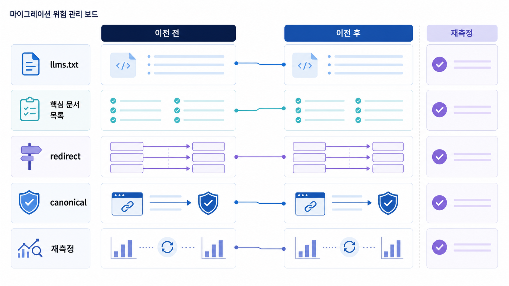

## llms.txt와 GEO 사이트 이전 리스크 관리


llms.txt는 AI가 사이트를 이해하는 데 참고할 수 있는 안내 파일로 논의되지만, 이것 하나로 GEO가 해결되지는 않습니다. 공식 URL, sitemap, robots, canonical, 내부 링크, schema, 실제 본문이 함께 맞아야 합니다.

사이트 이전이나 URL 구조 변경은 더 큰 리스크입니다. 좋은 콘텐츠와 외부 citation이 쌓인 URL을 바꾸면서 301, canonical, sitemap, 내부 링크를 놓치면 AI 답변은 오래된 URL이나 외부 리뷰를 계속 근거로 삼을 수 있습니다.

[TOC]

## llms.txt는 안내일 뿐 기준 전체가 아니다

llms.txt를 만들 때는 “AI에게 보여줄 요약 파일”로만 생각하면 약합니다. 어떤 페이지가 대표 URL인지, 어떤 문서가 리포트 예시인지, 어떤 FAQ가 최신인지 사이트 전체 구조와 맞아야 합니다.

| 항목 | 확인할 질문 | 주의할 점 |
|---|---|---|
| llms.txt | AI에게 어떤 대표 문서를 안내하는가 | 실제 sitemap/내부 링크와 충돌하지 않는가 |
| sitemap | 발견해야 할 URL이 들어 있는가 | 이전 URL이나 테스트 URL이 남지 않았는가 |
| canonical | 대표 URL이 분명한가 | 새 URL이 예전 URL을 가리키지 않는가 |
| 301 | 이전 URL의 신호가 이어지는가 | 캠페인/자료실 URL이 404로 끊기지 않는가 |

## 사이트 이전은 citation 리스크다

GEO 관점에서 사이트 이전은 검색 순위만의 문제가 아닙니다. AI 답변이 참고하던 source/citation URL이 바뀌는 사건입니다.

이전 전에는 인용 추적에서 현재 반복 citation URL을 뽑아야 합니다. 이전 후에는 그 URL이 어디로 연결되는지, 새 URL이 sitemap과 canonical에 반영됐는지, 공식 문서와 외부 글이 새 URL을 가리키는지 확인합니다.



*llms.txt와 사이트 이전은 독립 작업이 아니라 대표 URL, sitemap, canonical, citation 보존을 함께 보는 작업이다.*

## 가상 기업 AcmeGEO 예시

AcmeGEO가 `/geo-report` 페이지를 `/ai-search-report`로 바꿨습니다. 콘텐츠는 좋아졌지만 이전 URL이 404가 되고, 외부 블로그와 오래된 리포트는 여전히 예전 URL을 가리킵니다. AI 답변은 새 공식 URL 대신 외부 글을 계속 citation으로 보여줍니다.

해결 순서는 301 리다이렉트, canonical 수정, sitemap 갱신, 내부 링크 수정, llms.txt 대표 문서 갱신입니다. 이후 같은 질문 세트로 새 URL citation이 회복되는지 확인합니다.

## 정리 양식

```text
변경 전 URL:
변경 후 URL:
현재 citation 여부:
301 상태:
canonical 상태:
sitemap 반영:
llms.txt 반영:
외부 링크 수정 요청:
재측정 질문:
```

## 다음 흐름

대표 URL을 정리한 뒤에는 AI crawler가 실제로 접근할 수 있는지 robots와 sitemap을 확인해야 합니다. 이어서 [AI 크롤러 접근성과 GEO robots/sitemap 점검](https://wikidocs.net/346393)으로 넘어갑니다.
