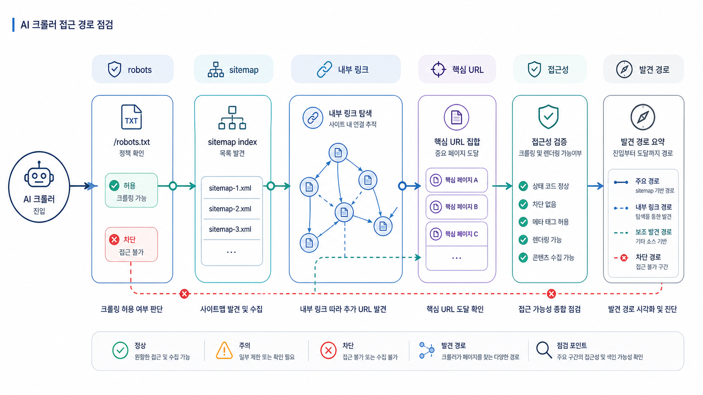

## AI 크롤러 접근성과 GEO robots/sitemap 점검


AI 크롤러 접근성은 “허용/차단”만의 문제가 아닙니다. 핵심 URL이 sitemap과 내부 링크로 발견되고, robots.txt가 의도와 다르게 막지 않으며, 페이지 안 링크가 실제 href로 연결되는지 함께 봐야 합니다.

GEO에서는 특히 source/citation 후보가 될 페이지를 우선 점검합니다. 제품 소개, 리포트 예시, 용어사전, 비교 글, 뉴스룸, 사례 페이지가 여기에 해당합니다.

[TOC]

## robots.txt와 sitemap의 역할

robots.txt는 크롤러 접근 규칙을 알려주고, sitemap은 중요한 URL 목록을 알려줍니다. 둘 다 직접 순위를 올리는 마법 장치가 아니라 발견과 접근을 돕는 기본 장치입니다.

```text
User-agent: *
Allow: /
Sitemap: https://example.com/sitemap.xml
```

sitemap은 핵심 URL이 빠지지 않도록 관리합니다.

```xml
<urlset xmlns="http://www.sitemaps.org/schemas/sitemap/0.9">
  <url>
    <loc>https://example.com/ko/glossary/generative-engine-optimization</loc>
    <lastmod>2026-05-03</lastmod>
  </url>
</urlset>
```

## 크롤 가능한 링크를 확인한다

내부 링크가 버튼 클릭 이벤트로만 연결되고 실제 href가 없으면 크롤러가 관계를 이해하기 어려울 수 있습니다. 중요한 링크는 HTML에서 실제 URL로 보여야 합니다.

| 링크 상태 | 판단 |
|---|---|
| 실제 href 링크 | 좋음 |
| 클릭 이벤트만 있고 href 없음 | 점검 필요 |
| 로그인 후에만 보이는 링크 | public source 후보로 약함 |



*robots, sitemap, 내부 링크는 핵심 URL이 발견되는 경로를 만든다.*

## 핵심 URL 발견 경로를 기록한다

```text
핵심 URL:
sitemap 포함 여부:
robots 허용 여부:
내부 링크 진입 경로:
외부 출처 링크:
canonical:
차단/누락 의심 지점:
```

이 기록이 있어야 개발팀에 “크롤이 안 되는 것 같다”가 아니라 “이 URL이 sitemap에는 있으나 주요 허브에서 내부 링크가 없다”처럼 구체적으로 요청할 수 있습니다.

## HaloX 사이트 진단과 연결하기

테크니컬 GEO는 개발 체크리스트가 아니라 “AI가 발견하고, 읽고, 해석하고, 인용할 수 있는가”를 확인하는 작업입니다. HaloX 기준으로는 `사이트 진단`에서 접근성/메타/schema/렌더링 이슈를 먼저 보고, `인용 추적`에서 실제 citation 후보 URL이 빠지는지 확인합니다.

| 점검 축 | 확인할 것 | 실행 티켓 예시 |
|---|---|---|
| 발견 | sitemap, robots, canonical, 상태 코드 | 핵심 URL 색인/접근성 점검 |
| 읽기 | 초기 HTML, 렌더링 후 DOM, 본문/표/FAQ 노출 | CSR 의존 구간 SSR/정적 본문 보강 |
| 해석 | title, meta, heading, schema, 내부 링크 | Organization/FAQ/Product schema 정리 |
| 인용 | citation 후보 URL의 대표성 | 중복 URL/리디렉션/canonical 정리 |

## 보고서에 남길 문장

```text
현재 문제는 콘텐츠 품질만의 문제가 아니라 AI와 검색엔진이 핵심 URL을 안정적으로 발견/해석하는 조건의 문제입니다. 사이트 진단 이슈를 먼저 닫은 뒤 같은 질문셋으로 citation 변화를 다시 봅니다.
```

## 다음 흐름

URL을 발견할 수 있다면 [Schema와 내부 링크](https://wikidocs.net/346394)에서 페이지의 의미 관계를 더 명확히 만드는 방법을 봅니다.
