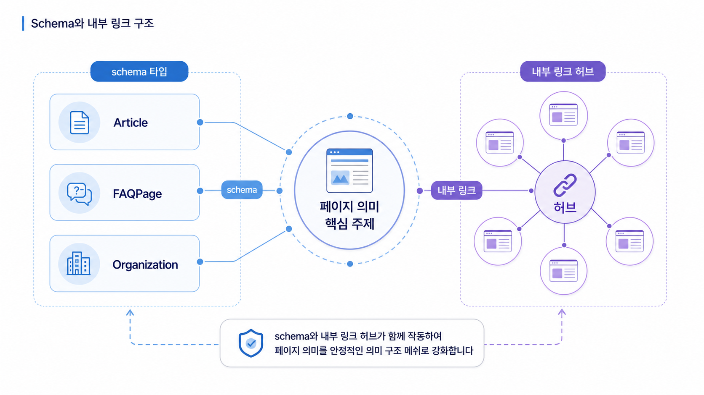

## Schema와 내부 링크로 AI 이해도 높이기


Schema와 내부 링크는 AI에게 “이 페이지가 무엇이고, 어떤 다른 페이지와 연결되는가”를 알려주는 구조입니다. GEO에서는 단순히 schema를 넣었는지가 아니라 질문, 답변, 근거 URL, 관련 페이지가 같은 의미망 안에 놓였는지를 봅니다.

좋은 schema도 본문과 다르게 말하면 약합니다. 내부 링크도 무작정 많이 넣는 것이 아니라 질문 흐름에 맞게 연결해야 합니다.

[TOC]

## schema는 본문을 대신하지 않는다

schema는 본문을 구조화하는 보조 신호입니다. 본문에는 리포트 예시가 없는데 schema만 FAQ를 넣거나, 상품 정보와 Product schema 값이 다르면 AI와 검색엔진은 신호를 안정적으로 해석하기 어렵습니다.

| 구조 요소 | 확인할 것 | GEO에서의 역할 |
|---|---|---|
| Organization | 브랜드명, URL, sameAs | 엔티티 기준점 |
| Article/BlogPosting | 제목, 저자, 날짜, 본문 요약 | 정보성 답변 근거 |
| FAQPage | 실제 질문과 답변 | Answer-first 보강 |
| Product | 가격, 재고, 리뷰, 브랜드 | 커머스 질문 대응 |
| Breadcrumb/Internal links | 상하위 관계 | 질문 흐름과 대표 URL 안내 |

## 내부 링크는 질문 흐름으로 설계한다

내부 링크는 페이지 권한을 나누는 장치이기도 하지만, GEO에서는 질문 흐름을 보여주는 장치입니다. 정의 페이지에서 비교 페이지로, 비교 페이지에서 리포트 예시로, 리포트 예시에서 주간 리포트나 콘텐츠 브리프로 이어져야 합니다.

HaloX 사이트 진단에서 URL별 이슈를 본 뒤, 전략맵의 클러스터와 내부 링크를 맞춰 봅니다. 특정 클러스터가 중요하지만 관련 페이지가 서로 연결되지 않았다면 AI가 토픽 묶음을 이해하기 어렵습니다.



*Schema와 내부 링크는 페이지 하나의 장식이 아니라 질문 클러스터와 대표 URL을 연결하는 의미망이다.*

## 가상 기업 AcmeGEO 예시

AcmeGEO의 용어 페이지, 비교 페이지, 리포트 예시 페이지가 각각 존재하지만 서로 연결되어 있지 않습니다. Organization schema에는 예전 SNS만 들어 있고, FAQPage에는 실제 비브랜드 질문이 빠져 있습니다.

수정은 schema 추가만으로 끝나지 않습니다. 기준 문장을 본문과 schema에 맞추고, “GEO란 무엇인가 → 도구 비교 → 리포트 예시 → 주간 운영”으로 내부 링크를 연결합니다. 이후 프롬프트 분석에서 관련 질문군의 공식 URL citation 변화를 봅니다.

## 정리 양식

```text
점검 URL:
페이지 역할:
적용할 schema 타입:
본문과 schema 불일치:
연결할 상위 페이지:
연결할 다음 행동 페이지:
관련 질문군:
재측정 질문:
```

## 다음 흐름

구조화 신호를 넣었다면 Google 공식 도구와 사이트 진단으로 실제 오류를 확인합니다. 이어서 [Google 공식 도구 기반 SEO/GEO 기술 점검](https://wikidocs.net/346842)을 봅니다.
