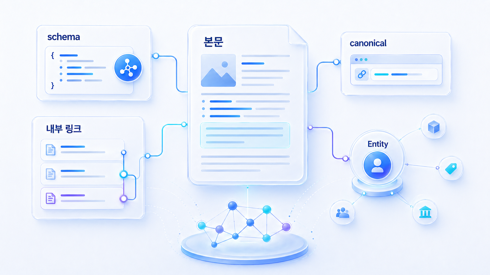

## Schema와 내부 링크는 AI 이해를 어떻게 돕나



Schema와 내부 링크는 AI가 페이지의 의미, 관계, 우선순위를 이해하도록 돕는 구조화 장치입니다. 본문이 좋아도 페이지가 무엇에 대한 글인지, 어떤 질문과 연결되는지, 어떤 제품/조직/entity와 연결되는지 흐리면 AI 답변에서 근거로 쓰이기 어렵습니다.

Schema는 검색엔진만을 위한 장식이 아닙니다. Article, FAQ, Organization, Product, SoftwareApplication, Breadcrumb, Review 같은 구조화 데이터는 페이지의 역할을 명확히 만드는 데 도움을 줍니다. 내부 링크는 관련 페이지를 묶어 AI가 주제 허브와 문맥을 따라가게 만드는 역할을 합니다.

다만 schema는 본문을 대신할 수 없습니다. AI와 검색엔진이 신뢰하기 쉬운 구조는 `사용자에게 보이는 본문`, `HTML 텍스트`, `schema`, `title/canonical`, `내부 링크 앵커`가 같은 의미를 말하는 구조입니다.

## schema를 붙이기 전에 맞춰야 할 5가지

Schema를 추가하기 전에 먼저 본문과 사이트 구조가 같은 사실을 말하는지 확인해야 합니다. 스키마만 추가하면 해결된다고 보면 위험합니다.

| 확인 항목 | 좋은 상태 | 위험한 상태 |
|---|---|---|
| 본문과 schema | 본문에 있는 정의/가격/FAQ를 schema가 보조 | schema에만 있고 화면 본문에는 없음 |
| title과 H1/H2 | 같은 질문과 주제를 가리킴 | title은 SEO 키워드, H2는 다른 주제 |
| canonical | 대표 URL이 명확함 | 구 URL/중복 URL이 대표로 남음 |
| 내부 링크 | 관련 개념/제품/사례가 본문 맥락에서 연결 | footer 링크만 많고 본문 연결은 약함 |
| 업데이트 정보 | 본문과 schema의 날짜/상태가 최신 | 오래된 가격/기능/조직 설명이 남음 |

## 어떤 schema를 어디에 쓸까

| 페이지 유형 | 우선 schema | 함께 볼 내부 링크 |
|---|---|---|
| 블로그/가이드 | Article, FAQ | 관련 글, glossary, 제품 기능, 케이스 |
| 글로서리 | DefinedTerm 또는 FAQ | 관련 개념, 측정 지표, 실습 페이지 |
| 제품 페이지 | Product, SoftwareApplication, Organization | 기능 설명, 비교표, 고객 사례, 보안/연동 문서 |
| 뉴스룸/보도자료 | NewsArticle, Organization | 팩트시트, 회사 소개, 제품 페이지 |
| 커머스 상품 | Product, Offer, Review, Breadcrumb | 카테고리, 리뷰, 구매 가이드 |
| 로컬/전문 서비스 | LocalBusiness, FAQ, Review | 지점, 전문 분야, 후기, 예약 안내 |

## 사례로 이해하기

B2B SaaS 사례에서는 제품 페이지가 “무엇을 하는 도구인지”보다 “어떤 질문에서 선택되는 도구인지”를 보여줘야 합니다. Product/SoftwareApplication schema와 비교표, 고객 사례, FAQ 내부 링크가 함께 있어야 AI가 추천 문맥을 이해하기 쉽습니다.

커머스/플랫폼 사례에서는 Product/Offer/Review schema가 중요합니다. 가격과 재고가 본문과 schema에서 다르게 보이면 AI 답변이 틀릴 수 있습니다. 내부 링크도 상품 상세, 카테고리, 구매 가이드, 리뷰를 자연스럽게 연결해야 합니다.

PR/뉴스룸 사례에서는 Organization/NewsArticle 구조와 팩트시트 링크가 중요합니다. 언론 기사만 많고 공식 회사 정보가 구조화되어 있지 않으면 entity 합의 신호가 약해집니다.

## HaloX로 확인할 수 있는 지점

| 기능 흐름 | 설명 방식 |
|---|---|
| Content structure scoring | answer-first/FAQ/표/schema가 있는지 본다 |
| Entity consistency | schema와 본문이 같은 브랜드 정의를 쓰는지 확인한다 |
| Internal link gap | 질문별 핵심 페이지가 서로 연결되는지 본다 |
| 화면 인용 개선 계획 | schema/내부 링크 보강 후 citation 변화를 재측정한다 |

## 실습 워크시트

| 입력 항목 | 작성 기준 |
|---|---|
| 페이지 유형 | 블로그/글로서리/제품/뉴스룸/커머스/로컬 |
| 현재 schema | 없음/일부 있음/오류 있음/정상 |
| 필요한 schema | Article/FAQ/Product/Organization/Review 등 |
| 내부 링크 허브 | 연결해야 할 상위 허브와 관련 페이지 |
| 불일치 | 본문, schema, title, canonical 정보가 다른 부분 |
| 수정 액션 | schema 추가/FAQ 정리/내부 링크 보강 |

## 정리 양식

```text
URL / 페이지 유형 / 현재 schema / 필요한 schema / 연결할 내부 페이지 5개 / 불일치 항목 / 수정 담당 / 재검수 기준
```

## 작성 예시

| 입력 항목 | 작성 예시 |
|---|---|
| 페이지 유형 | GEO 분석 제품 페이지 |
| 현재 schema | Organization만 있음 |
| 필요한 schema | SoftwareApplication, FAQ, Breadcrumb |
| 내부 링크 허브 | GEO 측정 지표, 답변 근거(source)/화면 인용(citation) 설명, 산업별 사례, 가격/도입 문의 |
| 불일치 | 본문은 GEO 분석 플랫폼, schema 설명은 SEO 도구로 남아 있음 |
| 수정 액션 | schema description을 최신 브랜드 정의로 수정하고 FAQ 내부 링크 추가 |

## 완료 기준

- 페이지 유형별 필요한 schema가 정리되었습니다.
- 본문/schema/title/canonical의 설명 불일치를 찾았습니다.
- 내부 링크가 단순 footer가 아니라 본문 맥락 안에 들어갑니다.
- 수정 후 재측정할 질문셋이 있습니다.

## 참고 링크 패키지

이 실습은 HaloX의 [스키마 마크업 실전 가이드](https://haloxlabs.ai/ko/blog/schema-markup-practical), [GEO 콘텐츠 구조화 가이드](https://haloxlabs.ai/ko/blog/geo-content-structure), [AI에게 인용되는 콘텐츠 만드는 법](https://haloxlabs.ai/ko/blog/how-to-get-cited-by-ai)를 함께 보면 좋습니다.

Schema는 본문을 대체하는 장치가 아니라 의미를 명확히 전달하는 보조 신호입니다. 기본 기준은 [schema.org](https://schema.org/)와 Google의 [구조화 데이터 소개](https://developers.google.com/search/docs/appearance/structured-data/intro-structured-data)를 함께 봅니다.

## Schema/내부 링크 최종 점검표

schema와 내부 링크는 별개 작업처럼 보이지만 GEO에서는 같은 목적을 가집니다. AI가 페이지의 의미와 관계를 안정적으로 이해하게 만드는 것입니다.

| 점검 항목 | 좋은 상태 | 나쁜 상태 |
|---|---|---|
| Article/BlogPosting | 제목, 설명, 작성/수정일, 본문 주제가 일치 | 오래된 제목이나 다른 주제의 schema가 남아 있음 |
| FAQPage | 본문에 실제 FAQ가 있고 schema와 일치 | schema에만 질문이 있고 본문에는 없음 |
| Product | 가격/재고/리뷰가 본문/feed와 일치 | schema와 상세페이지 값이 다름 |
| Breadcrumb | 허브/카테고리/하위 페이지 관계가 보임 | 현재 페이지 위치를 알기 어려움 |
| 내부 링크 앵커 | 링크 문구가 다음 질문을 설명 | “여기”, “자세히” 같은 모호한 링크 반복 |
| 허브 구조 | 대표 페이지가 하위 문서를 묶음 | 좋은 글이 서로 연결되지 않음 |

완료 기준은 schema 테스트 통과만이 아닙니다. 본문, title, canonical, schema, 내부 링크가 모두 같은 의미를 가리켜야 합니다.

## 다음 흐름

Schema와 내부 링크까지 정리했다면 [07. 산업별 GEO 전략](https://wikidocs.net/346335)으로 넘어가 업종별로 어떤 기술 요소와 콘텐츠 구조가 더 중요한지 봅니다.
