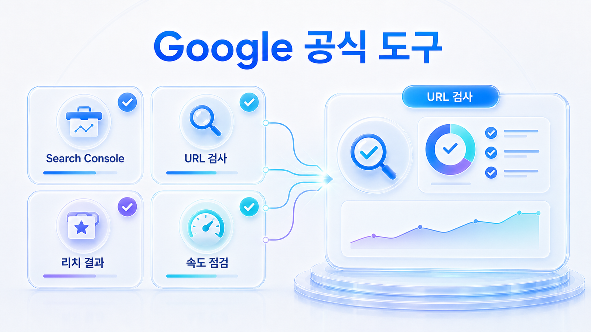
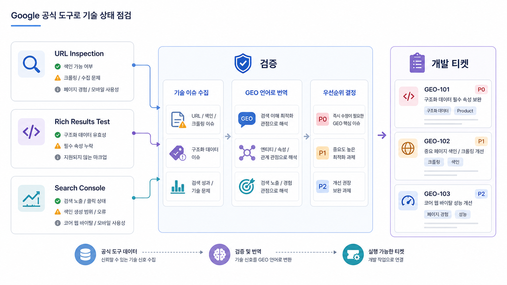

## Google 공식 도구 기반 SEO/GEO 기술 점검



GEO 기술 점검은 감으로 판단하면 안 됩니다. Search Console, URL Inspection, Rich Results Test, PageSpeed Insights 같은 공식 도구와 HaloX 사이트 진단을 함께 봐야 합니다.

공식 도구는 검색엔진이 페이지를 어떻게 보는지 확인하는 기준이고, HaloX 사이트 진단은 그 결과를 GEO 실행 티켓으로 나누는 데 씁니다. 둘을 함께 보면 “좋은 글인데 왜 AI 답변에 안 잡히는가”를 더 구체적으로 설명할 수 있습니다.

[TOC]

## 도구마다 보는 문제가 다르다

하나의 도구로 모든 기술 문제를 판단하지 않습니다. 색인, 렌더링, schema, 속도, 모바일 사용성, URL 상태를 나눠 봅니다.

| 도구/화면 | 확인할 것 | 연결 액션 |
|---|---|---|
| Search Console | 색인, 검색 노출, URL 문제 | 색인/크롤링 이슈 확인 |
| URL Inspection | Google이 본 URL 상태 | canonical, robots, 렌더링 점검 |
| Rich Results Test | 구조화 데이터 오류 | schema 수정 |
| PageSpeed Insights | 성능과 Core Web Vitals | 렌더링/속도 개선 |
| HaloX 사이트 진단 | SEO/GEO 점수와 URL별 이슈 | 개발/콘텐츠 티켓 분리 |

## 점수보다 URL별 티켓이 먼저다

기술 보고에서 흔한 실수는 점수만 공유하는 것입니다. 점수는 상태를 빠르게 보는 데 쓰고, 실행은 URL별 이슈로 내려가야 합니다.

예를 들어 핵심 리포트 예시 페이지가 noindex 상태라면 전체 사이트 점수가 높아도 GEO 관점에서는 큰 문제입니다. 반대로 낮은 우선순위의 오래된 글 하나가 느리다고 해서 이번 주 작업의 핵심이 되지는 않습니다.



*공식 도구는 검색엔진 관점을 확인하고, HaloX 사이트 진단은 그 결과를 실행 티켓으로 나누는 데 쓴다.*

## AcmeGEO 적용 예시

AcmeGEO의 비교 페이지가 AI 답변에 잘 나오지 않습니다. Search Console에서는 색인됐지만 URL Inspection에서 Google 선택 canonical이 다른 페이지로 잡힙니다. Rich Results Test에서는 FAQ schema 오류가 있고, HaloX 사이트 진단에서는 해당 URL의 GEO 점수가 낮습니다.

이 경우 보고 문장은 “기술 점수가 낮다”가 아니라 “비교 페이지의 canonical과 FAQ schema를 수정한 뒤 같은 비교 질문에서 공식 URL citation 변화를 확인한다”가 됩니다.

## 정리 양식

```text
점검 URL:
Search Console 상태:
URL Inspection 결과:
Rich Results/schema 오류:
성능/렌더링 이슈:
HaloX 사이트 진단 이슈:
수정 티켓:
재측정 질문:
```

## 다음 흐름

공식 도구로 오류를 본 뒤에는 어떤 schema 타입을 어떤 페이지에 적용할지 더 구체적으로 나눕니다. 이어서 [Schema 타입별 GEO 점검표](https://wikidocs.net/346851)를 봅니다.
