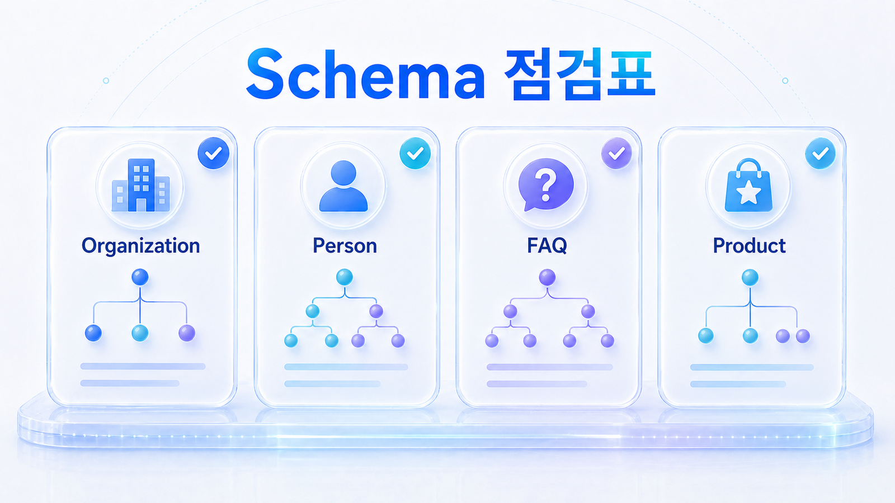
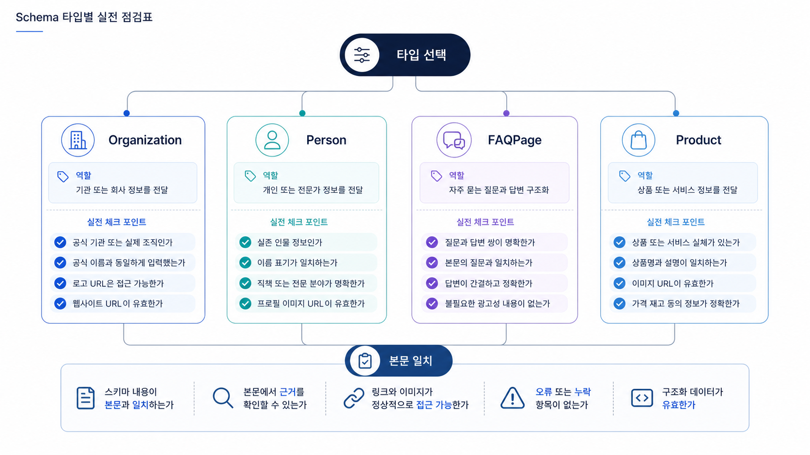

## Schema 타입별 GEO 점검표: Organization/Person/FAQ/Product



Schema는 많이 넣을수록 좋은 장식이 아닙니다. 페이지 역할에 맞는 타입을 고르고, 본문에 실제로 존재하는 정보를 구조화해야 합니다. GEO에서는 schema가 브랜드 엔티티, 질문 답변, 상품 정보, 작성자 신뢰를 보강하는지 봅니다.

이 페이지는 Organization, Person, FAQ, Product를 중심으로 어떤 페이지에 무엇을 넣고 무엇을 피해야 하는지 정리합니다.

[TOC]

## 페이지 역할에 맞는 타입을 고른다

모든 페이지에 같은 schema를 넣으면 신호가 흐려집니다. 회사 소개, 전문가 글, FAQ, 상품 상세, 리포트 예시는 각각 다른 구조가 필요합니다.

| Schema 타입 | 어울리는 페이지 | 확인할 점 |
|---|---|---|
| Organization | 회사 소개, 제품 홈, 자료실 | 브랜드명, URL, sameAs, 로고 |
| Person | 전문가 글, 인터뷰, 작성자 페이지 | 직책, 전문 영역, 소속 |
| FAQPage | 실제 FAQ, 비교/설명 페이지 | 본문에 보이는 질문과 답변 |
| Product | 상품 상세, 플랜 페이지 | 가격, 재고, 리뷰, 브랜드 |
| Article/BlogPosting | 블로그, 가이드, 리포트 | 제목, 날짜, 작성자, 요약 |

## schema와 본문은 같은 말을 해야 한다

FAQ schema에 넣은 질문이 본문에 보이지 않거나, Product schema의 가격이 상세 페이지와 다르면 구조화 데이터는 오히려 신뢰를 낮춥니다. GEO에서는 특히 AI가 답변 근거로 삼을 수 있는 문장과 schema 값이 맞아야 합니다.

커머스는 Product schema와 merchant feed를 함께 봐야 하고, 로컬/병원은 LocalBusiness, Physician, MedicalClinic 같은 타입을 사용할 때 실제 표시 정보와 규제 표현을 같이 검토해야 합니다.



*Schema 타입은 페이지 역할과 질문 의도에 맞춰 선택해야 한다.*

## AcmeGEO 적용 예시

AcmeGEO는 모든 글에 FAQPage schema를 넣었습니다. 하지만 일부 질문은 본문에 보이지 않고, 회사 소개 페이지에는 Organization schema가 빠져 있습니다. AI 답변은 AcmeGEO를 어떤 조직으로 이해해야 하는지보다 단편 FAQ만 읽게 됩니다.

수정은 FAQPage를 줄이고 Organization, Article, FAQ를 페이지 역할에 맞게 나누는 것입니다. 리포트 예시 페이지에는 FAQ를 유지하되, 회사 소개와 자료실에는 브랜드 엔티티와 대표 URL을 보강합니다.

## 정리 양식

```text
페이지 URL:
페이지 역할:
현재 schema 타입:
필요 schema 타입:
본문과 맞지 않는 값:
보강할 질문/답변:
검증 도구 결과:
재측정 질문:
```

## 다음 흐름

schema를 정리한 뒤에는 검색결과와 AI 답변에서 첫 설명으로 쓰이는 메타, canonical, robots meta를 확인해야 합니다. 이어서 [SEO 메타 정보와 canonical/robots meta 점검](https://wikidocs.net/346855)을 읽습니다.
