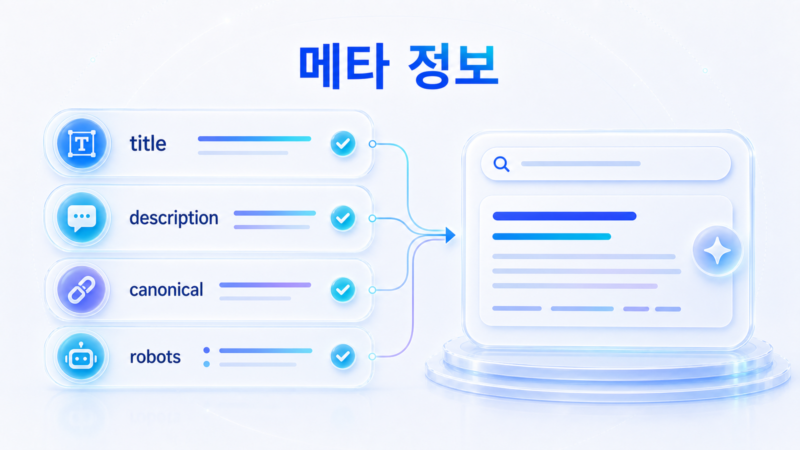
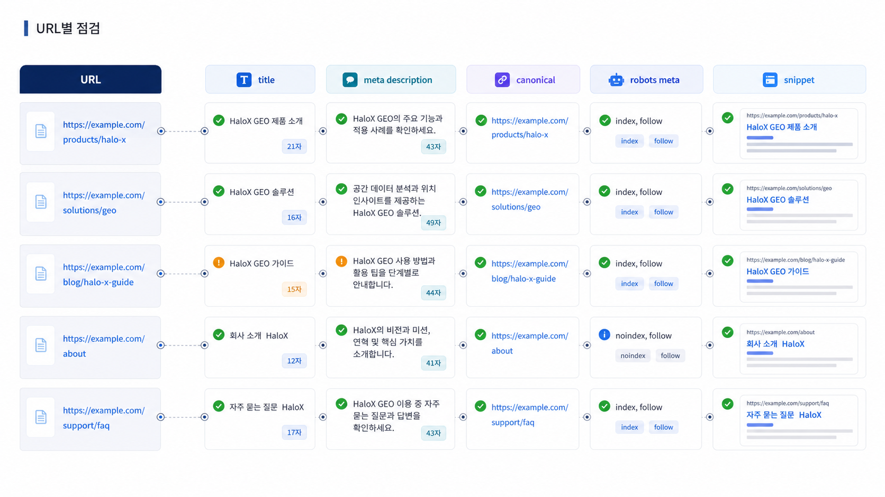

## SEO 메타 정보와 canonical/robots meta 점검



메타 정보와 canonical, robots meta는 작은 태그처럼 보이지만 GEO 리포트에서는 큰 차이를 만듭니다. AI와 검색엔진은 제목, 설명, 대표 URL, 색인 정책을 보고 페이지 역할을 판단합니다.

공식 URL이 citation 후보가 되려면 제목과 첫 답변이 질문과 맞고, canonical이 대표 URL을 가리키며, robots meta가 색인을 막지 않아야 합니다.

[TOC]

## 메타는 검색결과의 약속이다

title과 meta description은 페이지의 약속입니다. 본문은 GEO 리포트 예시인데 title은 일반 블로그처럼 되어 있거나, description이 핵심 질문을 설명하지 못하면 검색결과와 AI 답변 모두에서 역할이 흐려집니다.

| 항목 | 확인할 질문 | 문제 예시 |
|---|---|---|
| title | 페이지 주제가 분명한가 | 키워드만 나열됨 |
| description | 어떤 질문에 답하는가 | 기능 홍보만 있음 |
| canonical | 대표 URL이 맞는가 | 다른 언어/이전 URL을 가리킴 |
| robots meta | 색인 가능 상태인가 | noindex/nofollow가 남음 |
| snippet 후보 | 첫 문단이 답을 주는가 | 도입부가 길고 결론이 없음 |

## URL에서 먼저 확인할 기준

사이트 진단 Pages 탭에서 메타 상태와 HTTP 상태를 봅니다. 핵심 URL이 메타 누락, 중복 title, canonical 오류를 갖고 있으면 해당 URL은 citation 후보로 약해질 수 있습니다.

프롬프트 분석에서 빠지는 질문군이 있다면 해당 질문에 답해야 하는 페이지의 title/description/첫 문단을 비교합니다. 질문과 페이지 약속이 다르면 콘텐츠를 고치기 전에 메타부터 맞춥니다.



*메타와 canonical은 검색결과의 약속, 대표 URL, AI 답변 후보성을 함께 결정한다.*

## 가상 기업 AcmeGEO 예시

AcmeGEO의 리포트 예시 페이지 title은 “블로그 상세”로 남아 있고, description은 제품 홍보 문장입니다. 본문은 GEO 리포트 예시를 담고 있지만 검색결과와 AI 답변은 페이지 역할을 분명히 이해하지 못합니다.

수정은 title을 “GEO 리포트 예시: 고객과 임원에게 설명하는 문장”처럼 바꾸고, 첫 문단에 AVI, 인용률, 출처 가시성, 다음 액션을 넣는 것입니다. canonical과 robots meta도 대표 URL 기준으로 확인합니다.

## 정리 양식

```text
점검 URL:
title:
description:
canonical:
robots meta:
첫 문단의 답변성:
연결 질문군:
수정 담당:
재측정 질문:
```

## 다음 흐름

메타와 대표 URL을 정리했다면 검색결과에서 섹션 링크와 리치 리절트가 어떻게 보일 수 있는지 봅니다. 이어서 [SEO 사이트링크와 리치 리절트](https://wikidocs.net/346857)를 읽습니다.
