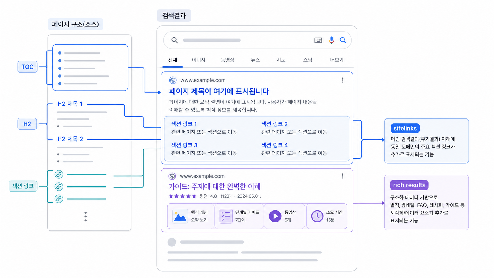

## SEO 사이트링크와 리치 리절트: 검색결과 섹션 링크


사이트링크와 리치 리절트는 다릅니다. 사이트링크는 검색결과에서 Google이 페이지나 사이트의 중요한 하위 링크를 자동으로 보여주는 것이고, 리치 리절트는 구조화 데이터 등을 바탕으로 검색결과를 더 풍부하게 보여주는 형식입니다.

WikiDocs나 긴 가이드에서 보이는 섹션 링크는 보통 명확한 heading, 목차, 앵커 구조, 내부 링크의 영향을 받습니다. schema를 넣는다고 모든 섹션 링크가 생기는 것은 아닙니다.

[TOC]

## 한 문장으로 구분한다

| 구분 | 의미 |
|---|---|
| 사이트링크 | 검색엔진이 중요하다고 판단한 하위 링크 |
| 리치 리절트 | 구조화 데이터 등으로 강화된 검색결과 형식 |
| 섹션 링크 | 페이지 안 특정 heading/앵커로 이동하는 링크 |

GEO 콘텐츠에서는 이 차이를 알아야 합니다. 섹션 링크가 잘 잡히면 독자와 AI가 페이지의 답변 단위를 더 쉽게 찾을 수 있습니다.

## 왜 목차와 heading이 도움이 되는가

긴 글에서 `[TOC]`, H2/H3, 앵커 구조는 페이지 안의 답변 단위를 나눕니다. Google이 어떤 섹션을 보여줄지는 보장할 수 없지만, 구조가 분명하면 검색결과와 AI 답변 모두에서 해석이 쉬워집니다.

좋은 heading은 키워드 나열이 아니라 질문이나 판단 기준입니다.

```text
나쁨: GEO 중요성
좋음: 브랜드 언급률과 화면 인용은 왜 따로 봐야 하나
```



*섹션 링크는 긴 페이지의 답변 단위를 검색결과에서 더 잘 찾게 만드는 구조 신호다.*

## 리치 리절트가 필요한 경우

FAQ, Product, Review, HowTo처럼 구조화 데이터가 의미 있는 페이지라면 리치 리절트 검증이 필요합니다. 하지만 모든 글에 schema를 억지로 넣을 필요는 없습니다. 먼저 본문 구조와 heading이 질문에 답하는지 봅니다.

## 실무 점검 순서

1. 페이지에 `[TOC]` 또는 명확한 목차가 있는지 본다.
2. H2가 질문/판단 기준으로 쓰였는지 확인한다.
3. 너무 긴 섹션을 나눌 필요가 있는지 본다.
4. 리치 리절트가 필요한 페이지인지 판단한다.
5. 검색결과에 어떤 링크/섹션이 보이는지 기록한다.

## 정리 양식

```text
URL:
대표 검색어:
검색결과에 보이는 하위 링크:
강화할 H2/H3:
리치 리절트 필요 여부:
schema 검증 필요 여부:
다음 수정 액션:
```

## 다음 흐름

기술 구조를 정리했다면 [산업별 GEO 전략](https://wikidocs.net/346335)에서 업종별로 어떤 질문과 출처가 달라지는지 봅니다.
