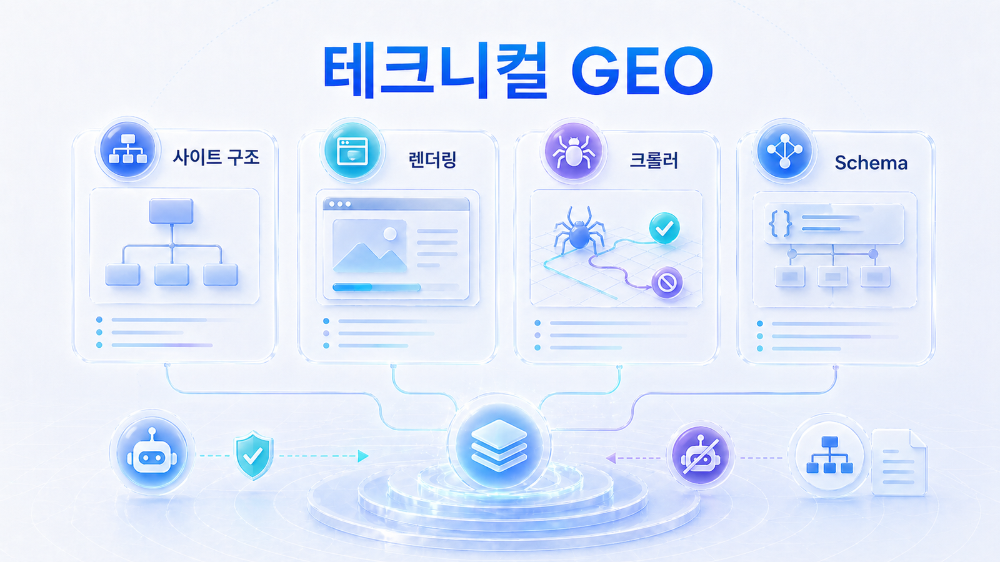
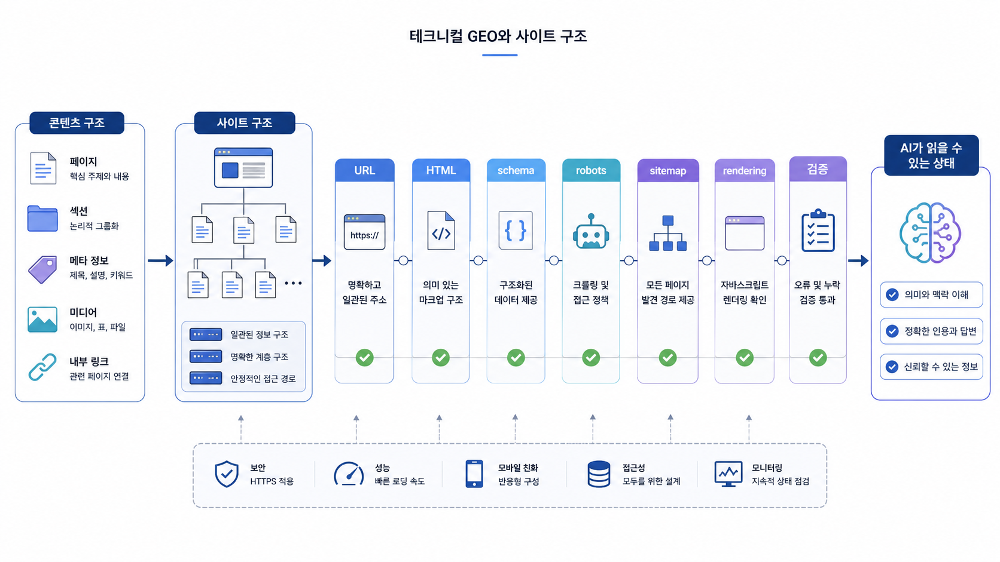

## 테크니컬 GEO와 사이트 구조

테크니컬 GEO는 AI가 콘텐츠를 발견하고, 읽고, 해석하고, 다시 인용할 수 있게 만드는 사이트의 기본 구조입니다. 04장에서 좋은 콘텐츠 구조를 만들고 05장에서 source/citation/entity 신호를 설계했다면, 06장에서는 그 구조와 신호가 실제 HTML, 렌더링, schema, sitemap, robots, 내부 링크, canonical에서도 유지되는지 확인합니다. 좋은 글을 많이 써도 AI 크롤러가 접근하지 못하거나 핵심 본문이 렌더링 뒤에만 보이면 답변 근거(source)/화면 인용(citation) 성과를 안정적으로 만들기 어렵습니다.

이 장은 마케팅팀과 개발팀이 같은 체크리스트를 보고 이야기할 수 있도록 구성합니다. `robots.txt`, `sitemap.xml`, canonical, 응답 코드, CSR/SSR, schema, 내부 링크, llms.txt, 사이트 이전 리스크를 각각 따로 보되, 최종 판단은 “AI 답변에 쓸 수 있는 근거가 안정적으로 노출되는가”로 모읍니다. 여기에 title/meta description 같은 메타 정보, 리치 리절트, Google 공식 점검 도구, PageSpeed/Search Console까지 연결해 SEO 기술 점검과 GEO 기술 점검을 한 흐름으로 봅니다.

[TOC]

## 04장/05장과 06장이 나뉘는 기준

04장은 `무엇을 어떤 구조로 써야 하는가`를 다룹니다. 05장은 그 콘텐츠가 웹 전체의 source/citation/entity 신호와 연결되는지 봅니다. 06장은 `그 콘텐츠와 신호가 실제로 크롤러와 AI에게 발견되고 읽히는가`를 확인합니다. 세 장을 분리해서 봐야 콘텐츠팀, PR/브랜드팀, 개발팀의 역할이 명확해집니다.

| 질문 | 04/05장에서 볼 것 | 06장에서 볼 것 |
|---|---|---|
| 첫 답변이 있는가 | 첫 문단에 정의/결론/조건이 있는가 | 초기 HTML에 그 문단이 실제 텍스트로 있는가 |
| 표가 있는가 | 비교 기준과 값이 명확한가 | 표가 이미지/JS 전용이 아니라 HTML table 또는 읽히는 구조인가 |
| FAQ가 있는가 | 질문과 답이 독자 문제에 맞는가 | FAQ 본문과 FAQPage schema가 충돌하지 않는가 |
| 내부 링크가 있는가 | 다음 질문으로 자연스럽게 이어지는가 | 크롤러가 링크를 발견할 수 있는 href 구조인가 |
| source 후보 URL이 있는가 | 05장에서 답변 근거 후보와 외부 source를 정했는가 | 그 URL이 200/301, sitemap, canonical, robots에서 안정적인가 |
| entity 신호가 있는가 | 조직/인물/제품 설명이 외부 채널과 일치하는가 | Organization/Person/ProfilePage schema와 대표 URL이 같은 설명을 말하는가 |
| schema가 있는가 | 본문 의미를 보조하는가 | JSON-LD가 최신 본문/title/canonical과 일치하는가 |
| schema 타입이 맞는가 | Organization, Person/ProfilePage, FAQPage, Article, Product 등 페이지 유형에 맞는가 | 본문에 보이는 정보만 구조화했는가 |
| 메타 정보가 맞는가 | title, meta description, canonical, robots meta가 본문과 같은 주제를 말하는가 | 대표 URL과 검색/공유 설명이 일관적인가 |
| 리치 리절트 후보인가 | FAQ/상품/조직/리뷰 등 구조화된 정보가 있는가 | Rich Results Test와 Schema Markup Validator에서 오류가 없는가 |

AI가 HTML을 Markdown식 텍스트로 바꿔 읽는다고 생각하면, 기술 점검은 선택이 아닙니다. 화면에는 보이지만 HTML/DOM/구조화 데이터에서 빠진 정보는 AI 답변 재료로 안정적으로 쓰이기 어렵습니다.

## 2~5장 결과를 개발 티켓으로 바꾸는 법

6장은 기술 항목을 따로 외우는 장이 아니라 앞 장의 측정 결과를 URL별 개발/SEO 티켓으로 번역하는 장입니다. 2장에서 citation이 약한 URL, 3장에서 source/citation 갭으로 분류된 노드, 4장에서 리라이트한 페이지, 5장에서 대표 source로 정한 URL을 기술적으로 안정화합니다.

| 앞 장의 신호 | 6장에서 확인할 것 | 개발/SEO 티켓 예시 |
|---|---|---|
| citation 후보 URL이 보이지 않음 | 색인, canonical, sitemap, 내부 링크 | 대표 URL sitemap 포함/canonical 수정 |
| source로 오래된 URL이 반복됨 | redirect, 301, robots meta | 구 URL 301 정리/robots meta 확인 |
| 본문은 있는데 AI 답변 품질이 낮음 | 초기 HTML, H2, table, FAQ schema | 핵심 답변 HTML 본문화 |
| entity 설명이 흔들림 | Organization/Person/Product schema | sameAs와 공식 URL 정렬 |
| 글로벌 URL이 혼선 | hreflang/canonical/locale | 언어별 alternate 링크 수정 |
| 리치 결과 후보가 약함 | Rich Results Test/Schema Validator | FAQ/Product/Article schema 오류 수정 |

AcmeGEO가 `GEO 리포트 예시` 페이지를 citation 후보로 키우려면 콘텐츠만 좋아서는 부족합니다. URL이 200으로 열리고, sitemap에 있고, canonical이 대표 URL을 가리키며, 첫 답변과 표가 초기 HTML에 있고, 내부 링크와 schema가 같은 주제를 말해야 합니다.

## 테크니컬 점검 패키지

_콘텐츠 구조는 URL, HTML, schema, robots, sitemap, rendering 검증을 지나야 AI가 안정적으로 읽을 수 있습니다._

이 장의 흐름은 `기본 기술 점검 → 렌더링 확인 → llms.txt/이전 리스크 → AI 크롤러 접근성 → schema/내부 링크 구조화 → Google 공식 도구 검증 → schema 타입별 점검 → 메타 정보 점검`입니다. 단순 개발 체크리스트가 아니라 GEO 리포트와 연결되는 점검표로 써야 합니다.

| 단계 | 핵심 질문 | 산출물 |
|---|---|---|
| 기본 점검 | AI가 핵심 페이지를 발견할 수 있는가 | robots/sitemap/canonical/응답 코드 점검표 |
| 렌더링 | 초기 HTML에서 답변 재료가 보이는가 | CSR/SSR/SSG 누락 콘텐츠 표 |
| llms.txt/이전 | 사이트 개편 후 기존 답변 근거(source)와 화면 인용(citation)이 흔들리지 않는가 | 이전 전후 URL 매핑표 |
| AI 크롤러 접근성 | 주요 AI/검색 크롤러가 막히지 않았는가 | 크롤러 접근 정책표 |
| Schema/내부 링크 | AI가 페이지 의미와 관계를 이해할 수 있는가 | schema/internal link 구조화 표 |
| Google 공식 도구 검증 | 메타 정보, 리치 리절트, schema, 속도, 색인 상태가 정상인가 | Search Console/Rich Results/PageSpeed 점검표 |
| Schema 타입별 점검 | Organization/Person/FAQ/Product를 어디에 써야 하는가 | 타입별 본문/HTML/JSON-LD 일치표 |
| 메타 정보 점검 | title/meta description/canonical/robots meta가 본문과 맞는가 | URL별 메타/canonical 점검표 |
| 사이트링크/리치 리절트 구분 | 검색결과의 작은 섹션 링크와 schema 기반 리치 리절트를 구분하는가 | `[TOC]`/앵커/헤딩/schema 비교 점검표 |

## 이 장에서 다루는 세부 페이지

- [06-01. 테크니컬 GEO 기본 점검표](https://wikidocs.net/346353)
- [06-02. CSR/SSR 렌더링은 GEO에서 왜 중요한가](https://wikidocs.net/346354)
- [06-03. llms.txt와 사이트 이전 리스크 관리](https://wikidocs.net/346355)
- [06-04. AI 크롤러 접근성과 robots/sitemap은 어떻게 점검할까](https://wikidocs.net/346393)
- [06-05. Schema와 내부 링크는 AI 이해를 어떻게 돕나](https://wikidocs.net/346394)
- [06-06. Google 공식 도구로 SEO/GEO 기술 상태 점검하기](https://wikidocs.net/346842)
- [06-07. Schema 타입별 실전 점검표: Organization/Person/FAQ/Product](https://wikidocs.net/346851)
- [06-08. 메타 정보 실전 점검: title/meta description/canonical/robots meta](https://wikidocs.net/346855)
- [06-09. 사이트링크와 리치 리절트 차이: 검색결과 섹션 링크는 어떻게 만들어지나](https://wikidocs.net/346857)

## 사례로 보는 테크니컬 GEO

커머스/플랫폼 사례에서는 상품 정보가 사용자에게는 보이지만 초기 HTML, schema, merchant feed, canonical에서 서로 다르게 보일 수 있습니다. 이 경우 AI는 가격, 재고, 리뷰, 카테고리 정보를 정확히 묶지 못하고 source로 쓰더라도 답변 품질이 흔들립니다.

뉴스룸/PR 사례에서는 기사와 팩트시트가 많아도 sitemap에 핵심 URL이 빠져 있거나, canonical이 엉켜 있거나, 사이트 개편 후 구 URL이 남아 있으면 AI 답변이 오래된 source를 붙잡을 수 있습니다.

글로벌/영문 GEO 사례에서는 locale, hreflang, canonical, 언어별 sitemap이 함께 맞아야 합니다. 한국어 글과 영문 글이 서로 다른 메시지를 주거나, 언어별 페이지 관계가 흐리면 AI 답변도 시장별로 일관되지 않습니다.

## HaloX 기능을 자연스럽게 붙이는 순서

테크니컬 GEO는 HaloX 리포트에서 발견한 문제를 개발 액션으로 바꾸는 연결 지점입니다.

1. 질문셋별로 citation이 약한 핵심 URL을 찾습니다.
2. 해당 URL의 robots/sitemap/canonical/응답 코드를 점검합니다.
3. 초기 HTML과 렌더링 후 화면에서 핵심 답변 재료가 같은지 봅니다.
4. schema와 내부 링크가 페이지의 의미와 관계를 설명하는지 확인합니다.
5. Google 공식 도구로 리치 리절트, 구조화 데이터, PageSpeed, Search Console 상태를 확인합니다.
6. llms.txt와 핵심 문서 허브가 AI에게 우선 읽을 경로를 안내하는지 봅니다.
7. 수정 후 같은 질문셋으로 답변 근거(source)/화면 인용(citation) 변화를 재측정합니다.

이 흐름은 [02. AI 검색 모니터링: 브랜드 언급률, 답변 근거, 화면 인용 읽는 법](https://wikidocs.net/346342), [05. 답변 근거, 화면 인용, 엔티티 전략](https://wikidocs.net/346333), [10-04. 4주차: GEO 실행 리포트와 30일 액션 플랜](https://wikidocs.net/346368)과 연결됩니다.

## 학습과 실무에서의 역할

| 사용 장면 | 이 장의 역할 | 산출물 |
|---|---|---|
| 실무 적용 | 사이트 기술 점검 실습 | 테크니컬 GEO 체크리스트 |
| 실무 | 개발팀에 넘길 수정 요청 정리 | URL별 이슈/담당/완료 기준 |
| 제품 설명 | HaloX 리포트의 원인을 기술 액션으로 연결 | citation 약한 URL의 기술 진단표 |
| 독자 실행 | 혼자 따라 할 수 있는 사이트 점검 실습 노트 | robots/sitemap/schema/llms.txt 실습표 |

## 개발팀에 넘기는 URL별 점검표

테크니컬 GEO는 전체 사이트를 한 번에 고치는 일이 아닙니다. 02장에서 citation이 약하거나 04장에서 리라이트한 핵심 URL부터 점검합니다.

| URL | 문제 유형 | 확인 방법 | 담당 | 완료 기준 |
|---|---|---|---|---|
| 핵심 가이드 URL | 초기 HTML에 본문 없음 | View source/렌더링 DOM 비교 | 개발 | 첫 답변과 H2가 HTML 텍스트로 확인됨 |
| 비교표 페이지 | 표가 이미지로만 있음 | HTML table/리스트 구조 확인 | 콘텐츠/개발 | 기준/값/주의점이 텍스트로 읽힘 |
| FAQ 페이지 | schema와 본문 불일치 | JSON-LD와 본문 대조/Rich Results Test | 개발 | FAQ 본문과 FAQPage schema 질문/답변 일치 |
| 회사/인물 프로필 | 조직/바이오 정보 불일치 | Organization/Person/ProfilePage schema와 본문 대조 | 콘텐츠/개발 | 조직명/직함/전문 분야/공식 링크가 일치 |
| 제품/서비스 페이지 | 메타 정보와 본문 불일치 | title/meta description/canonical 확인 | SEO/콘텐츠 | 검색 결과 설명과 본문 목적이 일치 |
| 핵심 랜딩 페이지 | 페이지 속도 저하 | PageSpeed Insights/Lighthouse 확인 | 개발 | LCP/CLS 등 주요 이슈 개선 계획 수립 |
| 허브 페이지 | 내부 링크 약함 | href/anchor text 점검 | 콘텐츠 | 관련 하위 페이지가 발견 가능한 링크로 연결 |
| 이전 URL | 구 URL이 남아 있음 | 301/canonical/sitemap 확인 | 개발 | 이전 URL이 새 URL로 안정적으로 연결 |

이 표는 개발 티켓으로 그대로 옮길 수 있어야 합니다. “GEO 개선”처럼 넓게 요청하지 말고, URL/문제/완료 기준을 분리해야 실행됩니다.

## HaloX로 이어지는 지점

기술 점검은 HaloX의 [llms.txt 설정 가이드](https://haloxlabs.ai/ko/blog/llms-txt-setup-guide), [schema 실무 가이드](https://haloxlabs.ai/ko/blog/schema-markup-practical)와 연결됩니다. 이 장의 체크리스트를 실행할 때 함께 참고하면 좋습니다. 테크니컬 GEO의 기본은 크롤러가 중요한 페이지를 발견하고 이해할 수 있게 만드는 것입니다. robots와 sitemap은 Google의 [robots.txt 소개](https://developers.google.com/search/docs/crawling-indexing/robots/intro), [sitemap 개요](https://developers.google.com/search/docs/crawling-indexing/sitemaps/overview)를 기준으로 함께 점검합니다.

메타 정보와 리치 리절트까지 확인할 때는 Google의 [구조화 데이터 소개](https://developers.google.com/search/docs/appearance/structured-data/intro-structured-data), [Organization schema markup](https://developers.google.com/search/docs/appearance/structured-data/organization), [ProfilePage schema markup](https://developers.google.com/search/docs/appearance/structured-data/profile-page), [FAQ structured data](https://developers.google.com/search/docs/appearance/structured-data/faqpage), [Rich Results Test](https://search.google.com/test/rich-results), [PageSpeed Insights](https://pagespeed.web.dev/), [Search Console 성과 보고서](https://support.google.com/webmasters/answer/7576553)를 함께 봅니다. 이 도구들은 SEO 점수를 확인하는 용도에 그치지 않고, GEO에서 AI가 읽을 수 있는 구조가 안정적인지 확인하는 기준으로 씁니다.

## 다음 흐름

이 장은 앞선 [05. 답변 근거, 화면 인용, 엔티티 전략](https://wikidocs.net/346333)의 흐름을 이어받습니다. 기술 점검까지 마치면 [07. 산업별 GEO 전략](https://wikidocs.net/346335)으로 넘어가 업종별로 어떤 기술 요소가 더 중요한지 봅니다.
