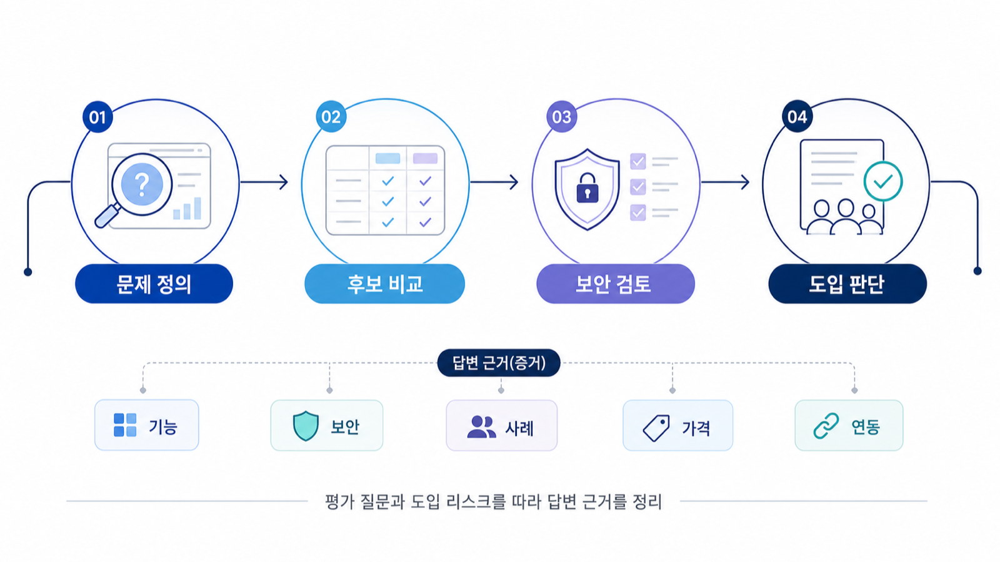

## B2B SaaS GEO 전략: 비교/검증 질문 대응


B2B SaaS에서 GEO는 “브랜드가 언급됐는가”만으로 판단하기 어렵습니다. 실제 구매자는 기능 하나보다 보안, 연동, 가격, 도입 난이도, 대체 솔루션, 고객 사례를 묶어서 묻습니다. AI 답변도 그 질문을 여러 하위 질문으로 나눈 뒤, 공식 사이트와 비교 글, 리뷰, 문서, 리포트를 조합해 후보를 좁힙니다.

그래서 B2B SaaS 페이지는 홍보 문구보다 검증 가능한 비교 기준을 먼저 갖춰야 합니다. HaloX 리포트 관점으로 보면 프롬프트 분석에서 비교/구매 검토 질문을 분리하고, 인용 추적에서 공식 URL과 경쟁사 URL이 어디에 쓰이는지 확인한 뒤, 전략맵에서 이번 달 보강할 클러스터를 정하는 흐름입니다.

`AcmeGEO`라는 이름은 설명을 위한 가상 기업명이며, 실제 고객 사례가 아닙니다.

[TOC]

## SaaS 질문은 길고 늦게 전환된다

B2B SaaS 구매자는 처음부터 “AcmeGEO 가격”처럼 브랜드명을 검색하지 않습니다. 먼저 “B2B SaaS용 GEO 도구 추천”, “콘텐츠팀이 AI 검색 가시성을 측정하는 방법”, “GEO 리포트 도구 A와 B의 차이”처럼 카테고리와 비교 기준을 묻습니다.

이 단계에서 빠지면 나중에 브랜드 검색이 늘어도 후보군에 들어가기 어렵습니다. GEO 운영의 첫 목표는 모든 질문에서 1등으로 보이는 것이 아니라, 구매 검토 질문에서 빠지지 않는 것입니다.

| 질문 유형 | AI가 확인하려는 것 | 준비해야 할 근거 |
|---|---|---|
| 문제 정의 | 왜 기존 SEO만으로 부족한가 | GEO/SEO 차이, 지표 설명 |
| 도구 비교 | 어떤 기준으로 도구를 고를까 | 기능 비교표, 리포트 예시, 한계 설명 |
| 내부 설득 | 임원에게 어떤 수치로 보고할까 | 주간 리포트, AVI/인용률/출처 가시성 해석 |
| 도입 검토 | 보안/연동/운영 리듬은 어떤가 | FAQ, 문서, 고객 사례, 운영 범위 |

## HaloX 리포트에서 먼저 볼 화면

B2B SaaS는 프롬프트 분석의 질문군 구분이 출발점입니다. 브랜드 질문만 보면 이미 알고 있는 고객의 반응만 보게 됩니다. 비브랜드, 비교, 구매 검토 질문을 따로 묶어 mention/source/citation을 확인해야 합니다.

인용 추적에서는 공식 도메인의 등장 여부보다 어느 문맥에서 인용되는지를 봅니다. 공식 URL이 기능 설명에는 인용되지만 비교 질문에서는 외부 리뷰나 경쟁사 문서만 반복된다면, 콘텐츠 문제가 아니라 비교 근거 부족일 수 있습니다.

사이트 진단은 기술 점검으로 끝내지 않습니다. 핵심 랜딩, 문서, 가격/플랜, 보안/연동 페이지가 AI와 검색엔진이 읽을 수 있는 구조인지 확인하고, 전략맵에서 `비교/대안`, `보안/도입`, `리포트/측정` 클러스터 중 하나를 먼저 실행합니다.



*B2B SaaS 질문은 기능 소개보다 검토 기준과 근거 페이지를 함께 요구한다.*

## 가상 기업 AcmeGEO 예시

AcmeGEO가 “B2B SaaS용 GEO 도구 추천” 질문에서 빠졌다고 가정합니다. 제품 기능 페이지는 충분하지만, AI 답변은 경쟁사의 비교 글과 외부 리뷰를 반복 인용합니다. 이때 바로 새 블로그 글을 여러 개 쓰기보다 다음 순서로 봅니다.

1. 프롬프트 분석에서 비교/구매 검토 질문만 모읍니다.
2. 인용 추적에서 경쟁사와 외부 리뷰 도메인을 분리합니다.
3. 공식 사이트에 비교 기준, 리포트 예시, 보안/연동 FAQ가 있는지 확인합니다.
4. 사이트 진단으로 해당 URL의 메타, schema, 내부 링크 상태를 확인합니다.
5. 전략맵에서 `도구 비교` 클러스터를 콘텐츠 제작으로 넘깁니다.

이 흐름의 산출물은 “콘텐츠 3개 발행”이 아니라 “비교 질문에서 공식 URL citation을 늘리기 위한 근거 페이지 1개와 FAQ 1개”가 됩니다.

## 회의에서 남길 판단 문장

| 보고 질문 | 좋은 답변 |
|---|---|
| 브랜드가 AI 답변에 나오나요? | 브랜드 질문에서는 언급되지만, 비브랜드 비교 질문에서는 경쟁사 출처가 더 강합니다. |
| 무엇을 먼저 고쳐야 하나요? | 기능 소개보다 비교 기준, 리포트 예시, 보안/연동 FAQ를 먼저 보강합니다. |
| 성공 기준은 무엇인가요? | 같은 질문 세트에서 공식 URL citation이 늘고, 경쟁사 단독 인용이 줄어드는지 봅니다. |

## 정리 양식

```text
대표 비교 질문:
비브랜드 질문에서 반복 등장한 경쟁 브랜드:
공식 URL이 인용된 질문:
공식 URL이 빠진 질문:
부족한 비교 기준:
보강할 근거 페이지/FAQ:
30일 뒤 재측정할 질문:
```

## 다음 흐름

B2B SaaS와 달리 상품형 서비스는 가격, 재고, 옵션, 리뷰 데이터가 답변 품질을 좌우합니다. 이어서 [커머스/플랫폼 AIO와 GEO 전략](https://wikidocs.net/346357)에서 상품 데이터 관점으로 확장합니다.
