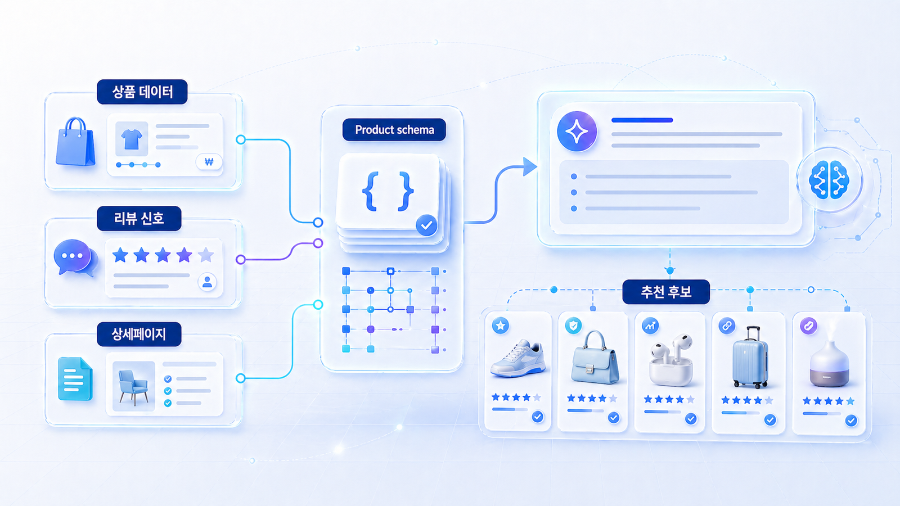
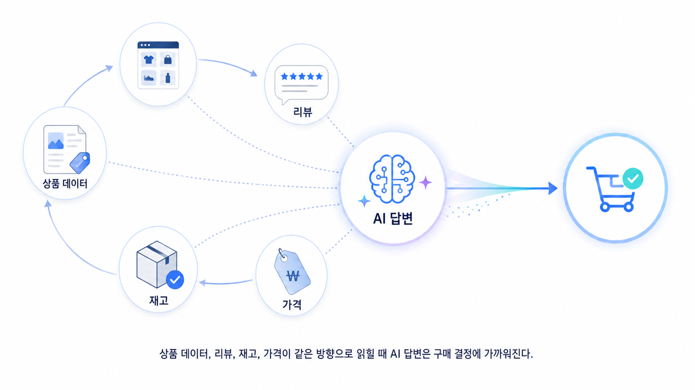

## 커머스/플랫폼 AIO와 GEO 전략



커머스와 플랫폼은 GEO만 따로 보기 어렵습니다. AI 답변뿐 아니라 AI 구매 에이전트가 상품명, 가격, 재고, 리뷰, 배송, 판매자 정보를 어떻게 읽는지도 함께 봐야 합니다.

따라서 커머스에서는 AIO와 GEO가 만납니다. 콘텐츠 설명이 좋아도 상품 데이터, schema, merchant feed, 리뷰 정보가 어긋나면 AI가 정확한 추천을 만들기 어렵습니다.

[TOC]

## 먼저 볼 기준

| 기준 | 읽는 법 |
|---|---|
| 상품 데이터 | 가격/재고/옵션/리뷰가 같은 방향인지 확인한다 |
| 답변 | 비브랜드 추천 질문에서 상품군 후보로 들어가는지 본다 |
| 기술 | Product schema와 feed가 본문 정보와 충돌하지 않는지 본다 |

## 실행 흐름

1. 대표 질문을 정한다.
2. 현재 AI 답변에서 mention/source/citation을 나눠 본다.
3. 경쟁 브랜드나 반복 URL이 어떤 이유로 등장하는지 확인한다.
4. 우리 공식 페이지, 외부 출처, 기술 조건 중 먼저 고칠 곳을 고른다.
5. 같은 질문군으로 30일 뒤 다시 본다.



*상품 데이터와 AI 구매 에이전트 연결*

## 커머스 예시

AcmeShop이 “중소기업용 업무 자동화 툴 추천” 답변에는 나오지만 실제 상품 정보가 오래됐다면, 블로그 글보다 상품 데이터와 제품 설명을 먼저 고쳐야 합니다. AI가 구매 판단에 쓰는 정보가 실제 판매 정보와 같아야 합니다.

## 정리 양식

```text
핵심 상품군:
AI 추천 질문:
상품 데이터 문제:
schema/feed 점검:
리뷰/후기 신호:
재측정 질문:
```

## 다음 흐름

로컬/전문 서비스는 [로컬/전문 서비스 GEO](https://wikidocs.net/346358)에서 지역 질문과 전환으로 봅니다.
