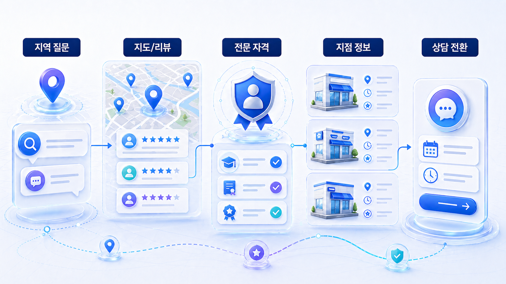
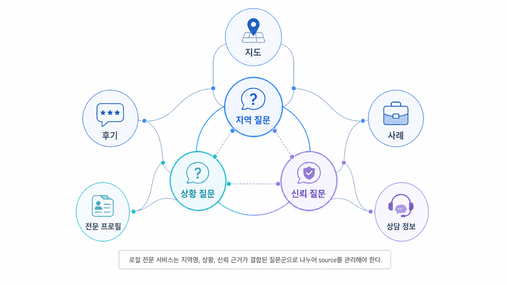

## 로컬/전문 서비스 GEO: 지역 질문과 전환



로컬 GEO는 “우리 병원/매장 이름이 AI 답변에 나오는가”보다 “지역 질문에서 방문 가능한 후보로 설명되는가”를 봅니다. 사용자는 지역, 증상, 상황, 시간, 주차, 예약, 후기 같은 조건을 붙여 묻고, AI는 지도 프로필, 공식 사이트, 리뷰, 외부 디렉터리, 지역 콘텐츠를 섞어 답합니다.

전문 서비스일수록 더 조심해야 합니다. 특히 병원, 법률, 금융 상담처럼 신뢰와 리스크가 큰 업종은 후기 표현, 자격/전문성, 방문 전 준비, 효과 보장 표현을 함께 관리해야 합니다. GEO는 노출만 늘리는 일이 아니라 잘못 설명될 위험을 줄이는 운영입니다.

[TOC]

## 로컬 질문은 “가까운 곳”만 묻지 않는다

AI 검색의 지역 질문은 지도 순위와 다르게 움직일 수 있습니다. “강남 피부과 추천”처럼 넓은 질문도 있지만, 실제로는 “토요일 진료하는 강남 피부과”, “주차 가능한 소아치과”, “초진 예약이 쉬운 정형외과”처럼 방문 조건이 붙습니다.

따라서 로컬 GEO의 핵심은 NAP 일관성, 지도 프로필, 리뷰 맥락, 공식 페이지, FAQ가 같은 정보를 말하게 만드는 것입니다.

| 질문 조건 | AI가 확인하는 정보 | 운영에서 볼 곳 |
|---|---|---|
| 위치/거리 | 주소, 지점명, 지도 프로필 | NAP, Google Business Profile, 네이버 플레이스 |
| 방문 가능성 | 영업시간, 예약, 주차, 준비물 | 공식 사이트, 지도 속성, FAQ |
| 신뢰 | 전문 분야, 자격, 후기 맥락 | 소개 페이지, 리뷰, 외부 프로필 |
| 리스크 | 효과 보장, 과장 후기, 의료광고 표현 | 콘텐츠 QA, 리뷰 답변, 정책 문서 |

## HaloX식 로컬 점검 흐름

프롬프트 분석에는 지역명과 상황 조건이 붙은 질문을 넣습니다. “홍대 치과”보다 “홍대 근처 야간 진료 가능한 치과”, “초진 예약이 쉬운 치과”처럼 실제 방문 전 질문에 가깝게 만듭니다.

인용 추적에서는 공식 사이트보다 지도/리뷰/디렉터리 출처가 더 강하게 잡히는지 확인합니다. 외부 출처가 강한 것 자체는 나쁘지 않습니다. 문제는 외부 정보와 공식 정보가 충돌하거나, 오래된 주소/전화번호/진료 시간이 반복되는 경우입니다.

사이트 진단은 지점별 페이지가 있는지, LocalBusiness/MedicalClinic 같은 schema가 맞는지, 예약/전화/길찾기 링크가 명확한지 확인하는 데 씁니다. 로컬 페이지는 정보가 조금만 틀려도 방문 전환과 신뢰가 같이 흔들립니다.



*로컬 GEO는 지도, 리뷰, 공식 페이지, 예약 정보를 한 질문 안에서 같이 맞추는 작업이다.*

## AcmeClinic 적용 예시

AcmeClinic이 “판교에서 토요일 진료하는 피부과” 질문에서 빠졌다고 가정합니다. 공식 사이트에는 토요일 진료가 보이지만, 지도 프로필에는 예전 시간이 남아 있고, 후기에는 예약 대기 시간이 길다는 문장이 반복됩니다.

이때 새 지역 콘텐츠를 쓰기 전에 NAP와 영업시간을 맞추고, 예약 안내와 주차/준비물 FAQ를 보강합니다. 리뷰 답변에서는 효과 보장처럼 오해될 수 있는 표현을 피하고, 방문 전 확인해야 할 정보를 안내합니다. 그 뒤 같은 질문 세트에서 공식 URL과 지도 프로필이 어떤 방식으로 인용되는지 다시 봅니다.

## 정리 양식

```text
대표 지역 질문:
방문 조건:
현재 AI 답변 후보:
공식 사이트 정보:
지도/디렉터리 정보:
리뷰에서 반복되는 맥락:
수정할 NAP/시간/예약 정보:
주의할 광고/후기 표현:
재측정 질문:
```

## 다음 흐름

언론과 뉴스룸이 강한 조직은 지역 정보보다 엔티티와 외부 신뢰 신호를 더 먼저 봅니다. 이어서 [PR/뉴스룸 GEO와 엔티티 전략](https://wikidocs.net/346388)을 봅니다.
