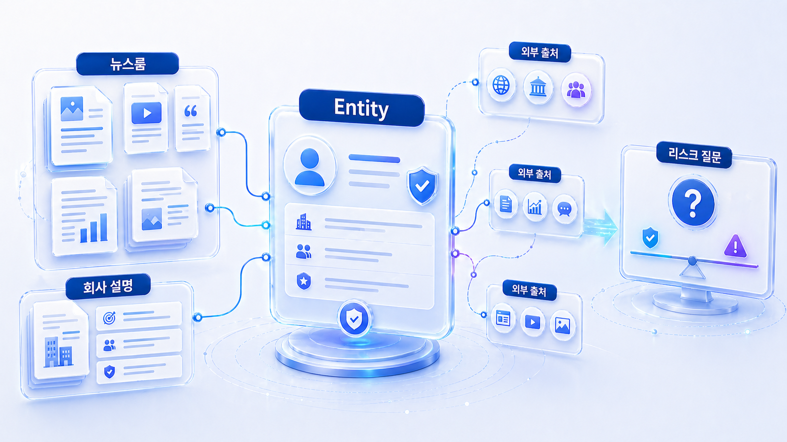

## PR/뉴스룸 GEO는 왜 엔티티 전략인가



PR/뉴스룸 GEO는 보도자료를 많이 내는 문제가 아닙니다. AI가 브랜드를 어떤 회사로 이해하고, 어떤 출처를 근거로 삼고, 어떤 이슈와 함께 설명하는지를 관리하는 엔티티 전략입니다.

기업 뉴스룸, PR 에이전시, 커뮤니케이션 조직은 이미 콘텐츠를 많이 가지고 있습니다. 하지만 콘텐츠가 많아도 AI 답변에서 회사 설명이 흔들리거나, 오래된 기사만 반복 인용되거나, 경쟁사 대비 추천 이유가 약하면 GEO 관점에서는 개선 과제가 남아 있습니다.

## 뉴스룸은 엔티티 허브가 되어야 한다

뉴스룸은 보도자료 저장소가 아니라 AI가 회사를 이해할 때 확인하는 공식 설명 허브가 되어야 합니다. 회사 소개, 대표 제품, 주요 수치, 리더십, 수상/인증, 최신 이슈 대응, 미디어 키트가 서로 연결되어 있어야 외부 언론과 AI 답변이 같은 방향으로 회사를 설명합니다.

| 뉴스룸 자산 | 맡아야 할 역할 | GEO 점검 기준 |
|---|---|---|
| 회사 소개/팩트시트 | 회사가 무엇을 하는지 한 문장으로 고정 | 제품/시장/고객군 설명이 최신인가 |
| 보도자료 | 특정 사건/출시/성과의 공식 source | 첫 문단에 핵심 사실과 날짜가 있는가 |
| 미디어 키트 | 로고, 대표 이미지, 공식 표기 제공 | 브랜드명/표기/링크가 일관적인가 |
| 리더십/바이오 | 대표/전문가의 신뢰 신호 | 직함/전문 분야/공식 프로필이 맞는가 |
| FAQ/입장문 | 반복 오해와 민감 이슈 대응 | 과장 없이 공식 입장을 설명하는가 |
| 외부 기사 링크 | 제3자 신뢰 근거 | 오래된 기사와 최신 공식 설명이 충돌하지 않는가 |

Google의 Article structured data는 기사형 콘텐츠의 기본 구조를 이해하는 데 도움이 됩니다. 뉴스룸 GEO에서는 여기에 Organization, Person/ProfilePage, 내부 링크, 최신 팩트시트를 함께 봅니다.

## 사례로 이해하기

한 엔터프라이즈형 조직은 뉴스룸, 보도자료, 유튜브, SNS, 캠페인 페이지를 모두 운영하고 있었습니다. 문제는 자산이 없는 것이 아니라 자산이 서로 다른 메시지를 말하고 있다는 점이었습니다. AI는 회사의 핵심 사업, 주요 서비스, 최근 이슈, 신뢰 근거를 일관되게 읽지 못했습니다.

이때 필요한 질문은 “콘텐츠를 더 만들까?”가 아니라 “AI가 어떤 출처 조합으로 우리 회사를 설명하고 있는가?”입니다.

| 점검 축 | 확인 질문 | 실행 방향 |
|---|---|---|
| 회사 설명 | AI가 회사의 핵심 사업을 일관되게 설명하는가 | 소개/팩트시트/FAQ 정비 |
| 뉴스룸 구조 | 보도자료가 answer-first 구조인가 | 요약/핵심 수치/질문형 섹션 추가 |
| 외부 출처 | 언론/위키/산업 리포트가 같은 설명을 반복하는가 | 답변 근거 맵과 PR 우선순위 설계 |
| 민감 이슈 | 리스크 질문에서 어떤 출처가 쓰이는가 | 오래된 정보/오해 문장 정정 |
| 경쟁 문맥 | 경쟁사와 함께 어떤 기준으로 비교되는가 | 비교 기준과 차별 메시지 강화 |

## HaloX로 확인할 수 있는 지점

이 사례에서는 HaloX를 “노출 점수 도구”로만 설명하면 약합니다. 다음 기능 흐름으로 보여주는 것이 자연스럽습니다.

| 기능 흐름 | 설명 방식 |
|---|---|
| 전략 프롬프트 세트 | CEO/브랜드/사업/이슈/비교 질문을 묶어 측정 |
| 뉴스룸 점수화 | 뉴스룸 콘텐츠가 answer-first/답변 근거(source)/화면 인용(citation)에 맞는지 확인 |
| Entity consistency | AI 답변에서 회사 설명이 일관되는지 추적 |
| 답변 근거 맵 | 어떤 언론/블로그/위키/리포트가 답변 근거가 되는지 분리 |
| 경쟁사 벤치마크 | 같은 질문에서 경쟁사가 더 강하게 설명되는 이유 확인 |

## PR/뉴스룸 질문셋 예시

| 질문 유형 | 질문 예시 | 필요한 source | 보강 액션 |
|---|---|---|---|
| 회사 정의 | 이 회사는 무엇을 하는 회사인가? | 회사 소개, 제품 페이지, 팩트시트 | 한 문장 소개와 핵심 사업 정리 |
| 제품 이해 | 어떤 문제를 해결하는가? | 제품 페이지, 고객 사례, 데모 자료 | 제품별 FAQ와 비교 기준 추가 |
| 신뢰 검증 | 믿을 만한 회사인가? | 언론, 수상, 파트너, 보안/정책 | 외부 source 맵 정리 |
| 이슈 대응 | 최근 논란/변경사항은 무엇인가? | 공식 입장문, 공지, 최신 기사 | 오래된 설명과 현재 입장 구분 |
| 경쟁 비교 | 경쟁사와 무엇이 다른가? | 비교 콘텐츠, 리포트, 사례 | 차별 기준을 질문형으로 정리 |

## 실습 워크시트

| 입력 항목 | 작성 기준 |
|---|---|
| 대표 질문 | 회사/사업/제품/이슈/비교 질문 20개 |
| 현재 답변 | AI가 회사를 어떻게 설명하는지 원문 기록 |
| 사용 출처 | 내부 뉴스룸/외부 언론/위키/리뷰/보고서 구분 |
| 메시지 오류 | 오래된 설명, 빠진 사업, 과장/축소된 표현 |
| 다음 액션 | 뉴스룸 리라이트, 팩트시트, PR source 보강, 비교 콘텐츠 |

## 정리 양식

```text
대표 질문 20개 / AI 답변 요약 / 반복 source / 잘못된 설명 / 고쳐야 할 뉴스룸 페이지 / PR 보강 후보 / 30일 재측정 계획
```

## 작성 예시

| 입력 항목 | 작성 예시 |
|---|---|
| 대표 질문 | 이 회사는 어떤 AI 검색 솔루션을 제공하나? |
| 현재 답변 | 과거 SEO 도구 중심으로 설명되고 GEO 분석 기능은 약하게 언급됨 |
| 사용 출처 | 오래된 블로그 2개, 외부 인터뷰 1개, 제품 페이지 1개 |
| 메시지 오류 | 답변 근거(source)/화면 인용(citation) 분석 기능과 AI 브리핑 모니터링이 빠짐 |
| 다음 액션 | 뉴스룸 팩트시트 작성, 제품 페이지 요약문 보강, 비교 질문 FAQ 추가 |

## 완료 기준

- AI가 회사를 어떻게 설명하는지 원문으로 확인했습니다.
- 내부 뉴스룸과 외부 답변 근거를 분리했습니다.
- 단순 콘텐츠 추가가 아니라 entity 일관성 개선 과제를 정했습니다.
- HaloX 기능을 측정/판단/실행 흐름으로 설명할 수 있습니다.

## 참고 링크 패키지

PR/뉴스룸 사례는 HaloX의 [AI에게 인용되는 콘텐츠 만드는 법](https://haloxlabs.ai/ko/blog/how-to-get-cited-by-ai), [AI 검색에서 GEO는 왜 평판 관리 문제가 되었을까?](https://haloxlabs.ai/ko/blog/geo-reputation-brand-consensus), [GEO 콘텐츠 구조화 가이드](https://haloxlabs.ai/ko/blog/geo-content-structure)를 함께 보면 좋습니다.

뉴스룸/PR 자산은 기사와 조직 정보를 구조화하는 방식도 함께 봐야 합니다. Google의 [Article structured data](https://developers.google.com/search/docs/appearance/structured-data/article)를 참고하면 보도자료/뉴스룸 콘텐츠의 기본 구조를 점검할 수 있습니다.

## 다음 흐름

PR/뉴스룸 구조를 이해했다면 [07-05. 금융/규제 산업 GEO는 무엇을 조심해야 하나](https://wikidocs.net/346389)로 넘어가 신뢰와 리스크가 강한 업종을 봅니다. 전체 사례 흐름은 [산업별 GEO 케이스북](https://wikidocs.net/346381)에서 다시 확인할 수 있습니다.
