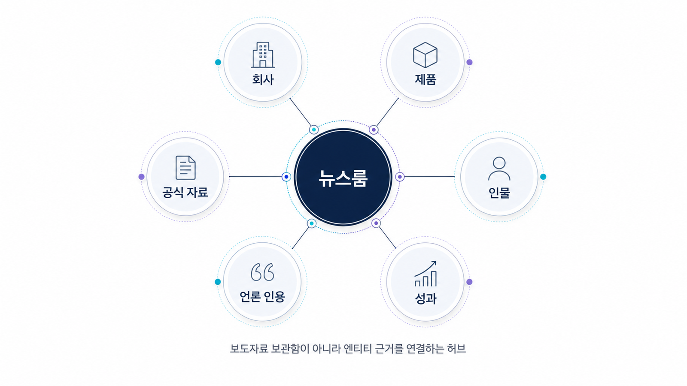

## PR/뉴스룸 GEO와 엔티티 전략


PR/뉴스룸 GEO는 보도자료를 많이 내는 일이 아닙니다. AI가 브랜드를 어떤 카테고리의 어떤 조직으로 이해하고, 어떤 외부 출처를 근거로 삼는지 관리하는 일입니다. 뉴스룸은 단순 소식 모음이 아니라 브랜드 엔티티의 기준 문장, 대표 이슈, 공식 입장을 쌓는 허브가 되어야 합니다.

AI 답변은 공식 사이트만 읽지 않습니다. 언론 기사, 인터뷰, 디렉터리, 외부 블로그, 커뮤니티에서 반복되는 설명을 함께 봅니다. 그래서 PR 관점의 GEO는 “이번 보도자료가 노출됐는가”보다 “반복 질문에서 어떤 출처가 브랜드 설명을 대표하는가”를 봐야 합니다.

[TOC]

## 뉴스룸은 브랜드 설명의 기준점이다

좋은 뉴스룸은 회사 소식을 날짜순으로 쌓는 데서 끝나지 않습니다. AI가 읽을 수 있는 형태로 카테고리, 제품, 지표, 대표 사례, 임원/전문가 발언, FAQ를 연결합니다.

외부 기사와 인터뷰가 늘어도 공식 기준 문장이 없으면 AI 답변은 제각각인 설명을 조합합니다. 한 기사에서는 “SEO 도구”, 다른 글에서는 “마케팅 자동화”, 또 다른 프로필에서는 “AI 콘텐츠 생성기”라고 쓰이면 브랜드 엔티티가 흐려집니다.

| 뉴스룸 자산 | GEO에서의 역할 | 확인할 점 |
|---|---|---|
| 회사 소개 | 브랜드 기준 문장 | 카테고리/대상/핵심 지표가 일관적인가 |
| 보도자료 | 새 이슈의 공식 근거 | 주장과 수치가 검증 가능한가 |
| 인터뷰 | 전문성/E-E-A-T 신호 | 발언 주제와 직책이 연결되는가 |
| 리포트/자료실 | citation 후보 | AI가 인용할 URL과 문장이 분명한가 |

## HaloX 리포트로 보는 PR 신호

프롬프트 분석에서는 브랜드 질문과 비브랜드 카테고리 질문을 나눠 봅니다. 브랜드 질문에서는 설명이 정확한지, 비브랜드 질문에서는 후보군에 들어가는지 확인합니다.

인용 추적에서는 언론/외부 도메인이 어떤 질문에서 반복되는지 봅니다. 외부 기사만 인용되고 공식 뉴스룸이 빠진다면, 공식 페이지가 AI에게 충분히 읽히지 않거나 citation으로 쓰기 좋은 구조가 아닐 수 있습니다.

사이트 진단은 뉴스룸과 자료실의 기술 상태를 봅니다. sitemap, canonical, 제목/메타, schema, 내부 링크가 약하면 좋은 보도자료도 근거 URL로 안정적으로 쓰이기 어렵습니다.



*뉴스룸은 보도자료 저장소가 아니라 공식 설명, 외부 인용, 리포트 근거를 연결하는 엔티티 허브다.*

## 가상 기업 AcmeNewsroom 예시

AcmeNewsroom은 “AI 검색 가시성 분석 기업” 질문에서 경쟁사보다 덜 언급됩니다. 원인을 보니 외부 기사에서는 Acme를 다양한 표현으로 소개하고, 공식 뉴스룸에는 GEO 리포트 예시나 지표 설명이 부족합니다.

이때 필요한 작업은 보도자료 추가 배포가 아닙니다. 공식 소개 문장을 정리하고, 대표 리포트 예시를 자료실에 올리며, 기존 언론/프로필의 설명이 같은 카테고리를 가리키도록 맞춥니다. 이후 인용 추적에서 공식 뉴스룸과 외부 기사가 함께 잡히는지 봅니다.

## 정리 양식

```text
브랜드 기준 문장:
핵심 카테고리:
대표 비브랜드 질문:
반복 인용되는 외부 출처:
빠져 있는 공식 뉴스룸 URL:
보강할 자료실/리포트/FAQ:
수정할 외부 프로필 설명:
재측정 질문:
```

## 다음 흐름

규제 산업은 신뢰 신호뿐 아니라 표현 리스크와 책임 범위도 함께 관리해야 합니다. 이어서 [금융/규제 산업 GEO](https://wikidocs.net/346389)로 넘어갑니다.
