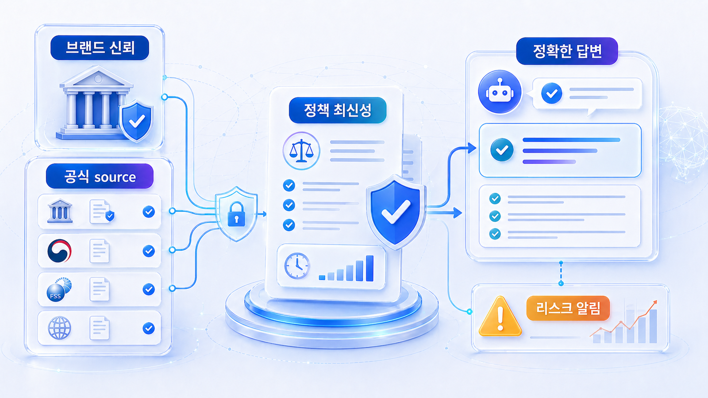
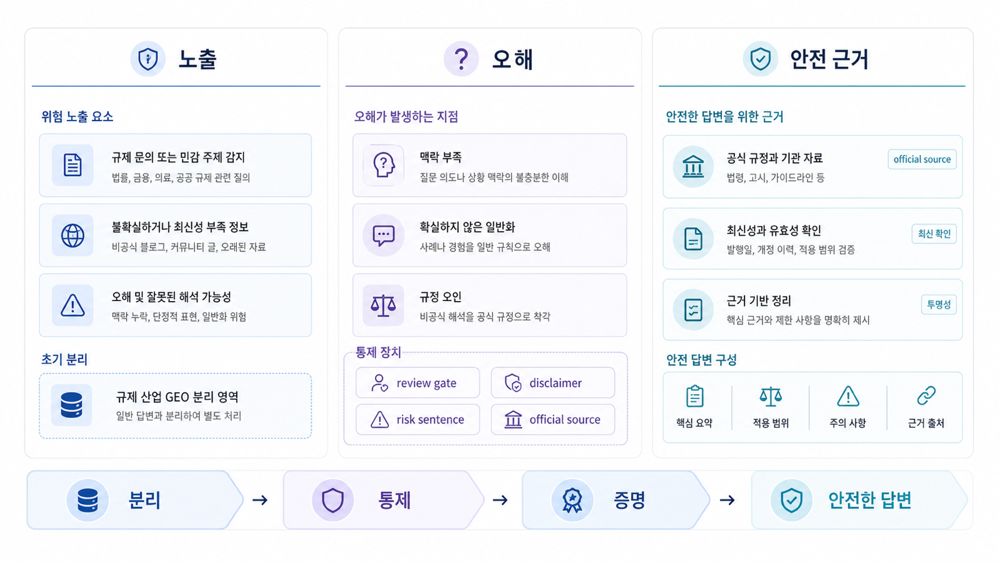

## 금융/규제 산업 GEO: 신뢰와 리스크 관리



금융, 보험, 투자, 의료, 법률처럼 규제가 있는 산업의 GEO는 공격적인 노출보다 정확성과 책임 범위가 먼저입니다. AI 답변이 브랜드를 언급하더라도 수익 보장, 효과 보장, 자격 오해, 오래된 정책을 근거로 설명하면 오히려 리스크가 커집니다.

이 업종에서는 “AI가 우리를 추천했는가”보다 “어떤 질문에서, 어떤 근거로, 어떤 표현으로 설명했는가”를 봐야 합니다. HaloX 리포트도 점수보다 질문 유형, citation URL, 위험 표현, 수정할 공식 근거를 함께 읽어야 합니다.

[TOC]

## 규제 산업의 GEO는 방어와 설명이 같이 필요하다

규제 산업에서 비브랜드 질문은 대개 신뢰 판단을 포함합니다. “초보자가 쓰기 좋은 환전 앱”, “퇴직연금 상품 비교”, “여드름 치료 병원 추천”처럼 질문 자체에 위험이 있습니다. AI가 답변을 만들 때 공식 문서, 약관, 공시, 전문가 설명, 후기, 언론 보도를 섞으면 잘못된 표현이 생길 수 있습니다.

따라서 콘텐츠팀은 좋은 문장을 쓰는 것만으로 충분하지 않습니다. 법무/컴플라이언스, PR, 제품, CS와 함께 답변 가능 범위와 금지 표현을 정해야 합니다.

| 점검 축 | 봐야 할 것 | 위험 신호 |
|---|---|---|
| 질문 | 추천/비교/효과/수익 질문 구분 | 보장성 표현이 붙은 질문을 방치함 |
| 근거 | 공식 문서, 공시, 전문가 설명 | 외부 블로그만 citation으로 반복됨 |
| 표현 | 한계, 조건, 유의사항 | 단정적 추천, 과장된 효과, 최신성 누락 |
| 실행 | 수정 책임자와 검수 루프 | 콘텐츠 수정과 법무 검수가 분리되지 않음 |

## HaloX 리포트에서 위험 질문을 분리한다

프롬프트 분석에서는 전체 평균보다 위험 질문군을 따로 봅니다. 브랜드가 잘 언급되는 질문보다, AI가 잘못 설명할 가능성이 큰 질문을 먼저 표시합니다.

인용 추적에서는 공식 약관, 공시, 가이드, 전문가 설명 URL이 citation으로 잡히는지 봅니다. 경쟁사나 외부 블로그가 반복 인용된다면, 공식 설명이 없거나 AI가 읽기 어려운 구조일 수 있습니다.

사이트 진단은 중요한 문서가 검색엔진과 AI crawler에게 열려 있는지, canonical과 업데이트 날짜가 맞는지, 구조화 데이터와 내부 링크가 신뢰 신호를 보강하는지 확인합니다.



*규제 산업 GEO는 노출 증가와 표현 리스크 관리를 같은 보드에서 봐야 한다.*

## 가상 기업 AcmeFinance 예시

AcmeFinance가 “해외 송금 수수료 저렴한 서비스” 질문에서 언급되지만, AI 답변은 오래된 외부 리뷰를 근거로 수수료를 설명합니다. 공식 수수료 페이지는 있지만 업데이트 날짜가 눈에 잘 보이지 않고, 비교 FAQ가 없습니다.

이 경우 첫 작업은 순위 상승이 아니라 기준 근거 정리입니다. 수수료 페이지에 업데이트 날짜와 조건을 명확히 쓰고, 자주 묻는 비교 질문을 FAQ로 분리하며, 외부 리뷰가 오래된 정보로 반복 인용되는 질문을 모니터링합니다. 보고서에는 “언급률 상승”이 아니라 “위험 질문에서 공식 citation 회복”을 목표로 둡니다.

## 정리 양식

```text
위험 질문군:
현재 AI 답변의 문제 표현:
반복 citation URL:
공식 근거 URL:
최신성/조건/한계 보강 항목:
검수 담당자:
다음 주 재측정 질문:
```

## 다음 흐름

캠페인처럼 기간이 짧은 URL은 한 번 언급되는 것과 반복 citation이 완전히 다릅니다. 이어서 [캠페인 URL citation 추적 설계](https://wikidocs.net/346390)를 봅니다.
