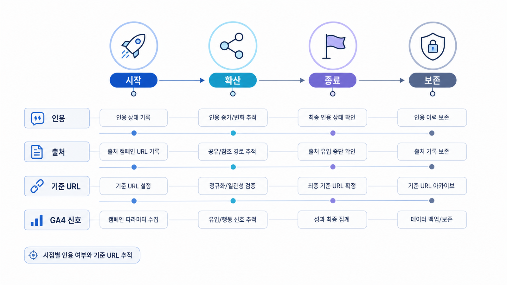

## 캠페인 URL citation 추적 설계


캠페인 URL은 GEO에서 자주 사라집니다. 이벤트 페이지, 랜딩 페이지, 보도자료, 광고 URL은 기간이 짧고 구조가 바뀌기 쉽습니다. AI가 한 번 언급했다고 해서 반복 citation이 만들어지는 것은 아닙니다.

캠페인 GEO의 핵심은 “이번 캠페인이 AI 답변에 나왔다”가 아니라 “어떤 질문에서 어떤 URL이 근거로 남았고, 캠페인 종료 후에도 어떤 공식 문서로 이어지는가”입니다. 캠페인을 단발 노출로 끝내지 않으려면 URL 생애주기를 먼저 설계해야 합니다.

[TOC]

## 캠페인 URL은 오래 남을 근거와 분리한다

캠페인 페이지는 짧은 메시지와 전환에 최적화되는 경우가 많습니다. 반면 AI 답변은 캠페인 조건, 대상, 혜택, 기간, 근거, 후기, 공식 발표를 함께 확인하려 합니다. 랜딩만 있고 설명형 근거 페이지가 없으면 citation이 광고 URL이나 외부 기사로 흩어집니다.

캠페인 운영에서는 세 종류의 URL을 분리하는 것이 좋습니다.

| URL 유형 | 역할 | GEO 점검 포인트 |
|---|---|---|
| 캠페인 랜딩 | 신청/구매/참여 전환 | 기간, 조건, canonical, 종료 후 처리 |
| 공식 설명 페이지 | AI가 인용할 근거 | 대상, 혜택, 조건, FAQ, 업데이트 날짜 |
| 외부 보도/파트너 | 신뢰와 확산 | 공식 설명과 표현이 충돌하지 않는가 |

## HaloX에서 캠페인을 재측정하는 법

프롬프트 분석에는 캠페인명 질문만 넣지 않습니다. “브랜드명 이벤트”, “혜택 조건”, “비슷한 캠페인 추천”, “종료 후 신청 가능 여부”처럼 실제 사용자가 물을 질문을 나눕니다.

인용 추적에서는 캠페인 랜딩, 공식 설명 페이지, 외부 기사/파트너 URL을 분리합니다. 랜딩만 반복 citation되면 종료 후 깨질 수 있고, 외부 기사만 반복되면 공식 조건이 빠질 수 있습니다.

사이트 진단에서는 campaign URL의 HTTP 상태, canonical, robots, sitemap 반영, 종료 후 리다이렉트 계획을 봅니다. 특히 종료된 캠페인을 404로 닫아버리면 AI 답변에 남은 citation이 깨진 근거가 됩니다.



*캠페인 URL은 시작 전 기준 URL, 운영 중 citation, 종료 후 보존 URL을 함께 설계해야 한다.*

## 가상 기업 AcmeCampaign 예시

AcmeCampaign이 “신규 고객 3개월 무료 이벤트”를 진행한다고 가정합니다. 광고 랜딩은 잘 만들어졌지만, 이벤트 조건과 종료 후 안내를 담은 공식 설명 페이지가 없습니다. AI 답변은 외부 제휴 기사만 인용하고, 기간이 지난 뒤에도 오래된 혜택을 추천합니다.

해결은 랜딩을 더 화려하게 만드는 것이 아닙니다. 공식 설명 페이지를 만들고, 캠페인 종료 후에도 조건과 종료 사실이 남는 보존 URL을 준비합니다. 인용 추적에서는 캠페인명 질문과 혜택 비교 질문에서 어떤 URL이 citation으로 잡히는지 주간으로 봅니다.

## 정리 양식

```text
캠페인명:
캠페인 기간:
대표 질문:
전환 랜딩 URL:
공식 설명/보존 URL:
외부 보도/파트너 URL:
종료 후 리다이렉트/보존 계획:
재측정 질문:
```

## 다음 흐름

산업별 전략을 서비스나 제안서로 바꾸려면 측정 조건과 실행 범위를 명확히 해야 합니다. 이어서 [GEO 리포트와 AI 검색 성과 검증](https://wikidocs.net/346359)에서 보고 기준으로 연결합니다.
