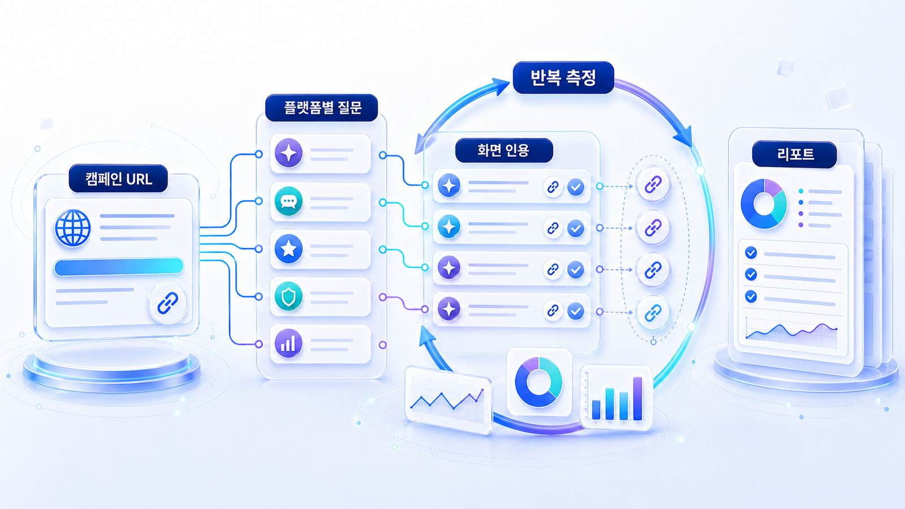

## 캠페인 URL 인용 추적은 어떻게 설계할까



캠페인 URL 인용 추적은 “우리 URL이 한 번 나왔는가”를 확인하는 일이 아닙니다. 어떤 질문에서, 어떤 플랫폼에서, 어떤 source와 함께, 얼마나 반복적으로 화면 인용되는지 보는 운영 리포트입니다.

PR 캠페인, 인플루언서 콘텐츠, 브랜드 캠페인, 신제품 런칭 페이지는 짧은 기간에 많은 콘텐츠가 생깁니다. 하지만 AI 답변이 그 URL을 실제 근거로 쓰는지는 별도로 확인해야 합니다.

## 사례로 이해하기

캠페인 운영자는 보통 조회수, 클릭, 전환, SNS 반응을 봅니다. GEO 관점에서는 여기에 한 가지 질문이 추가됩니다.

“이 캠페인 URL이 AI 답변의 근거가 되었는가?”

단발성 화면 인용(citation)은 우연일 수 있습니다. 중요한 것은 반복 측정했을 때 같은 질문군에서 URL이 안정적으로 등장하는지, 검색 TOP10에는 있지만 AI 답변에는 빠지는지, 브랜드와 경쟁사가 함께 비교되는지입니다.

| 측정 항목 | 보는 이유 | 실행 방향 |
|---|---|---|
| URL 화면 인용 여부 | 화면에 클릭 가능한 근거로 보이는지 확인 | 캠페인 URL별 화면 인용 리포트 |
| 인용 안정성 | 우연한 1회 노출과 반복 인용 구분 | 같은 질문을 주기적으로 재측정 |
| 검색 TOP10 교차율 | 검색에는 있는데 AI 답변에는 빠지는지 확인 | 제목/요약/구조/source 보강 |
| Co-mention | 경쟁 캠페인이나 대체 브랜드와 함께 나오는지 확인 | 비교 문맥과 메시지 조정 |
| Answer quality | 캠페인 메시지가 정확히 요약되는지 확인 | 캠페인 랜딩 리라이트 |

## HaloX로 확인할 수 있는 지점

이 사례는 HaloX 기능을 가장 직관적으로 보여주기 좋습니다. URL 단위로 질문, citation, 플랫폼, 반복성을 묶어 보여줄 수 있기 때문입니다.

| 기능 흐름 | 설명 방식 |
|---|---|
| URL별 citation tracking | 특정 캠페인 URL이 어떤 질문에서 인용되는지 확인 |
| AI 브리핑 인용 안정성 | 네이버/구글 AI 답변에서 반복적으로 보이는지 추적 |
| Search TOP10 vs AI answer overlap | 검색 결과와 AI 답변의 출처 차이를 비교 |
| Campaign 답변 근거 맵 | 인플루언서/언론/블로그/랜딩 페이지를 source 유형별로 분리 |
| 30일 액션 리포트 | 다음 배포/리라이트/PR 보강 우선순위 제시 |

## 실습 워크시트

| 입력 항목 | 작성 기준 |
|---|---|
| 캠페인 URL | 추적할 랜딩/기사/콘텐츠 URL |
| 질문셋 | 캠페인 메시지와 연결되는 정보/비교/추천/검증 질문 |
| 플랫폼 | ChatGPT/Perplexity/Gemini/Google AI Overviews/네이버 AI 브리핑 |
| 화면 인용 결과 | URL이 화면 링크로 표시됐는지 |
| 반복성 | 같은 질문을 여러 번 측정했을 때 유지되는지 |
| 다음 액션 | 리라이트, source 보강, 추가 배포, 기술 점검 |

## 정리 양식

```text
캠페인 URL 목록 / 질문셋 30개 / 플랫폼별 화면 인용 여부 / 검색 TOP10 교차율 / 인용 안정성 / 다음 배포 액션 / 재측정 날짜
```

## 작성 예시

| 입력 항목 | 작성 예시 |
|---|---|
| 캠페인 URL | /ko/blog/geo-campaign-report-sample |
| 질문셋 | AI 검색 리포트 예시, GEO 캠페인 성과 측정, citation 추적 방법 |
| 플랫폼 | Google AI Overviews, 네이버 AI 브리핑, Perplexity |
| 화면 인용 결과 | Perplexity 2개 질문에서 화면 인용, 네이버 AI 브리핑은 미노출 |
| 반복성 | 1주일 뒤 같은 질문에서 1개만 유지 |
| 다음 액션 | 제목/요약문 보강, 외부 답변 근거 3개 추가, 2주 뒤 재측정 |

## 완료 기준

- 캠페인 URL을 질문셋과 연결했습니다.
- 단발성 노출과 반복 citation을 구분했습니다.
- 검색 결과와 AI 답변의 출처 차이를 확인했습니다.
- 다음 배포/리라이트/PR 보강 액션이 정리되어 있습니다.

## 참고 링크 패키지

캠페인 URL 추적은 HaloX의 [AI에게 인용되는 콘텐츠 만드는 법](https://haloxlabs.ai/ko/blog/how-to-get-cited-by-ai), [AVI 점수란?](https://haloxlabs.ai/ko/blog/avi-score-explained), [GEO 콘텐츠 구조화 가이드](https://haloxlabs.ai/ko/blog/geo-content-structure)를 함께 보면 좋습니다.

캠페인 URL은 AI 답변에 인용되기 전에 크롤러가 링크를 발견할 수 있어야 합니다. Google의 [크롤 가능한 링크 가이드](https://developers.google.com/search/docs/crawling-indexing/links-crawlable)를 함께 보면 추적 URL과 랜딩 페이지 점검 기준을 잡을 수 있습니다.

## 다음 흐름

캠페인 URL 인용 추적까지 정리했다면 [08. 글로벌/영문 GEO 전략](https://wikidocs.net/346336)으로 넘어갑니다. 전체 사례 흐름은 [산업별 GEO 케이스북](https://wikidocs.net/346381)에서 다시 확인할 수 있습니다.
