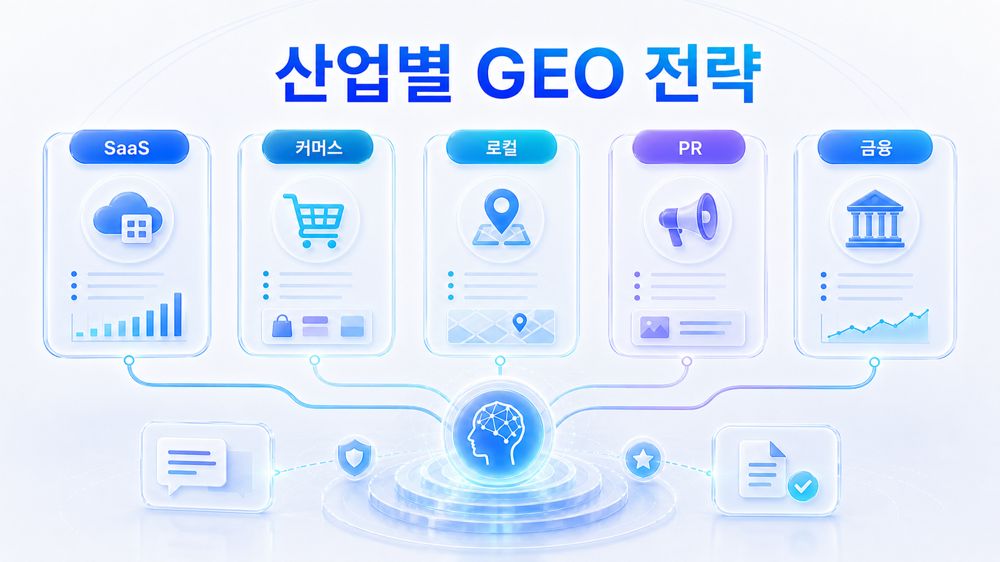
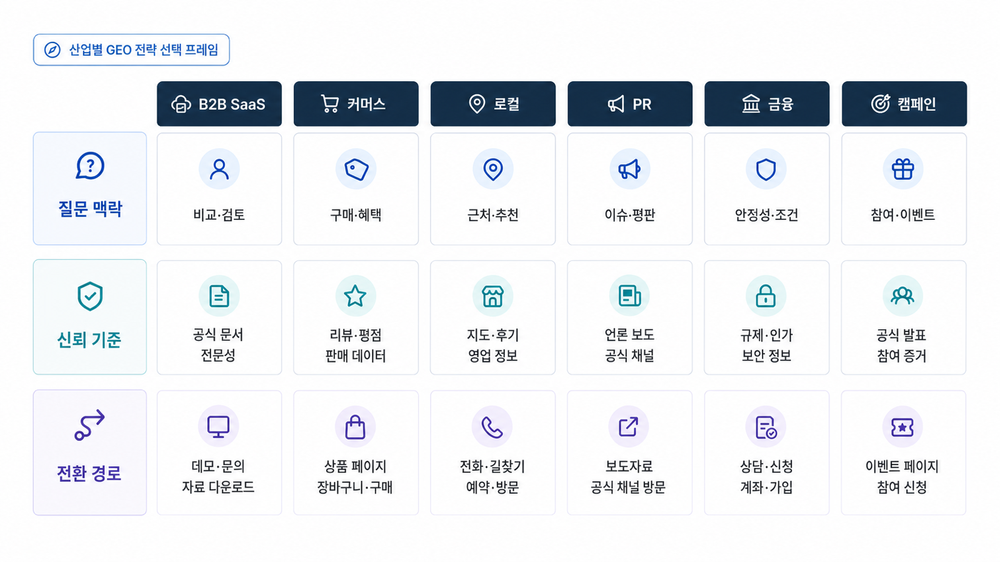

## 산업별 GEO 전략

산업별 GEO 전략은 업종 이름만 바꾸는 작업이 아닙니다. B2B SaaS, 커머스/플랫폼, 로컬/전문 서비스, PR/뉴스룸, 금융/규제 산업, 캠페인 운영은 질문 구조와 필요한 출처가 다릅니다. 그래서 같은 mention 지표를 보더라도 어떤 질문에서, 어떤 근거로, 어떤 의사결정자에게 보여줄 것인지가 달라집니다.

이 장은 [02. AI 검색 모니터링: 브랜드 언급률, 답변 근거, 화면 인용 읽는 법](https://wikidocs.net/346342)을 산업별 실행 전략으로 바꾸는 장입니다. 앞 장에서 지표를 배웠다면, 여기서는 “우리 업종에서는 무엇을 먼저 볼 것인가”를 정합니다.

[TOC]

## 산업별 GEO를 나누는 기준

산업별 GEO를 나눌 때는 업종명을 먼저 보지 않습니다. 먼저 `누가 질문하는가`, `무엇을 결정하려는가`, `어떤 출처를 믿는가`, `실수했을 때 리스크가 무엇인가`를 봅니다. 같은 “추천해줘” 질문이라도 B2B SaaS에서는 보안/연동/도입 사례가 중요하고, 로컬 서비스에서는 위치/리뷰/예약 가능성이 중요하며, 금융/규제 산업에서는 공식 정책과 위험 고지가 먼저입니다.

| 구분 기준 | 봐야 할 질문 | 예시 |
|---|---|---|
| 의사결정자 | 누가 AI에게 묻는가 | 마케터, 구매팀, 환자, 투자자, 기자, 캠페인 담당자 |
| 답변 단위 | AI가 무엇을 후보로 올리는가 | 브랜드, 제품, 지점, 전문가, 뉴스룸 URL, 캠페인 URL |
| 신뢰 출처 | 어떤 source가 설득력을 만드는가 | 공식 페이지, 리뷰, 인증, 언론, 지도, 정책 문서, 상품 데이터 |
| 전환 행동 | 답변 뒤 무엇을 하게 되는가 | 데모 신청, 구매, 예약, 상담, 기사 확인, 자료 다운로드 |
| 실패 리스크 | 잘못 인용되면 무엇이 문제인가 | 가격 오류, 재고 오류, 의료/금융 오해, 오래된 기사, 잘못된 지점 정보 |

이 기준을 먼저 잡으면 산업별 GEO가 “업종별 체크리스트”로 얕아지지 않습니다. 각 업종 페이지는 질문 구조, 필요한 근거, 콘텐츠/출처/기술 액션이 어떻게 달라지는지를 보여 줍니다.

## 산업별 전략을 고르는 공통 프레임

산업별 GEO는 업종 이름만 바꾸는 것이 아닙니다. 같은 mention/source/citation 지표라도 산업마다 구매 여정, 리스크, source 유형, 기술 데이터가 다릅니다.

| 판단 축 | B2B SaaS | 커머스/플랫폼 | 로컬/전문 서비스 | PR/뉴스룸 | 금융/규제 | 캠페인 URL |
|---|---|---|---|---|---|---|
| 핵심 질문 | 비교/도입/보안 | 상품 추천/가격/리뷰 | 지역/예약/신뢰 | 회사 설명/이슈 | 안전/정책/인증 | 단기 이슈/대표 URL |
| 우선 source | 사례/문서/리뷰 | 상품 데이터/리뷰 | 지도/리뷰/NAP | 뉴스룸/언론 | 정책/공시/FAQ | 랜딩/보도자료 |
| 기술 신호 | schema/문서/SSO | Product/feed/schema | GBP/NAP/로컬 URL | Article/Organization | 최신성/정책 URL | canonical/redirect |
| 리스크 | 기능 과장 | 재고/가격 오류 | 후기/광고 표현 | 오래된 기사 | 법적 오해 | URL 종료 |
| 재측정 | 추천형 질문 | 상품군 질문 | 지역 질문 | 브랜드/이슈 질문 | 리스크 질문 | 캠페인 질문 |

이 표를 먼저 고르면 각 산업 페이지가 흩어진 사례집이 아니라 1~6장의 워크플로우를 업종별로 적용하는 실무 가이드가 됩니다.

*산업별 GEO는 업종명보다 질문 맥락, 신뢰 기준, 전환 경로를 함께 보고 선택한다.*

## 산업별 적용 패키지

이 장의 세부 페이지는 여섯 가지 현장 사례로 확장합니다. 실제 회사명이나 외부에 드러내지 않는 정보는 넣지 않고, 반복적으로 확인한 운영 패턴을 산업별 사례로 정리합니다.

| 페이지 | 핵심 사례 | 먼저 볼 질문 |
|---|---|---|
| 07-01 | B2B SaaS와 도구 도입 | 비교/추천/보안/연동 질문에서 후보가 되는가 |
| 07-02 | 커머스/플랫폼 AIO | 상품/카테고리/리뷰/가격 정보가 AI에게 읽히는가 |
| 07-03 | 로컬/전문 서비스 | 지역 질문과 후기/source가 지점 전환으로 이어지는가 |
| 07-04 | PR/뉴스룸/엔터프라이즈 | 뉴스룸과 보도자료가 엔티티 허브로 작동하는가 |
| 07-05 | 금융/규제 산업 | 브랜드 신뢰와 비브랜드 전환 질문을 동시에 잡는가 |
| 07-06 | 캠페인 URL 인용 추적 | 캠페인 URL이 반복적으로 citation 되는가 |

전체 사례 흐름은 [산업별 GEO 케이스북](https://wikidocs.net/346381)에서 한 번에 볼 수 있습니다. 이 장은 그 케이스북을 독자가 자기 업종에 바로 적용할 수 있도록 업종별 페이지로 풀어낸 버전입니다.

## 이 장을 읽는 방법

07장은 처음부터 끝까지 순서대로 읽는 장이라기보다, 자기 업종이나 현재 과제에 가까운 페이지를 골라 읽는 장입니다. 공통 기준은 01~06장에서 만든 질문셋, 측정 지표, 콘텐츠 구조, 답변 근거, 기술 점검입니다.

B2B SaaS라면 07-01을 먼저 보고, 커머스/플랫폼이라면 07-02를 먼저 보면 됩니다. 자기 업종과 직접 맞지 않는 페이지는 건너뛰고 08장 글로벌 전략이나 10장 실행 로드맵으로 넘어가도 됩니다.

## 이 장에서 다루는 세부 페이지

- [07-01. B2B SaaS GEO는 무엇이 다른가](https://wikidocs.net/346356)
- [07-02. 커머스와 플랫폼은 GEO보다 AIO를 먼저 봐야 할까](https://wikidocs.net/346357)
- [07-03. 로컬/전문 서비스 GEO는 무엇을 봐야 하나](https://wikidocs.net/346358)
- [07-04. PR/뉴스룸 GEO는 왜 엔티티 전략인가](https://wikidocs.net/346388)
- [07-05. 금융/규제 산업 GEO는 무엇을 조심해야 하나](https://wikidocs.net/346389)
- [07-06. 캠페인 URL 인용 추적은 어떻게 설계할까](https://wikidocs.net/346390)

## 읽는 순서

처음 읽는다면 07-01부터 순서대로 읽습니다. 이미 실무 과제가 정해져 있다면 현재 막힌 지점부터 읽어도 됩니다. 예를 들어 상품 데이터가 문제라면 커머스/플랫폼 페이지를, 지역 추천이 문제라면 로컬/전문 서비스 페이지를, PR 제안이나 뉴스룸 운영이 문제라면 PR/뉴스룸 페이지를 먼저 봅니다.

## 학습과 실무에서의 역할

| 사용 장면 | 이 장의 역할 | 산출물 |
|---|---|---|
| 실무 적용 | 업종별 사례로 판단 기준 정리 | 질문맵/측정표/체크리스트 |
| 실무 | 현재 업종의 병목을 진단 | 콘텐츠 갭/답변 근거 맵/기술 점검 |
| 제품 설명 | HaloX 기능을 문제 해결 흐름으로 설명 | AVI/mention, 답변 근거(source), 화면 인용(citation)/URL 추적 리포트 |
| 책 | 혼자 따라 할 수 있는 케이스 실습 노트 | 사례표/템플릿/FAQ |

## HaloX 기능을 자연스럽게 붙이는 순서

산업별 사례에서는 기능을 먼저 설명하지 않습니다. 먼저 업종의 질문을 보여주고, 그 질문을 측정하려면 어떤 리포트 카드가 필요한지 연결합니다.

1. 업종별 대표 질문을 정한다.
2. 질문군 구성과 우선 지표를 고른다.
3. mention, 답변 근거(source), 화면 인용(citation), co-mention/answer quality를 읽는다.
4. HaloX의 리포트 카드를 해당 의사결정에 연결한다.
5. 콘텐츠/출처/기술/캠페인 실행으로 나눈다.

이 순서를 쓰면 “HaloX 기능 소개”가 아니라 “실무자가 당장 판단해야 하는 문제를 줄이는 도구”로 설명됩니다.

## HaloX로 이어지는 지점

산업별 GEO를 읽은 뒤에는 HaloX의 [GEO 평판/브랜드 합의 신호](https://haloxlabs.ai/ko/blog/geo-reputation-brand-consensus)를 함께 보면 좋습니다. 업종마다 신뢰 신호와 비교 문맥이 달라지는 이유를 더 깊게 볼 수 있습니다. 산업별 전략을 나눌 때도 공통 기준은 “독자가 실제 선택에 필요한 정보를 얻는가”입니다. Google의 [유용한 콘텐츠 만들기](https://developers.google.com/search/docs/fundamentals/creating-helpful-content)를 공통 기준으로 두고, 산업별로 필요한 증거와 구조만 다르게 설계합니다.

## 다음 흐름

이 장은 앞선 [06. 테크니컬 GEO와 사이트 구조](https://wikidocs.net/346334)의 흐름을 이어받습니다. 세부 페이지를 읽은 뒤에는 [08. 글로벌/영문 GEO 전략](https://wikidocs.net/346336)으로 넘어가거나, 사례 전체를 보려면 [90. 산업별 GEO 케이스북](https://wikidocs.net/346381)을 읽습니다.
