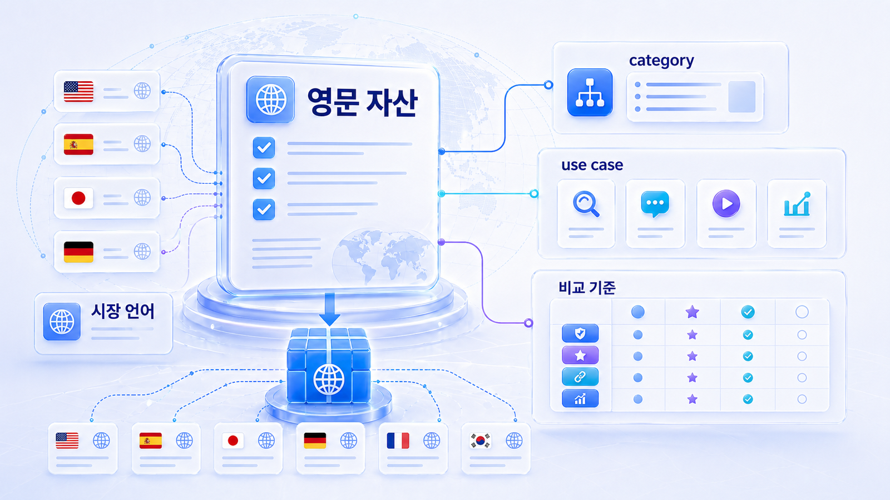
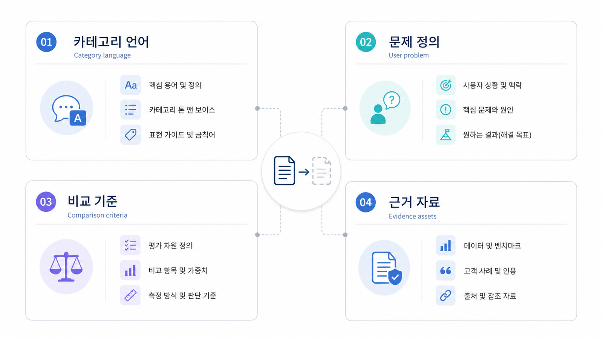

## 영문 GEO 카테고리 자산 구축



글로벌 GEO는 번역에서 시작하면 약합니다. 먼저 영어권 사용자가 어떤 카테고리 언어로 문제를 묻는지 확인하고, 그 언어로 설명되는 대표 페이지를 만들어야 합니다.

한국어 브랜드 설명을 그대로 번역하면 영어권 AI 답변의 카테고리와 맞지 않을 수 있습니다. category page, comparison page, glossary, report sample이 영어권 질문에 맞게 다시 설계되어야 합니다.

[TOC]

## 먼저 볼 기준

| 기준 | 읽는 법 |
|---|---|
| 언어 | 한국어 직역보다 영어권 카테고리 표현을 우선한다 |
| 자산 | 용어/비교/사례/리포트 예시를 영어로 준비한다 |
| 측정 | 영문 비브랜드 질문에서 후보로 들어가는지 본다 |

## 실행 흐름

1. 대표 질문을 정한다.
2. 현재 AI 답변에서 mention/source/citation을 나눠 본다.
3. 경쟁 브랜드나 반복 URL이 어떤 이유로 등장하는지 확인한다.
4. 우리 공식 페이지, 외부 출처, 기술 조건 중 먼저 고칠 곳을 고른다.
5. 같은 질문군으로 30일 뒤 다시 본다.



*영문 카테고리 언어와 source 설계*

## 영문 진입 예시

AcmeGEO가 한국에서는 GEO 리포트 도구로 이해되지만 영어권에서는 AI search visibility platform으로 더 잘 설명될 수 있습니다. 이 차이를 반영해 영문 첫 문단과 비교 기준을 다시 씁니다.

## 글로벌 GEO에서 따로 봐야 할 것

글로벌 GEO는 한국어 페이지를 번역하는 일만으로 해결되지 않습니다. 시장별 검색 의도, 언어별 질문 표현, locale/hreflang, 현지 source 후보가 다릅니다. 같은 브랜드라도 영어권 AI 답변에서는 한국어 출처보다 영문 카테고리 페이지, 글로벌 디렉터리, 현지 리뷰/미디어가 더 강하게 작동할 수 있습니다.

| 점검 축 | 확인 질문 |
|---|---|
| 언어 | 영어 질문에서 쓰는 표현이 한국어 키워드와 다른가 |
| URL | locale/hreflang/canonical이 시장별 대표 URL을 분명히 가리키는가 |
| source | 현지에서 신뢰할 만한 외부 출처가 있는가 |
| 리포트 | 국가/언어/모델 조건을 분리해 재측정하는가 |

## 보고서에 남길 문장

```text
글로벌 GEO는 번역 품질보다 시장별 질문과 source/citation 조건을 먼저 봅니다. 영어 질문셋, 대표 URL, 현지 source 후보를 분리해 기준선을 잡고 30일 뒤 같은 조건으로 재측정합니다.
```

## 정리 양식

```text
영문 카테고리:
대표 질문:
영문 기준 문장:
필요 페이지:
경쟁 source:
재측정 질문:
```

## 다음 흐름

다국어 URL 구조는 [Locale/hreflang 점검](https://wikidocs.net/346360)에서 이어집니다.
