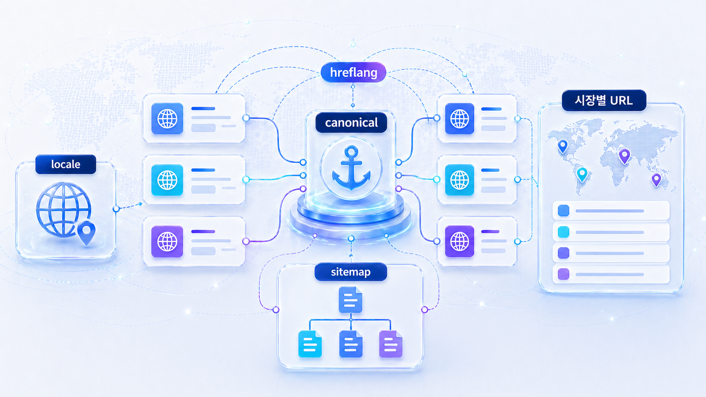
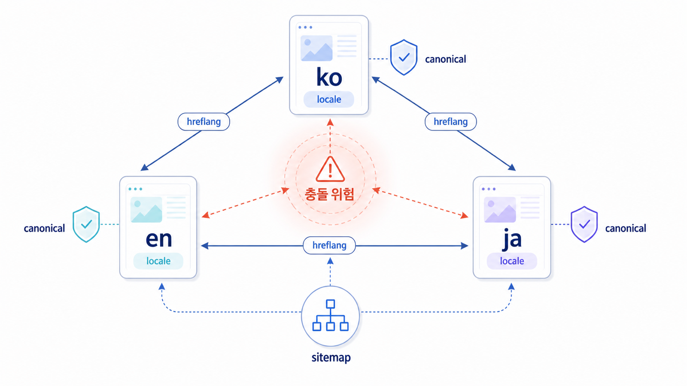

## Locale/hreflang은 GEO에서 어떻게 봐야 하나



글로벌 GEO에서는 언어와 지역 처리가 콘텐츠만큼 중요합니다. 영어 페이지가 있어도 어떤 URL이 미국 영어용인지, 글로벌 영어용인지, 한국어 원문인지, 일본어 현지화 페이지인지 검색엔진과 AI가 이해하지 못하면 답변 근거가 흔들립니다.

`locale`은 페이지가 겨냥하는 언어/지역 조합입니다. `hreflang`은 Google 같은 검색엔진에 “이 페이지의 다른 언어/지역 버전은 여기 있다”고 알려주는 신호입니다. GEO 관점에서는 이 신호가 시장별 대표 source를 정리하는 기술적 기준이 됩니다.

[TOC]

## Locale과 hreflang의 기본 개념

| 개념 | 의미 | GEO에서 보는 이유 |
|---|---|---|
| language | 콘텐츠 언어입니다. 예: ko, en, ja | AI가 어떤 언어의 답변 근거로 쓸지 판단합니다 |
| region | 대상 지역입니다. 예: US, GB, KR, JP | 같은 언어라도 시장/규제/가격/지원 범위가 달라집니다 |
| locale | 언어와 지역의 조합입니다. 예: en-US, en-GB, ko-KR | 국가별 질문셋과 URL을 연결합니다 |
| hreflang | 대체 언어/지역 URL을 알려주는 태그입니다 | 잘못된 언어 페이지 노출과 source 혼선을 줄입니다 |
| canonical | 대표 URL을 지정하는 신호입니다 | 중복 페이지 정리와 hreflang 충돌 여부를 봅니다 |

Google은 [Localized Versions of your Pages](https://developers.google.com/search/docs/specialty/international/localized-versions)에서 HTML link 태그, HTTP header, sitemap 중 한 가지 방식으로 언어/지역별 대체 페이지를 알릴 수 있다고 설명합니다. 중요한 것은 각 언어 버전이 서로를 다시 참조해야 한다는 점입니다.

## hreflang은 어떻게 생겼나

HTML head에 넣는 기본 형태는 다음과 같습니다.

```html
<link rel="alternate" hreflang="ko-KR" href="https://example.com/ko/geo/" />
<link rel="alternate" hreflang="en-US" href="https://example.com/en-us/geo/" />
<link rel="alternate" hreflang="en" href="https://example.com/en/geo/" />
<link rel="alternate" hreflang="x-default" href="https://example.com/geo/" />
```

이 예시에서 `ko-KR`은 한국어/한국, `en-US`는 영어/미국, `en`은 지역을 특정하지 않는 영어, `x-default`는 언어나 지역을 확정하기 어려운 사용자를 위한 기본 페이지입니다.

GEO 실무에서는 태그가 “있다/없다”만 보지 않습니다. 다음 세 가지를 함께 봅니다.

| 점검 기준 | 좋은 상태 | 위험한 상태 |
|---|---|---|
| 상호 참조 | ko 페이지와 en 페이지가 서로를 hreflang으로 가리킴 | en 페이지는 ko를 가리키지만 ko 페이지는 en을 가리키지 않음 |
| canonical 정합성 | 각 언어 페이지가 자기 자신을 canonical로 가리킴 | en 페이지 canonical이 ko 페이지를 가리킴 |
| 내용 대응 | 같은 주제의 현지화 페이지끼리 연결 | 전혀 다른 주제의 페이지끼리 hreflang 연결 |

## canonical과 hreflang이 충돌하면 안 된다

canonical은 “대표 URL은 이것”이라는 신호이고, hreflang은 “이 페이지의 다른 언어/지역 버전은 이것”이라는 신호입니다. 둘이 충돌하면 검색엔진과 AI가 어느 페이지를 대표 source로 봐야 할지 헷갈릴 수 있습니다.

| 상황 | 예시 | 판단 |
|---|---|---|
| 올바른 자기 참조 canonical | `/ko/product` canonical이 `/ko/product` | 정상 |
| 올바른 hreflang 대체 | `/ko/product`가 `/en/product`를 alternate로 표시 | 정상 |
| 교차 canonical 오류 | `/en/product` canonical이 `/ko/product` | 영문 페이지가 대표 source로 인정받기 어려움 |
| 자동 번역 중복 | `/en/product`가 내용만 번역되고 시장 정보 없음 | 현지 질문 대응이 약함 |
| 잘못된 매칭 | `/ko/pricing`이 `/en/blog`를 hreflang으로 연결 | 언어 대체 관계가 아님 |

Google의 [canonical 지정 가이드](https://developers.google.com/search/docs/crawling-indexing/consolidate-duplicate-urls)는 중복 URL의 대표 신호를 설명합니다. 다국어 페이지에서는 canonical이 각 언어 버전의 대표 URL을 보존하는지 확인해야 합니다.


<small>locale, hreflang, canonical은 검색엔진과 AI 크롤러가 어느 시장의 페이지를 읽을지 정하는 신호다.</small>


## URL 구조별 장단점

글로벌 사이트는 언어/지역 URL 구조를 먼저 정해야 합니다. 정답은 하나가 아니지만, 관리 기준은 명확해야 합니다.

| 구조 | 예시 | 장점 | 주의점 |
|---|---|---|---|
| 서브디렉터리 | `example.com/en/`, `example.com/ko/` | 관리가 쉽고 도메인 권한을 공유 | 국가별 타깃이 약하면 콘텐츠/링크로 보강 필요 |
| 국가+언어 디렉터리 | `example.com/en-us/`, `example.com/en-gb/` | 시장별 질문/가격/규제 분리 쉬움 | 콘텐츠 중복과 운영 비용 증가 |
| 서브도메인 | `en.example.com` | 조직/시장별 분리 쉬움 | 도메인 신호가 분산될 수 있음 |
| ccTLD | `example.co.kr`, `example.co.jp` | 국가 신호가 강함 | 운영/브랜딩/기술 관리 비용 증가 |
| 파라미터 | `?lang=en` | 구현은 쉬움 | 크롤링/공유/분석 기준이 흔들리기 쉬움 |

GEO에서는 URL 구조보다 “시장별 대표 페이지가 명확한가”가 더 중요합니다. 영문 페이지가 하나뿐이라도 글로벌 영어용인지, 미국용인지, 싱가포르용인지 운영 기준을 정해야 합니다.

## 다국어 sitemap으로 관리하기

사이트 규모가 커지면 HTML head에만 의존하지 않고 sitemap에서도 언어 대체 관계를 관리할 수 있습니다. Google은 sitemap을 통해 URL과 대체 언어 버전을 제출할 수 있다고 안내합니다. 기본 sitemap 개념은 Google의 [Sitemap 가이드](https://developers.google.com/search/docs/crawling-indexing/sitemaps/overview)를 함께 보면 됩니다.

개발팀 요청은 다음처럼 구체화합니다.

```text
요청: ko/en 대표 페이지 50개의 hreflang/canonical/sitemap 상태를 점검해 주세요.
범위: /ko/, /en/, /en-us/ 하위 핵심 랜딩/블로그/문서 페이지
확인 항목: 자기 참조 canonical, 상호 hreflang, x-default, sitemap 포함 여부, 200 status, noindex 여부
산출물: URL별 상태표와 수정 PR
```

## GEO 관점의 locale 점검표

| 점검 항목 | 확인 질문 | 수정 액션 |
|---|---|---|
| 시장 정의 | 이 URL은 어느 언어/지역 질문에 답하는가? | URL별 target locale을 표로 작성 |
| 콘텐츠 현지화 | 번역을 넘어 가격/규제/사례/표현이 현지화됐는가? | 시장별 FAQ와 사례 추가 |
| hreflang | 대체 언어 페이지가 상호 참조되는가? | 누락/오류 URL을 개발 요청으로 정리 |
| canonical | 각 언어 페이지가 자기 대표 URL을 보존하는가? | 교차 canonical 오류 수정 |
| sitemap | 핵심 페이지가 sitemap에 포함되는가? | 다국어 sitemap 또는 alternate 정보 추가 |
| 내부 링크 | 한국어 페이지에서만 영문 페이지가 고립되지 않는가? | 언어 전환 링크와 글로벌 허브 추가 |
| 재측정 | locale별 질문셋으로 다시 확인하는가? | 국가/언어별 baseline 분리 |

## hreflang 오류를 GEO 리스크로 읽기

hreflang 오류는 단순 국제 SEO 문제가 아닙니다. AI가 시장별 대표 source를 잘못 이해하거나 한국어 URL을 영어 답변 근거로 쓰게 만드는 리스크가 될 수 있습니다.

| 오류 유형 | GEO 리스크 | 수정 방향 |
|---|---|---|
| return tag 없음 | 언어 버전 관계가 불완전함 | 양방향 alternate 설정 |
| canonical 충돌 | 대표 URL과 언어 URL이 다르게 해석됨 | self canonical과 hreflang 정렬 |
| x-default 없음 | 지역 미확정 사용자의 기본 경로가 불명확 | 글로벌 기본 페이지 지정 |
| 자동 번역 얕은 페이지 | answer quality가 약함 | 현지 query/FAQ/source 반영 |
| sitemap 누락 | 언어별 URL 발견이 약함 | 다국어 sitemap 제출 |

AcmeGEO의 `/ko/geo-report`와 `/en/ai-search-report`가 서로 다른 시장 질문에 답한다면 단순 번역 관계가 아닐 수 있습니다. 이때는 hreflang만 붙이기보다 각 locale의 검색 의도와 canonical 전략을 먼저 정해야 합니다.

## Search Console에서 볼 것

Search Console은 GEO 도구는 아니지만 글로벌 사이트의 기본 문제를 확인하는 데 유용합니다. 다음 항목을 봅니다.

| 영역 | 확인할 것 | GEO 해석 |
|---|---|---|
| 색인 생성 | 핵심 영문 URL이 색인 가능한가 | AI/검색엔진이 source로 읽을 기본 조건 |
| 페이지 | alternate/canonical 관련 제외가 많은가 | 대표 URL 혼선 가능성 |
| 검색 실적 | 국가/언어별 노출과 쿼리 차이 | 시장별 질문셋 보정 근거 |
| sitemap | 제출 URL과 색인 URL 차이 | 핵심 페이지 누락 여부 |
| URL 검사 | 실제 HTML에 hreflang/canonical이 있는가 | 렌더링 후 신호 확인 |

## 실습 워크시트

| 입력 항목 | 작성 기준 |
|---|---|
| target locale | en, en-US, ko-KR처럼 언어/지역 조합 |
| representative URL | 해당 시장의 대표 URL |
| alternate URLs | 대응되는 다른 언어/지역 URL |
| canonical status | 자기 참조/교차 오류/누락 |
| hreflang status | 정상/누락/상호 참조 오류/잘못된 locale |
| localization gap | 가격, 사례, 규제, FAQ, 표현 차이 |
| developer request | 태그/sitemap/canonical/internal link 수정 요청 |

## 정리 양식

```text
locale / 대표 URL / 대응 URL / canonical 상태 / hreflang 상태 / sitemap 포함 / 현지화 gap / 개발 요청 / 재검수일
```

## 체크리스트

- 타깃 국가/언어 조합이 `언어만`인지 `언어+지역`인지 정했는가?
- 각 언어 페이지가 자기 자신을 canonical로 가리키는가?
- hreflang이 상호 참조되고 x-default 필요 여부를 검토했는가?
- 같은 주제의 대체 페이지끼리만 hreflang으로 묶었는가?
- 영문 페이지가 단순 번역이 아니라 현지 질문/사례/FAQ를 반영했는가?
- sitemap, 내부 링크, 언어 전환 UI가 같은 URL 체계를 말하는가?
- locale별 GEO 질문셋과 baseline을 분리했는가?

## 참고 링크 패키지

locale/hreflang 점검은 Google의 [Localized Versions of your Pages](https://developers.google.com/search/docs/specialty/international/localized-versions)와 [Managing Multi-Regional and Multilingual Sites](https://developers.google.com/search/docs/specialty/international/managing-multi-regional-sites)를 기준으로 봅니다. canonical 충돌은 [canonical 지정 가이드](https://developers.google.com/search/docs/crawling-indexing/consolidate-duplicate-urls)를 함께 확인합니다.

온페이지 기준이 흔들릴 때는 HaloX의 [온페이지 SEO 체크리스트](https://haloxlabs.ai/ko/blog/on-page-seo-checklist-2026)를 참고하고, GEO에서는 이 신호가 시장별 source/citation 혼선을 줄이는 역할을 한다고 보면 됩니다.

## 흔한 질문

**Q. hreflang을 넣으면 AI 답변 노출이 바로 좋아지나요?**

아닙니다. hreflang은 언어/지역 URL을 정리하는 기술 신호입니다. 답변 노출은 콘텐츠 품질, 출처 신뢰, 질문 적합성, 외부 source와 함께 봐야 합니다.

**Q. en 페이지만 있으면 en-US, en-GB를 나눌 필요가 있나요?**

시장별 가격, 규제, 배송, 지원 범위, 사례가 다르면 나누는 편이 좋습니다. 차이가 거의 없다면 먼저 `en` 글로벌 페이지로 운영하고, 질문/전환 데이터가 쌓이면 지역별로 분리합니다.

**Q. 자동 번역 페이지도 hreflang으로 묶어도 되나요?**

기술적으로는 가능하지만 GEO 관점에서는 권장하지 않습니다. 자동 번역만 있고 현지 질문/사례/FAQ가 없으면 source로 쓰일 문장 품질이 약합니다.

## 다음 흐름

이전: [08-01. 영문 카테고리 자산은 왜 먼저 필요한가](https://wikidocs.net/346359) / 다음: [08-03. 글로벌 답변 근거 맵을 만드는 법](https://wikidocs.net/346361)
