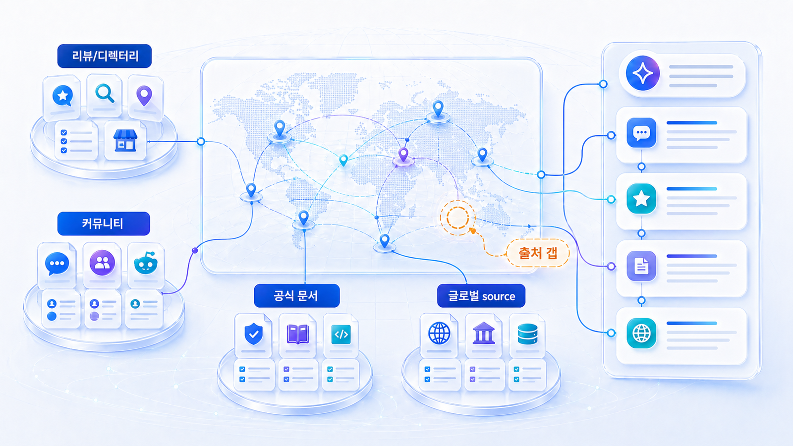
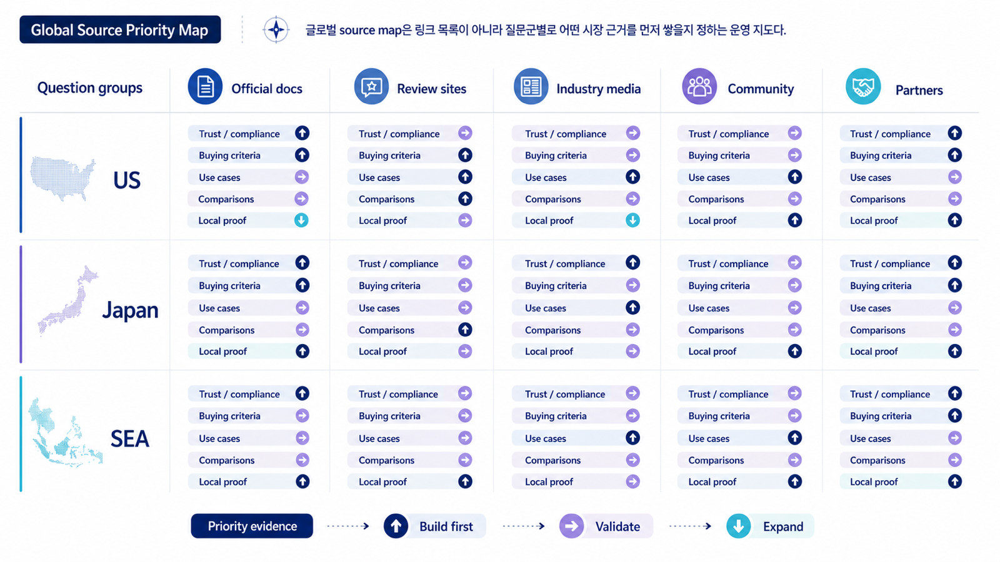

## 글로벌 source map: 시장별 답변 근거 설계



글로벌 GEO에서 source map은 “해외 매체에 많이 노출되기”가 아닙니다. 시장별 AI 답변이 어떤 미디어, 디렉터리, 리뷰, 커뮤니티, 공식 docs를 반복 근거로 삼는지 확인하고, 그 출처 구조에 맞춰 공식 자산과 외부 신호를 설계하는 일입니다.

미국, 일본, 동남아, 유럽 시장은 질문 언어뿐 아니라 신뢰하는 출처와 규제 표현도 다릅니다. 같은 브랜드 메시지를 여러 시장에 뿌리는 방식으로는 안정적인 citation을 만들기 어렵습니다.

[TOC]

## source map은 시장별로 따로 만든다

| 출처 유형 | 확인할 것 | 실행 예시 |
|---|---|---|
| 공식 사이트/docs | 카테고리/가이드/FAQ | 영문 docs, report example |
| 미디어/PR | 산업 매체, 인터뷰 | 현지 문제 중심 보도자료 |
| 디렉터리 | SaaS/앱/업종 디렉터리 | 카테고리와 설명 일치 |
| 리뷰/커뮤니티 | Reddit, G2, 현지 포럼 | 실제 사용 맥락 확인 |
| 파트너/행사 | 웨비나, 리포트, 공동 콘텐츠 | 현지 신뢰 채널 확보 |

## HaloX 리포트와 연결하는 법

프롬프트 분석에서 시장별 질문셋을 분리합니다. 같은 영어라도 미국 B2B SaaS 질문과 싱가포르 에이전시 질문은 다르게 볼 수 있습니다.

인용 추적에서는 반복되는 도메인을 우선순위로 정합니다. 공식 URL이 전혀 잡히지 않는지, 경쟁사 glossary가 반복되는지, 리뷰 플랫폼이 강한지에 따라 실행이 달라집니다.

전략맵과 콘텐츠 제작에서는 source/citation 약점을 콘텐츠 티켓으로 바꿉니다. 예를 들어 “GEO report template” 질문에서 경쟁사 docs가 반복된다면 영문 report example과 glossary, comparison page를 먼저 만듭니다.



*글로벌 source map은 시장별 질문에서 반복 인용되는 도메인을 보고 공식 자산과 외부 신호의 우선순위를 정하는 작업이다.*

## AcmeGlobal 적용 예시

AcmeGlobal은 미국 시장에서 “LLM SEO tool for agencies” 질문을 측정합니다. mention은 낮고, source는 경쟁사 블로그와 SaaS 디렉터리, Reddit 글에 몰려 있습니다. 공식 docs는 기능 설명만 있고 에이전시 운영 질문에 답하지 않습니다.

첫 액션은 미국 시장용 agency guide와 report example을 만들고, 디렉터리 카테고리 설명을 맞추는 것입니다. PR은 “우리 제품 출시”보다 “AI search reporting workflow for agencies”라는 문제 중심으로 설계합니다.

## source map 양식

```text
시장/언어:
대표 질문군:
반복 source 도메인:
반복 citation URL:
경쟁 브랜드:
공식 자산 부족:
외부 출처 후보:
리스크 표현:
이번 달 실행:
재측정 질문:
```

## 다음 흐름

글로벌 source map까지 정리했다면 리포트와 제안서 기준으로 넘어갑니다. 이어서 [GEO 리포트 핵심 항목과 실행 판단 기준](https://wikidocs.net/346362)을 봅니다.
