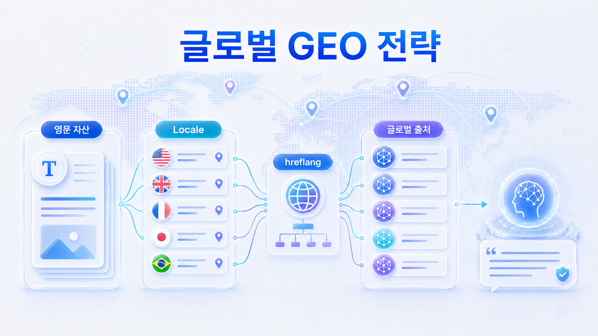
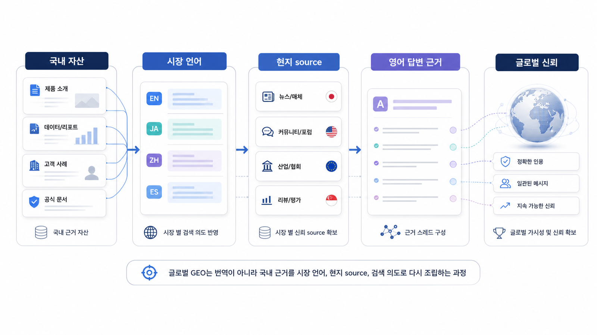

## 글로벌/영문 GEO 전략

글로벌/영문 GEO는 한국어 콘텐츠를 영어로 번역하는 작업이 아닙니다. 영어권 AI 검색이 이해하는 카테고리 언어, 국가/언어별 URL 신호, 외부 source 구조를 따로 설계하는 작업입니다.

국내에서 브랜드가 어느 정도 알려져 있어도, 영어권 답변 시장에서는 처음 보는 엔티티일 수 있습니다. 이때 AI는 자사 홈페이지 한 페이지만 보지 않습니다. 영문 카테고리 페이지, 문서, 리뷰, 디렉터리, 커뮤니티, 파트너 페이지, 언론 기사, 구조화 데이터, hreflang/canonical 신호를 함께 읽고 “이 브랜드를 어떤 시장의 어떤 후보로 볼지” 판단합니다.

[TOC]

## 글로벌 GEO에서 먼저 바뀌는 기준

국내 GEO와 글로벌 GEO는 같은 방법론을 공유하지만, 판단 기준이 달라집니다. 한국어 질문 시장에서는 자사 블로그/국내 언론/네이버 검색 결과가 강한 신호가 될 수 있습니다. 반면 영어권 시장에서는 영어 카테고리 정의, 해외 경쟁 대안, 영문 리뷰/디렉터리, 현지 커뮤니티 언급, 국제화 기술 신호가 함께 필요합니다.

| 구분 | 국내 GEO에서 자주 보는 것 | 글로벌/영문 GEO에서 추가로 봐야 할 것 |
|---|---|---|
| 카테고리 | 한국어 제품명/서비스명/문제 표현 | 영어권 카테고리명, 대안군, 구매자가 쓰는 표현 |
| 질문셋 | 국내 검색/AI 질문 | US/Global/SEA 등 시장별 영어 질문과 비교 질문 |
| 출처 | 자사 블로그, 국내 기사, 네이버/국내 커뮤니티 | 영문 문서, 리뷰 사이트, 디렉터리, Reddit, 파트너 페이지, 글로벌 미디어 |
| 기술 신호 | indexability, schema, sitemap, canonical | locale, hreflang, 언어별 canonical, 다국어 sitemap, 국가별 내부 링크 |
| 신뢰 신호 | 국내 사례/브랜드 인지도 | 영문 케이스, 글로벌 고객/파트너, 영어권 제3자 설명 |

## 번역과 현지화는 다르다

영문 GEO에서 가장 흔한 실패는 “한국어 페이지를 영어로 옮기면 글로벌 페이지가 된다”고 보는 것입니다. 번역은 문장을 다른 언어로 바꾸는 일입니다. 현지화는 그 시장의 질문, 비교 기준, 구매 맥락, 규제, 가격 단위, 지원 범위, 경쟁사를 반영해 답변 재료를 다시 구성하는 일입니다.

예를 들어 한국어로 `AI 검색 최적화 솔루션`이라고 부르는 서비스를 영어로 그대로 `AI search optimization solution`이라고 옮길 수는 있습니다. 하지만 영어권 시장에서 사용자가 실제로 묻는 질문이 `best LLM visibility tools`, `Generative Engine Optimization platform`, `AI search monitoring software`, `brand visibility in ChatGPT`라면, 영문 페이지는 이 표현들과의 관계를 설명해야 합니다.

## 국내 GEO 자산을 글로벌 자산으로 바꾸는 순서

글로벌 GEO는 한국어 페이지를 영어로 번역하는 일이 아니라, 시장별 query/source/locale을 다시 설계하는 일입니다. 국내에서 성과가 있던 콘텐츠도 영어권에서는 카테고리명, 경쟁사, 리뷰 채널, 구매 기준이 달라질 수 있습니다.

| 국내 자산 | 글로벌에서 다시 정할 것 | 산출물 |
|---|---|---|
| 한국어 핵심 query | 영어권 category/query 표현 | English question portfolio |
| 한국어 Answer-first 페이지 | 영문 첫 답변/비교 기준/FAQ | English category page |
| 국내 source/citation | G2, Product Hunt, Reddit, global media | global source map |
| 국내 URL 구조 | locale, hreflang, canonical | international URL checklist |
| 국내 사례 | 영문 case/proof/partner signal | global proof package |
| 국내 리포트 | US/Global 질문셋 재측정 | market-by-market report |

AcmeGEO가 국내에서 `GEO 도구`로 설명되더라도, 영어권에서는 `AI search visibility monitoring`, `LLM visibility analytics`, `AI citation tracking` 같은 표현과 어떻게 연결되는지 먼저 정해야 합니다.

*글로벌 GEO는 번역이 아니라 국내 근거를 시장 언어, 현지 source, 검색 의도로 다시 조립하는 과정이다.*

## 글로벌 확장 3단계

이 장은 `영문 카테고리 자산 → locale/hreflang → 글로벌 답변 근거 맵` 순서로 읽습니다. 세 단계가 함께 맞아야 AI가 시장별 답변에서 브랜드를 안정적으로 이해합니다.

| 단계 | 핵심 질문 | 산출물 |
|---|---|---|
| 1. 영문 카테고리 자산 | 영어권에서 우리는 어떤 카테고리의 어떤 후보인가? | 영문 카테고리 정의, 첫 답변 문단, 비교 기준, FAQ |
| 2. locale/hreflang | 어느 URL이 어느 언어/지역 사용자를 위한 대표 페이지인가? | 언어별 URL 표, hreflang/canonical 점검표, 다국어 sitemap 요청사항 |
| 3. 글로벌 source map | AI가 영어권 답변에서 참고할 외부 근거는 어디인가? | 미디어/리뷰/디렉터리/커뮤니티/파트너 source map |

## 글로벌 GEO 감사 질문

글로벌 페이지를 점검할 때는 다음 질문을 먼저 던집니다.

| 감사 질문 | 왜 중요한가 | 확인 위치 |
|---|---|---|
| 영어 첫 문단만 읽어도 카테고리와 대상 고객이 보이는가? | AI와 사용자가 브랜드를 분류하는 첫 기준입니다 | 영문 홈페이지/카테고리 페이지 |
| 한국어 페이지와 영문 페이지가 서로 다른 시장 질문에 답하는가? | 단순 번역이면 현지 질문에서 밀릴 수 있습니다 | KO/EN 콘텐츠 비교 |
| hreflang이 상호 참조되고 canonical과 충돌하지 않는가? | 언어/지역별 대표 URL 혼선을 줄입니다 | HTML head/sitemap/Search Console |
| 영어권 제3자 출처가 브랜드를 같은 방식으로 설명하는가? | 글로벌 답변의 source/citation 후보가 됩니다 | 디렉터리/리뷰/언론/커뮤니티 |
| 국가별 질문셋으로 재측정하고 있는가? | 글로벌 노출은 시장별로 따로 봐야 합니다 | GEO 리포트/질문셋 |

## Google 공식 문서로 확인할 기준

Google은 다국어/다지역 사이트를 운영할 때 각 언어 또는 지역 버전의 페이지를 명확히 알려야 한다고 안내합니다. 핵심은 `hreflang`으로 대체 버전을 표시하고, 각 버전이 서로를 참조하며, canonical과 충돌하지 않게 관리하는 것입니다. Google의 [Localized Versions of your Pages](https://developers.google.com/search/docs/specialty/international/localized-versions), [Managing Multi-Regional and Multilingual Sites](https://developers.google.com/search/docs/specialty/international/managing-multi-regional-sites), [canonical 지정 가이드](https://developers.google.com/search/docs/crawling-indexing/consolidate-duplicate-urls)를 함께 봐야 합니다.

GEO 관점에서는 이 기준을 검색 색인 문제로만 보지 않습니다. AI 검색이 여러 언어 페이지를 답변 근거로 읽을 때, 어떤 페이지가 어느 시장의 대표 source인지 명확해야 같은 브랜드라도 국가별 답변이 흔들리지 않습니다.

## 이 장에서 다루는 세부 페이지

- [08-01. 영문 카테고리 자산은 왜 먼저 필요한가](https://wikidocs.net/346359)
- [08-02. Locale/hreflang은 GEO에서 어떻게 봐야 하나](https://wikidocs.net/346360)
- [08-03. 글로벌 답변 근거 맵을 만드는 법](https://wikidocs.net/346361)

## HaloX로 이어지는 지점

글로벌 GEO는 자사 사이트와 외부 출처가 같은 설명을 반복할 때 강해집니다. HaloX의 [GEO 평판/브랜드 합의 신호](https://haloxlabs.ai/ko/blog/geo-reputation-brand-consensus)는 여러 출처가 브랜드를 같은 카테고리/기능/대상 고객으로 설명하는지 보는 기준으로 연결됩니다. 영문 페이지 구조는 HaloX의 [AI 검색이 선택하는 콘텐츠 구조](https://haloxlabs.ai/ko/blog/ai-preferred-content-structure)와 [GEO 콘텐츠 구조화 가이드](https://haloxlabs.ai/ko/blog/geo-content-structure)를 글로벌 시장 언어로 확장해서 적용하면 됩니다.

## 다음 흐름

이 장은 앞선 [07. 산업별 GEO 전략](https://wikidocs.net/346335)의 흐름을 글로벌 시장으로 확장합니다. 세부 페이지를 읽은 뒤에는 [09. GEO 리포트와 실행 검증](https://wikidocs.net/346337)으로 넘어가 글로벌 GEO 실행 결과를 리포트와 다음 액션으로 어떻게 검증할지 점검합니다.
