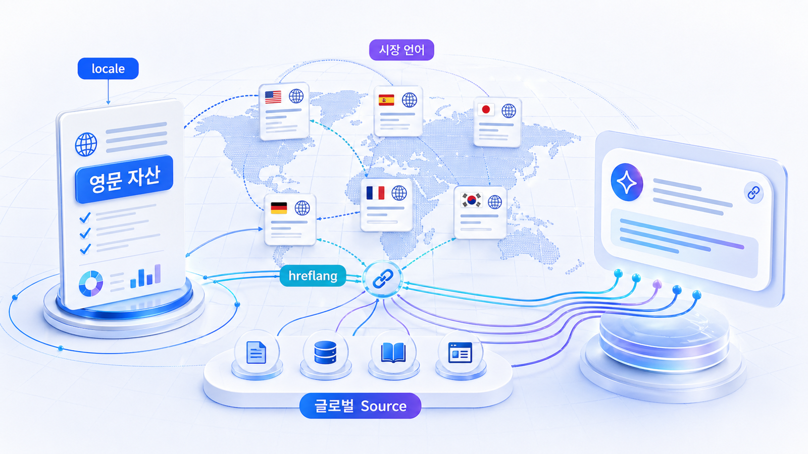

## 글로벌/영문 GEO 전략

이 장은 `글로벌/영문 GEO 전략`를 하나의 큰 주제로만 설명하지 않고, 실무자가 바로 따라 할 수 있는 세부 페이지로 나눕니다. GEO는 개념을 아는 것보다 질문, 콘텐츠, 출처, 기술, 리포트가 어떻게 이어지는지 보는 것이 중요합니다.

국내 사이트를 해외 질문 시장으로 확장하려면 언어, 지역, 출처 구조를 함께 봐야 합니다. 각 세부 페이지는 영문 자산과 locale/hreflang, 글로벌 source map을 순서대로 점검합니다.

## 글로벌 확장 패키지

이 장의 세부 페이지는 `영문 카테고리 자산 → locale/hreflang → 글로벌 source map` 순서로 이어집니다. 번역보다 먼저 영어권 AI가 이해할 시장 언어와 출처 구조를 잡습니다.

## 이 장에서 다루는 세부 페이지

- [08-01. 영문 카테고리 자산은 왜 먼저 필요한가](https://wikidocs.net/346359)
- [08-02. Locale/hreflang은 GEO에서 어떻게 봐야 하나](https://wikidocs.net/346360)
- [08-03. 글로벌 source map을 만드는 법](https://wikidocs.net/346361)

## 읽는 순서

처음 읽는다면 [08-01. 영문 카테고리 자산은 왜 먼저 필요한가](https://wikidocs.net/346359)부터 순서대로 읽습니다. 이미 실무 과제가 정해져 있다면 현재 막힌 지점부터 읽어도 됩니다. 예를 들어 질문 설계가 막히면 질문맵 페이지를, 콘텐츠 실행이 막히면 리라이트 체크리스트를, 리포트 운영이 막히면 실행 리포트 페이지를 먼저 봅니다.

## 학습과 실무에서의 역할

| 사용 장면 | 이 장의 역할 | 산출물 |
|---|---|---|
| 실무 적용 | 한 단계의 실행 흐름을 정리 | 질문맵/체크리스트/리포트 |
| 실무 | 현재 병목을 진단 | 콘텐츠 갭/출처 맵/기술 점검 |
| 실무 적용 | 글로벌 확장 점검 기준 | 표/정리 양식/FAQ |

## HaloX로 이어지는 지점

글로벌 GEO는 출처와 브랜드 합의 신호가 중요합니다. HaloX의 [GEO 평판/브랜드 합의 신호](https://haloxlabs.ai/ko/blog/geo-reputation-brand-consensus)를 함께 보면 영문 source map을 왜 따로 만들어야 하는지 이해하기 쉽습니다. 글로벌 페이지는 단순 번역보다 대상 시장과 언어 신호가 중요합니다. Google의 [다국어/다지역 사이트 가이드](https://developers.google.com/search/docs/specialty/international/localized-versions)를 함께 보면 hreflang과 locale 점검 기준을 잡기 쉽습니다.

## 다음 흐름

이 장은 앞선 [07. 산업별 GEO 전략](https://wikidocs.net/346335)의 흐름을 이어받습니다. 세부 페이지를 읽은 뒤에는 다음 장으로 넘어가 전체 GEO 운영 흐름을 이어갑니다.
