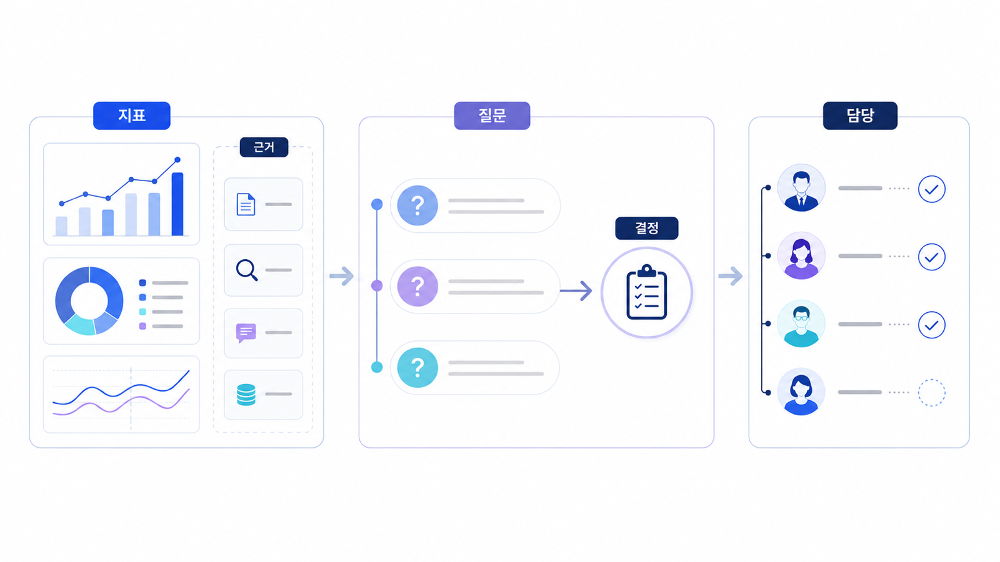

## GEO 리포트 핵심 항목과 실행 판단 기준


GEO 리포트는 점수표가 아니라 실행 판단 문서입니다. 좋은 리포트는 질문셋, mention/source/citation, 경쟁 문맥, 원인, 다음 액션을 한 흐름으로 보여줍니다.

리포트가 “가시성 72점”에서 끝나면 팀은 움직이지 못합니다. 어떤 질문에서 빠졌고, 어떤 URL이나 출처가 약하며, 이번 달 무엇을 고칠지 보여야 합니다.

[TOC]

## 먼저 볼 기준

| 기준 | 읽는 법 |
|---|---|
| 질문셋 | 어떤 질문을 기준으로 측정했는지 보인다 |
| 원인 | 콘텐츠/source/기술 중 약한 지점이 나뉜다 |
| 액션 | 30일 안에 고칠 과제가 나온다 |

## 실행 흐름

1. 리포트 기간, 엔진, 질문셋, 측정 조건을 먼저 고정한다.
2. mention/source/citation을 한 점수로 합치지 않고 질문군별로 나눈다.
3. 경쟁 URL과 공식 URL이 반복되는 이유를 리포트 문장으로 적는다.
4. 콘텐츠, 출처, 기술, 리포트 중 이번 달 실행 과제를 하나로 좁힌다.
5. 다음 리포트에서 같은 질문셋으로 변화와 원인을 설명한다.



*리포트를 실행 과제로 바꾸는 구조*

## 리포트 예시

AcmeGEO 리포트가 “추천형 질문에서 mention은 40%지만 citation은 10%”라고 말한다면, 다음 문장은 “공식 리포트 예시 페이지와 외부 비교 글을 보강한다”가 되어야 합니다. 숫자는 액션으로 이어져야 합니다.

## 정리 양식

```text
리포트 기간:
질문셋:
가장 약한 지표:
경쟁 URL:
원인:
30일 액션:
```

## 다음 흐름

지표 해석은 [mention/source/citation 지표 해석](https://wikidocs.net/346363)에서 더 나눠 봅니다.
