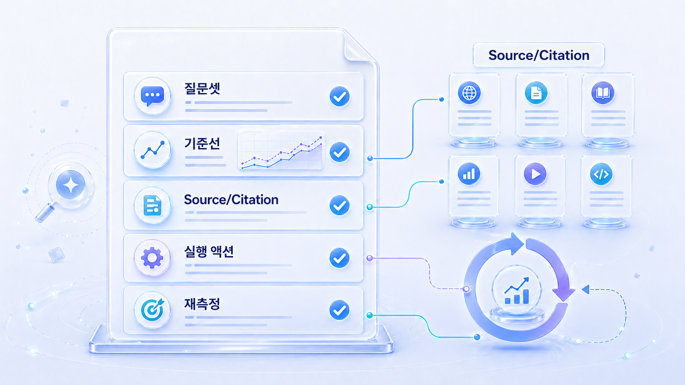

## GEO 리포트는 무엇을 보여줘야 하나



GEO 리포트는 “AI 검색에 우리 브랜드가 나왔는가”만 확인하는 표가 아닙니다. 좋은 리포트는 어떤 질문에서 브랜드가 보였는지, 어떤 답변 근거(source)가 쓰였는지, 실제 화면 인용(citation)은 어느 URL로 잡혔는지, 경쟁사는 어떤 문맥에서 함께 등장했는지, 다음에 무엇을 고쳐야 하는지 보여줘야 합니다.

이 페이지는 직접 실행한 리포트, 도구 리포트, 대행사/컨설팅 리포트를 모두 같은 기준으로 읽기 위한 기본 틀입니다. 외부 파트너를 검토할 때도 먼저 “무엇을 증명해야 하는가”가 아니라 “리포트가 어떤 판단을 가능하게 하는가”를 봐야 합니다.

## GEO 리포트의 목적

GEO 리포트의 목적은 보고가 아니라 판단입니다. 리포트를 보고 다음 행동이 정해지지 않는다면 점수가 아무리 정교해도 실무에는 약합니다.

| 리포트 목적 | 답해야 하는 질문 | 다음 액션 예시 |
|---|---|---|
| 현재 상태 확인 | 우리 브랜드가 어떤 질문에서 보이나? | 기준선 질문셋 확정 |
| 원인 파악 | 빠진 이유가 콘텐츠/출처/기술 중 어디에 있나? | 리라이트/source 보강/개발 티켓 분리 |
| 경쟁 비교 | 경쟁사는 어떤 질문과 source에서 강한가? | 비교 콘텐츠/외부 출처/뉴스룸 보강 |
| 리스크 발견 | 잘못된 설명이나 오래된 source가 반복되는가? | 공식 설명 수정/FAQ/정정 페이지 작성 |
| 재측정 준비 | 다음 달 같은 조건으로 비교할 수 있나? | 질문셋 버전 관리/측정 조건 기록 |

## 리포트에 반드시 있어야 할 7가지

| 항목 | 좋은 상태 | 위험 신호 |
|---|---|---|
| 질문셋 | 원문 질문, 질문 유형, 구매 단계, 산업 맥락이 보임 | 질문 없이 점수만 있음 |
| 측정 조건 | 플랫폼, 모델, 날짜, 언어/지역, 반복 여부가 기록됨 | 언제 어디서 측정했는지 불명확 |
| mention | 브랜드 언급 여부와 문맥이 분리됨 | 언급 수만 보여줌 |
| 답변 근거(source) | AI가 참고한 페이지/도메인/채널이 분류됨 | source와 citation을 섞어서 표현 |
| 화면 인용(citation) | 실제 링크로 표시된 URL이 따로 정리됨 | citation URL 단위 분석이 없음 |
| 경쟁 문맥 | 경쟁사가 왜 등장했는지 source와 콘텐츠 기준으로 설명 | 단순 순위표만 있음 |
| 실행 액션 | 콘텐츠/오프사이트/기술/제품 메시지 액션이 나뉨 | “콘텐츠 강화 필요” 같은 추상 문장만 있음 |

## 리포트 한 장 요약 예시

아래 예시는 형식입니다. 실제 리포트에서는 브랜드/산업/질문셋에 맞게 바꿔야 합니다.

```text
이번 달 핵심 변화: 브랜드 mention은 늘었지만 공식 페이지 citation은 약함
강한 질문군: 브랜드 직접 질문, 제품 기능 질문
약한 질문군: 비교/대안 질문, 가격/도입 질문
주요 source: 자사 블로그 2개, 외부 리뷰 1개, 경쟁사 비교 페이지 3개
주요 문제: answer-first 문단 부족, FAQ 누락, Product/Organization schema 불일치
다음 30일 액션: 비교 페이지 2개 리라이트, FAQ/schema 보강, 외부 디렉터리 설명 정렬
재측정 기준: 같은 질문셋 40개로 mention/source/citation 변화 비교
```

이 요약은 경영진 보고, 콘텐츠팀 실행, 개발팀 요청, 외부 파트너 검토를 하나의 기준으로 묶습니다.

## 질문셋 없이 리포트는 성립하지 않는다

GEO 리포트의 품질은 질문셋 품질에서 시작합니다. 질문셋이 모호하면 점수도 모호해집니다.

| 질문셋 유형 | 예시 | 리포트에서 봐야 할 것 |
|---|---|---|
| 브랜드형 | HaloX는 무엇인가? | 브랜드 설명 정확성, 공식 source 여부 |
| 카테고리형 | GEO 도구는 무엇을 봐야 하나? | 카테고리 후보 진입 여부 |
| 비교형 | Profound와 HaloX는 무엇이 다른가? | 경쟁 문맥, 차별 기준, source/citation |
| 문제 해결형 | AI 검색에서 브랜드가 안 보이면 무엇을 고쳐야 하나? | 콘텐츠/기술/오프사이트 액션 연결 |
| 산업형 | B2B SaaS GEO 리포트는 어떤 지표를 봐야 하나? | 산업별 질문과 신뢰 출처 |
| 리스크형 | AI가 잘못된 정보를 말하면 어떻게 대응하나? | 공식 정정 source와 위험 표현 |

## 직접 실행 리포트와 외부 리포트의 차이

직접 실행 리포트는 처음에는 단순해도 괜찮습니다. 중요한 것은 같은 질문셋과 같은 기준으로 반복 측정하는 것입니다. 반대로 외부 리포트나 유료 도구는 더 많은 데이터를 보여줄 수 있지만, 질문셋과 액션 기준이 불명확하면 판단에 도움이 되지 않습니다.

| 구분 | 장점 | 확인할 점 |
|---|---|---|
| 직접 실행 리포트 | 우리 맥락에 맞게 질문을 설계 가능 | 반복성/기록 방식/플랫폼 조건 관리 필요 |
| 도구 리포트 | 반복 측정과 대시보드 공유가 쉬움 | 질문셋/지표 정의/액션 연결 확인 필요 |
| 대행사/컨설팅 리포트 | 해석과 실행 우선순위 제안 가능 | 과장된 약속보다 증거와 재측정 기준 확인 필요 |
| 내부 월간 리포트 | 팀 액션과 담당을 바로 연결 가능 | 경영진/콘텐츠/개발 관점 분리 필요 |

## 리포트 검토 질문 예시

```text
1. 이 리포트의 질문셋 원문은 무엇인가요?
2. 질문은 브랜드형/카테고리형/비교형/문제 해결형/산업형으로 나뉘어 있나요?
3. mention, 답변 근거(source), 화면 인용(citation)을 각각 어떻게 구분했나요?
4. 경쟁사가 나온 이유를 source와 콘텐츠 구조로 설명할 수 있나요?
5. 콘텐츠/오프사이트/테크니컬 중 무엇을 먼저 고쳐야 하나요?
6. 다음 30일 뒤 같은 조건으로 무엇을 비교하나요?
```

## 실습 워크시트

| 입력 항목 | 작성 기준 |
|---|---|
| 리포트 목적 | 기준선/재측정/월간 운영/도구 검토/제안서 검토 |
| 질문셋 | 질문 원문과 유형 |
| 측정 조건 | 플랫폼/날짜/언어/지역/반복 여부 |
| 현재 상태 | mention/source/citation/경쟁사 요약 |
| 원인 가설 | 콘텐츠/출처/기술/제품 메시지 중 병목 |
| 다음 액션 | 30일 안에 실행할 작업 |
| 재측정 기준 | 같은 질문셋으로 볼 지표 |

## 체크리스트

- 질문셋 원문이 리포트에 포함되어 있는가?
- mention/source/citation이 분리되어 있는가?
- 경쟁사가 왜 등장했는지 설명할 수 있는가?
- 콘텐츠/오프사이트/기술 액션이 구분되어 있는가?
- 다음 30일 액션과 담당자가 정해져 있는가?
- 같은 질문셋과 조건으로 다시 측정할 수 있는가?
- 리포트가 점수보다 의사결정에 도움이 되는가?

## 참고 링크 패키지

GEO 리포트의 기본 지표는 [02-03. 브랜드 언급률, 답변 근거, 화면 인용은 어떻게 나눠 읽나](https://wikidocs.net/346350)와 [02-04. AI 검색 리포트는 어떤 지표로 읽어야 하나](https://wikidocs.net/346351)를 먼저 참고하면 좋습니다. 리포트에서 source/citation이 약하게 나온다면 [05-01. 답변 근거와 화면 인용은 무엇이 다른가](https://wikidocs.net/346347)와 [06. 테크니컬 GEO와 사이트 구조](https://wikidocs.net/346334)를 함께 봐야 합니다.

## 흔한 질문

**Q. 리포트에 점수 하나만 있어도 되나요?**

점수는 요약 지표로 쓸 수 있지만, 점수만으로는 실행이 어렵습니다. 질문셋, source, citation, 경쟁 문맥, 다음 액션이 함께 있어야 합니다.

**Q. 리포트는 매월 꼭 만들어야 하나요?**

모든 브랜드가 매월 리포트를 만들 필요는 없습니다. 다만 콘텐츠/출처/기술을 지속적으로 고치는 팀이라면 월간 리포트가 실행 로그와 재측정 기준 역할을 합니다.

**Q. 대행사 리포트와 내부 리포트는 다르게 봐야 하나요?**

형식은 다를 수 있지만 기준은 같습니다. 질문셋이 공개되고, 지표가 분리되고, 다음 액션과 재측정 기준이 있어야 합니다.

## 다음 흐름

이전: [09. GEO 리포트와 실행 검증](https://wikidocs.net/346337) / 다음: [09-02. mention/source/citation 지표는 어떻게 해석하나](https://wikidocs.net/346363)
