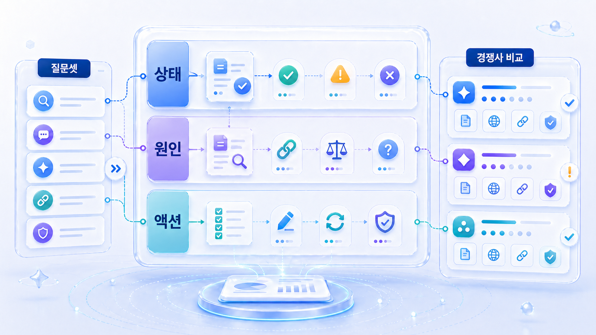
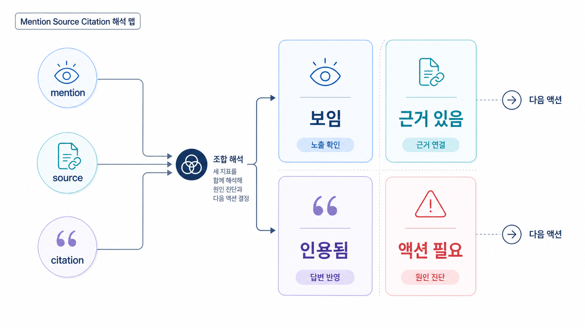

## mention/source/citation 지표는 어떻게 해석하나



GEO 리포트에서 가장 중요한 세 가지 지표는 mention, 답변 근거(source), 화면 인용(citation)입니다. 이 셋을 분리해서 읽어야 AI 검색 성과가 실제로 좋아진 것인지, 단순히 브랜드 이름만 한 번 나온 것인지 판단할 수 있습니다.

mention은 브랜드가 답변에 언급되었는지, source는 AI가 답변을 구성할 때 참고한 근거가 무엇인지, citation은 사용자 화면에 실제 링크로 표시된 URL이 무엇인지에 가깝습니다. 플랫폼마다 세부 구현은 다르지만, 실무에서는 이 셋을 나눠 기록해야 다음 액션이 보입니다.

[TOC]

## 세 지표의 차이

| 지표 | 무엇을 보는가 | 좋은 상태 | 위험한 상태 |
|---|---|---|---|
| mention | 답변 안에 브랜드/제품/사람/페이지가 언급되는가 | 정확한 카테고리와 문맥으로 언급 | 이름은 나오지만 설명이 틀림 |
| 답변 근거(source) | AI가 답변을 구성할 때 참고한 출처는 무엇인가 | 공식 페이지/신뢰 출처/최신 콘텐츠가 근거로 쓰임 | 오래된 기사나 경쟁사 페이지에 의존 |
| 화면 인용(citation) | 사용자 화면에 링크로 표시되는 URL은 무엇인가 | 공식 페이지나 의도한 콘텐츠가 citation으로 표시 | 외부 글만 인용되거나 관련 없는 URL이 표시 |
| co-mention | 어떤 경쟁사/대안과 함께 나오는가 | 원하는 비교군과 함께 등장 | 다른 카테고리 브랜드와 묶임 |
| sentiment/context | 어떤 평가 문맥으로 설명되는가 | 강점/대상/제한 조건이 정확함 | 과장/오해/부정확한 비교가 반복 |

## 조합별 해석법

mention/source/citation은 따로 볼 때보다 조합으로 읽어야 합니다.

| 상태 | 해석 | 다음 액션 |
|---|---|---|
| mention 없음 / source 없음 / citation 없음 | 질문 시장에서 후보로 잡히지 않음 | 카테고리 페이지, FAQ, 외부 source부터 확보 |
| mention 있음 / source 약함 / citation 없음 | 이름은 알려졌지만 근거가 약함 | 공식 설명, 외부 출처, 구조화된 콘텐츠 보강 |
| mention 있음 / source 있음 / citation 없음 | 답변 재료는 되지만 화면 링크로 이어지지 않음 | answer-first 문단, title/canonical, 내부 링크, schema 점검 |
| mention 있음 / source 있음 / citation 있음 | 기본 가시성은 확보 | 문맥 정확성, 경쟁 비교, 전환 액션 보강 |
| mention 있음 / citation은 외부 글만 잡힘 | 제3자 출처 의존도가 높음 | 공식 페이지의 설명력과 신뢰 신호 강화 |
| mention 있음 / 설명이 틀림 | 엔티티/카테고리 합의 신호가 흔들림 | Organization/ProfilePage/schema, 소개 문단, 외부 프로필 정렬 |



<small>mention, source, citation은 따로 보는 지표가 아니라 조합으로 원인과 다음 액션을 판단해야 한다.</small>


## 플랫폼별로 같은 지표도 다르게 보인다

ChatGPT, Perplexity, Google AI Overviews, Gemini 등은 답변 생성 방식과 citation 노출 방식이 다릅니다. 그래서 “AI 검색에 나왔다”를 한 줄로 묶으면 안 됩니다.

| 플랫폼/환경 | 주로 확인할 것 | 리포트에서 주의할 점 |
|---|---|---|
| ChatGPT | 답변 문맥, 추천 후보, 브랜드 설명 정확성 | citation이 항상 같은 방식으로 보이지 않을 수 있음 |
| Perplexity | source와 citation URL | 인용 URL이 실제로 질문 의도와 맞는지 확인 |
| Google AI Overviews | 검색 쿼리와 화면 인용 후보 | 검색 결과/검색 의도/페이지 품질 신호와 함께 해석 |
| Gemini/기타 AI | 브랜드 설명과 비교 문맥 | 플랫폼별 반복성/언어 조건 기록 필요 |
| 수동 프롬프트 테스트 | 질문 표현에 따른 답변 차이 | 한 번의 답변을 일반화하지 않기 |

Google AI Overviews처럼 검색 결과와 연결되는 환경은 기존 SEO 신호와도 이어집니다. Google의 [유용한 콘텐츠 만들기](https://developers.google.com/search/docs/fundamentals/creating-helpful-content), [title link](https://developers.google.com/search/docs/appearance/title-link), [snippet](https://developers.google.com/search/docs/appearance/snippet), [canonical](https://developers.google.com/search/docs/crawling-indexing/consolidate-duplicate-urls) 문서를 함께 보면 citation 후보가 되는 페이지의 기본 상태를 점검하기 쉽습니다.

## 지표 변화량을 과대해석하지 않는 법

GEO 지표는 플랫폼, 질문셋, 모델, 날짜에 따라 흔들릴 수 있습니다. 그래서 단일 수치 변화보다 같은 질문군에서 반복되는 패턴을 봐야 합니다.

| 변화 | 조심할 점 | 확인할 보조 데이터 |
|---|---|---|
| mention 급증 | 브랜드 질문 비중이 늘었을 수 있음 | 질문군 비중/비브랜드 결과 |
| citation 증가 | 외부 복제본만 인용될 수 있음 | 대표 URL 여부/canonical |
| source 변화 | 일시적 기사 노출일 수 있음 | 다음 달 반복성/source diversity |
| answer quality 개선 | 일부 질문에만 국한될 수 있음 | 질문군별 accuracy |
| 경쟁사 하락 | 시장 질문 자체가 바뀌었을 수 있음 | SERP/GSC/트렌드 변화 |

## 리포트는 상태 → 원인 → 액션 순서로 읽는다

점수 화면만 보면 팀은 움직이지 못합니다. 좋은 리포트는 다음 순서로 읽어야 합니다.

1. **상태**: 지금 AI 답변에 보이는가?
2. **문맥**: 어떤 카테고리/역할/평가로 설명되는가?
3. **근거**: 어떤 source가 답변을 뒷받침하는가?
4. **인용**: 어떤 URL이 citation으로 보이는가?
5. **경쟁**: 어떤 경쟁사가 어떤 source와 함께 나오는가?
6. **액션**: 다음 측정 전 무엇을 바꿀 것인가?

## 사례로 이해하기

엔터프라이즈 뉴스룸은 보도자료와 블로그를 많이 운영하지만 AI 답변에서는 경쟁사나 제3자 매체가 더 자주 인용될 수 있습니다. 이때 리포트가 단순히 “노출 낮음”이라고만 말하면 팀은 무엇을 고쳐야 할지 모릅니다.

좋은 리포트는 질문별로 답변 근거(source)와 화면 인용(citation)을 분리합니다. 예를 들어 특정 질문에서는 자사 뉴스룸이 답변 근거 후보로 잡히지만 화면 인용은 외부 기사로 빠질 수 있습니다. 이 경우 자사 페이지의 answer-first 구조, schema, 내부 링크, 최신성, 외부 출처와의 일관성을 함께 확인해야 합니다.

## GEO 도구 리포트 검증 체크리스트

도구 리포트를 볼 때도 같은 기준을 적용합니다. 대시보드가 예쁜지보다 지표가 행동으로 이어지는지 확인합니다.

| 검증 항목 | 통과 기준 | 보류 기준 |
|---|---|---|
| 질문셋 관리 | 질문 추가/분류/버전 관리 가능 | 고정 질문만 제공 |
| 반복 측정 | 날짜별 변화 비교 가능 | 단발성 캡처만 제공 |
| source/citation 분리 | 출처와 인용 URL을 나눠 보여줌 | 둘을 하나로 표시 |
| 경쟁사 비교 | 경쟁사가 나온 이유를 추적 | 단순 순위표만 제공 |
| 액션 연결 | 콘텐츠/기술/오프사이트 과제로 연결 | 점수 해석만 제공 |
| export/공유 | 팀 회의와 실행표로 옮길 수 있음 | 화면 안에서만 확인 가능 |

## 리포트 판단표

| 질문 | 답이 예/아니오로 나오는가 | 아니오라면 필요한 보강 |
|---|---|---|
| 어떤 질문에서 mention이 늘었나? | 예/아니오 | 질문셋 원문과 유형 추가 |
| 어떤 source가 반복적으로 쓰였나? | 예/아니오 | 도메인/페이지/채널 분류 추가 |
| citation URL이 의도한 페이지인가? | 예/아니오 | URL 단위 citation 표 추가 |
| 경쟁사가 강한 이유가 설명되는가? | 예/아니오 | 경쟁 source와 콘텐츠 구조 비교 |
| 다음 액션이 담당자별로 나뉘는가? | 예/아니오 | 콘텐츠/PR/개발 액션 분리 |

## 실습 워크시트

| 입력 항목 | 작성 기준 |
|---|---|
| 질문 | 측정한 AI 질문 원문 |
| mention | 브랜드 언급 여부와 문맥 |
| source | 답변 근거로 쓰인 도메인/페이지/채널 |
| citation | 화면에 표시된 URL |
| competitor | 함께 등장한 경쟁사/대안 |
| diagnosis | 콘텐츠/출처/기술/메시지 중 원인 |
| next action | 다음 측정 전 실행할 일 |

## 정리 양식

```text
질문 / mention 상태 / source 후보 / citation URL / 경쟁사 문맥 / 원인 진단 / 다음 액션 / 재측정일
```

## 체크리스트

- mention, source, citation을 각각 다른 열로 기록했는가?
- 플랫폼별 답변 차이를 한 점수로 뭉개지 않았는가?
- citation URL이 실제로 의도한 페이지인지 확인했는가?
- 경쟁사가 등장한 이유를 source와 콘텐츠 구조로 설명했는가?
- 점수 변화가 콘텐츠/출처/기술 액션으로 연결되는가?
- 다음 측정에서 같은 질문셋으로 비교할 수 있는가?

## 참고 링크 패키지

지표 개념은 [02-03. 브랜드 언급률, 답변 근거, 화면 인용은 어떻게 나눠 읽나](https://wikidocs.net/346350)를 먼저 보면 좋습니다. source/citation이 약한 이유를 찾을 때는 [05-01. 답변 근거와 화면 인용](https://wikidocs.net/346347), [06-05. Schema와 내부 링크](https://wikidocs.net/346353), [06-08. 메타 정보 실전 점검](https://wikidocs.net/346855)을 함께 확인합니다.

## 흔한 질문

**Q. mention이 늘면 GEO가 좋아진 건가요?**

부분적으로는 좋아진 신호일 수 있습니다. 하지만 source와 citation이 약하거나 문맥이 틀리면 아직 안정적인 성과라고 보기 어렵습니다.

**Q. citation만 보면 되나요?**

citation은 중요하지만 전부는 아닙니다. citation이 없어도 답변 근거로 쓰이는 source가 있을 수 있고, mention 문맥이 브랜드 인식에 영향을 줄 수 있습니다.

**Q. 도구마다 점수가 다르면 무엇을 믿어야 하나요?**

점수 자체보다 질문셋, 측정 조건, 지표 정의, 반복 측정 가능성을 봐야 합니다. 서로 다른 도구의 점수를 직접 비교하기보다 같은 도구 안에서 변화와 원인을 보는 편이 안전합니다.

## 다음 흐름

이전: [09-01. GEO 리포트는 무엇을 보여줘야 하나](https://wikidocs.net/346362) / 다음: [09-03. GEO 실행 범위와 비용은 어떻게 판단하나](https://wikidocs.net/346364)
