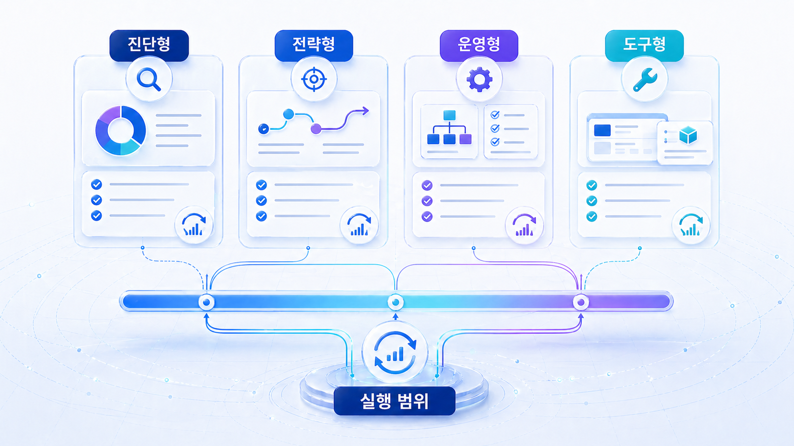
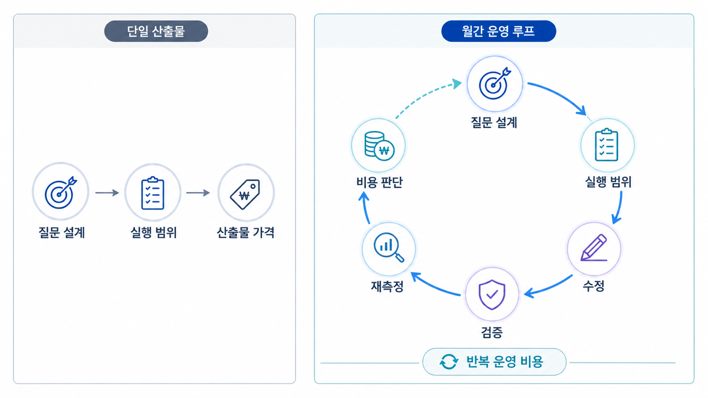

## GEO 실행 범위와 비용 판단



GEO 비용은 산출물 개수보다 운영 범위로 판단해야 합니다. 한 번의 진단인지, 콘텐츠와 출처를 고치는 전략 프로젝트인지, 매달 재측정하는 운영인지에 따라 가격과 기대값이 달라집니다.

먼저 구매자가 무엇을 증명하고 싶은지 정해야 합니다. 브랜드가 AI 답변에 보이는지, 왜 빠지는지, 무엇을 고치면 달라지는지, 매달 반복할 가치가 있는지에 따라 범위가 달라집니다.

[TOC]

## 먼저 볼 기준

| 기준 | 읽는 법 |
|---|---|
| 진단 | 현재 상태와 약한 질문군을 확인한다 |
| 전략 | 콘텐츠/source/기술 액션을 설계한다 |
| 운영 | 30일 단위로 재측정하고 개선한다 |

## 실행 흐름

1. 대표 질문을 정한다.
2. 현재 AI 답변에서 mention/source/citation을 나눠 본다.
3. 경쟁 브랜드나 반복 URL이 어떤 이유로 등장하는지 확인한다.
4. 우리 공식 페이지, 외부 출처, 기술 조건 중 먼저 고칠 곳을 고른다.
5. 같은 질문군으로 30일 뒤 다시 본다.



*진단/전략/운영 범위 구분*

## 비용 판단 예시

AcmeGEO가 첫 달에는 30개 질문 기준선만 필요하다면 진단 범위가 맞습니다. 반대로 경쟁사 URL을 따라잡고 매달 리포트를 남겨야 한다면 운영 범위로 봐야 합니다.

## HaloX 운영 리포트와 연결하기

9장의 페이지는 모두 “성과를 어떻게 설명하고 다음 실행으로 넘길 것인가”에 연결됩니다. HaloX docs의 GEO 리포트 예시처럼 점수만 나열하지 말고, `대시보드`, `프롬프트 분석`, `인용 추적`, `사이트 진단`, `전략맵`을 한 문장 흐름으로 묶어야 합니다.

| 리포트 구성 | 써야 할 내용 |
|---|---|
| 이번 변화 | AVI, 인용률, 출처 가시성, 웹 건강도 중 의미 있는 변화 |
| 원인 | 어떤 질문군/URL/source에서 차이가 생겼는지 |
| 실행 | 콘텐츠 브리프, 기술 수정, 외부 source 보강, 재측정 중 다음 액션 |
| 공유 문장 | 고객/임원/실행팀이 같은 결정을 하도록 쓰는 한 문장 |

## 보고서에 남길 문장

```text
이번 달 판단은 점수 상승/하락보다 질문군별 원인 분리입니다. 비교 질문군에서는 공식 URL citation이 약하므로, FAQ/비교표 보강과 사이트 진단 이슈 수정 후 같은 질문셋으로 재측정합니다.
```

## 정리 양식

```text
목표:
필요한 증명:
질문 수:
수정 범위:
재측정 주기:
예산 판단:
```

## 다음 흐름

외부 제안서를 비교할 때는 [GEO 제안서 비교](https://wikidocs.net/346397)를 봅니다.
