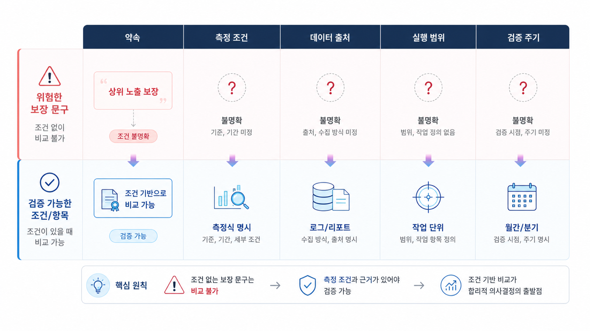

## GEO 제안서 검토: 측정 조건과 실행 범위 확인


GEO 제안서는 멋진 성과 문구보다 **측정 조건과 실행 범위**를 먼저 확인해야 합니다. “AI 검색 노출을 높이겠습니다”라는 말만으로는 견적, 성과, 책임 범위를 비교할 수 없습니다.

좋은 제안서는 질문셋, 모델, 지역, 언어, 측정 기간을 먼저 고정합니다. 그다음 브랜드 언급, 답변 근거(source), 화면 인용(citation), 사이트 이슈, 콘텐츠 실행 과제를 분리합니다. 이 순서가 있어야 고객과 실행팀이 같은 리포트를 보고 같은 결정을 내릴 수 있습니다.

HaloX 공식 문서의 [GEO 리포트 예시](https://docs.haloxlabs.ai/ko/guides/geo-report-example)도 같은 기준으로 읽으면 좋습니다. 점수만 보는 것이 아니라, 어떤 질문에서 확인했고, 어떤 URL이 근거로 쓰였고, 다음 주에 무엇을 고칠지까지 이어져야 합니다.

[TOC]

## 제안서에서 먼저 확인할 것

제안서를 받으면 가격표보다 아래 항목을 먼저 봅니다. 이 항목이 없으면 실행 전후를 비교할 기준이 없습니다.

| 확인 항목 | 제안서에 보여야 할 내용 | 비어 있을 때 생기는 문제 |
|---|---|---|
| 질문셋 | 브랜드/비브랜드/비교/구매 검토 질문 구분 | 유리한 질문만 골라 성과처럼 보일 수 있음 |
| 측정 조건 | 모델, 지역, 언어, 측정일, 반복 횟수 | 다음 달 수치와 비교할 수 없음 |
| 지표 구분 | mention/source/citation, AVI, 웹 건강도 | 점수 변화의 원인을 설명하기 어려움 |
| 실행 범위 | 콘텐츠, source 보강, 기술 수정, 리포트 운영 | 진단만 하고 실행 책임이 흐려짐 |
| 재측정 방식 | 같은 질문셋으로 언제 다시 볼지 | 개선이 실제 효과인지 확인하기 어려움 |

## 제안서를 운영 합의서로 읽는 법

GEO 제안서는 개념 설명서가 아니라 운영 합의서에 가깝습니다. “무엇을 하겠다”보다 “무엇을 어떤 조건에서 측정하고, 무엇을 고치고, 언제 다시 확인할지”가 보여야 합니다.

1. **고객 상황**: 서비스, 경쟁사, 우선 질문군을 적습니다.
2. **진단 범위**: 사이트 진단, 프롬프트 분석, 인용 추적, 전략맵 중 어디까지 볼지 정합니다.
3. **운영 리듬**: 주간 변화 확인, 격주 콘텐츠 브리프, 월간 의사결정 리포트처럼 반복 주기를 정합니다.
4. **산출물**: 진단 리포트, 콘텐츠 브리프, 수정 제안, 주간/월간 리포트를 구분합니다.
5. **성공 기준**: 브랜드 언급, 공식 URL citation, 질문 커버리지, 사이트 이슈 감소를 함께 봅니다.

이 구조가 있으면 제안서는 “우리가 잘하겠습니다”가 아니라 “이 질문에서, 이 화면으로, 이 액션까지 확인하겠습니다”가 됩니다.

## 위험한 제안서 문장 바꾸기



*GEO 제안서는 결과 문구보다 측정 조건/실행 범위/재측정 방식을 함께 봐야 합니다.*

아래처럼 문장을 바꾸면 제안서의 약속이 실제 운영 기준으로 내려옵니다.

| 모호한 문장 | 검토해야 할 질문 | 제안서에 다시 써야 할 문장 |
|---|---|---|
| “AI 검색 노출을 올립니다.” | 어떤 질문에서 무엇이 노출되는가? | 브랜드/비브랜드/비교 질문셋별 mention/source/citation을 측정합니다. |
| “ChatGPT에서 1위를 목표로 합니다.” | 모델과 조건이 고정됐는가? | ChatGPT/Perplexity/Google AI Overviews를 분리하고 모델/지역/언어/측정일을 기록합니다. |
| “콘텐츠를 많이 발행합니다.” | 어떤 답변 공백을 메우는가? | 전략맵의 비교/대안 질문군에서 FAQ, 비교표, 근거 URL을 먼저 보강합니다. |
| “월간 리포트를 제공합니다.” | 리포트가 다음 액션으로 이어지는가? | 주간 변화, 원인, 다음 콘텐츠/기술/source 액션을 한 장으로 정리합니다. |

## 좋은 제안서와 부족한 제안서 비교

두 제안서가 있다고 가정해보겠습니다.

A 제안서는 “AI 검색 상위 노출을 빠르게 만들겠다”고 말합니다. 하지만 질문셋, 모델, 지역, 현재 기준선, 실행 범위가 없습니다. 이런 문서는 결과가 좋아 보여도 나중에 무엇이 바뀌었는지 설명하기 어렵습니다.

B 제안서는 먼저 질문 30개를 브랜드/비브랜드/비교/구매 검토로 나눕니다. 현재 mention/source/citation을 측정하고, 공식 URL보다 외부 리뷰가 더 자주 citation되는 질문군을 찾습니다. 그다음 공식 FAQ/비교표 보강, schema/메타 수정, 외부 source 후보 정리를 30일 액션으로 제안합니다. 다음 달에는 같은 질문셋으로 다시 측정합니다.

실무에서는 B가 더 좋은 제안서입니다. 화려한 약속은 적지만, 실행팀이 바로 티켓으로 나눌 수 있고 고객도 다음 리포트에서 변화를 확인할 수 있기 때문입니다.

## 제안서 검토 예시

| 항목 | 좋은 기록 예시 |
|---|---|
| 대상 서비스 | B2B SaaS 보안 솔루션 |
| 우선 질문셋 | “기업용 보안 솔루션 추천”, “A사 대안”, “보안 솔루션 비교”, “가격/도입 기간” 등 30개 |
| 측정 조건 | ChatGPT/Perplexity/Google AI Overviews, 한국어, 국내 기준, 매월 첫째 주 2회 반복 |
| 현재 기준선 | mention 42%, source 28%, citation 11%, 공식 가격/도입 안내 URL citation 낮음 |
| 주요 원인 | 비교 질문에서 외부 블로그와 리뷰 사이트가 반복 citation됨 |
| 30일 액션 | 비교표 페이지 보강, 도입 절차 FAQ 작성, schema 점검, 외부 source 후보 10개 정리 |
| 재측정 기준 | 같은 질문셋으로 mention/source/citation 변화와 공식 URL citation 증가 확인 |

이 표가 채워지지 않는 제안서는 아직 실행 계획이 아니라 방향성 설명에 가깝습니다.

## 담당자별 실행 티켓으로 바꾸기

제안서 검토가 끝나면 바로 실행 티켓으로 나눕니다.

| 담당 | 실행 티켓 | 완료 기준 |
|---|---|---|
| 마케팅 담당 | 질문셋 30개를 브랜드/비브랜드/비교/구매 검토로 분류 | 질문별 의도와 우선순위가 기록됨 |
| 콘텐츠 담당 | citation이 약한 질문군의 FAQ/비교표/근거 URL 보강 | 수정 URL과 수정 이유가 리포트에 연결됨 |
| 개발/사이트 담당 | schema, title, description, canonical, sitemap 상태 확인 | 기술 이슈와 수정 예정일이 정리됨 |
| 운영 담당 | 월간 재측정 일정과 공유 리포트 템플릿 확정 | 다음 측정일과 공유 대상이 정해짐 |

## 제안서 검토 양식

```text
제안사:
대상 서비스/도메인:
우선 질문셋:
측정 모델/지역/언어/기간:
현재 기준선:
지표 구분: mention / source / citation / AVI / 웹 건강도
실행 범위: 콘텐츠 / source 보강 / 기술 수정 / 리포트 운영
고객에게 공유할 산출물:
재측정 일정:
수정이 필요한 제안 문장:
```

## 완료 기준

이 페이지의 목표는 제안서를 잘 읽는 것이 아니라, 제안서를 실행 가능한 운영 계획으로 바꾸는 것입니다. 아래 네 가지가 채워지면 검토가 끝난 상태로 볼 수 있습니다.

- 측정 질문셋과 모델/지역/언어/기간이 정해졌다.
- mention/source/citation을 분리해 현재 기준선을 기록했다.
- 콘텐츠/source/기술/리포트 운영 중 어디까지 실행 범위인지 합의했다.
- 다음 재측정일과 담당자별 실행 티켓이 정해졌다.

## 다음 흐름

제안서의 기준을 확인했다면, 다음에는 반복 운영 상품으로 바꿔야 합니다. 리포트 운영 방식은 [월간 GEO 리포트 운영](https://wikidocs.net/346398)에서 이어서 봅니다.
