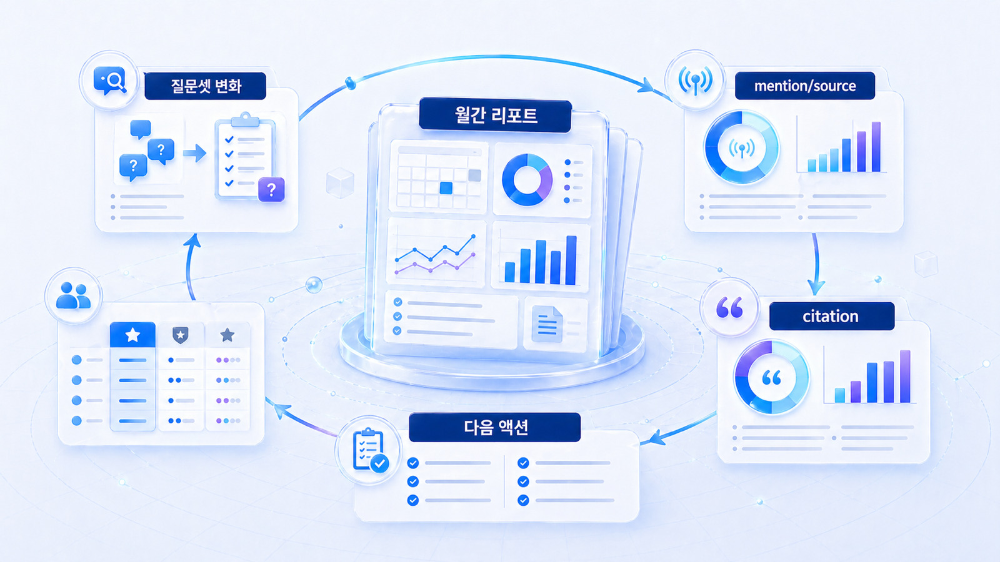

## GEO 리포트 운영: 브랜드 가시성 월간 관리



GEO 리포트는 한 번 보고 끝내기보다 매달 같은 질문군으로 변화 추이를 보는 운영 문서에 가깝습니다. AI 답변은 모델, 출처, 경쟁 콘텐츠 변화에 따라 달라지기 때문입니다.

월간 운영에서는 새 점수보다 변화 이유를 더 크게 봅니다. 어떤 질문에서 좋아졌고, 어떤 경쟁 URL이 새로 들어왔고, 어떤 수정이 효과를 냈는지를 남겨야 합니다.

`AcmeGEO`라는 이름은 설명을 위한 가상 기업명이며, 실제 고객 사례가 아닙니다.

[TOC]

## 먼저 볼 기준

| 기준 | 읽는 법 |
|---|---|
| 반복성 | 같은 질문군과 조건으로 다시 측정한다 |
| 변경 로그 | 수정한 콘텐츠/source/기술 액션을 남긴다 |
| 다음 액션 | 이번 달 리포트가 다음 달 작업으로 이어진다 |

## 실행 흐름

1. 월간 고정 질문셋과 비교할 이전 리포트를 준비한다.
2. 이번 달 움직인 mention/source/citation만 먼저 고른다.
3. 변화 원인을 콘텐츠, 출처, 기술, 경쟁 문맥으로 분리한다.
4. 다음 30일 액션을 담당자와 산출물 중심으로 적는다.
5. 다음 리포트에서 같은 질문셋으로 실행 결과를 확인한다.


*브랜드 가시성을 반복 관리하는 흐름*

## 월간 운영 예시

AcmeGEO가 3월에 리포트 예시 페이지를 고친 뒤 4월 추천형 질문에서 citation이 늘었다면, 리포트는 그 인과를 기록해야 합니다. 그래야 다음 달에도 반복 가능한 운영이 됩니다.

## 작성 예시와 완료 기준

| 월간 리포트 항목 | 예시 |
|---|---|
| 지난달 액션 | `GEO report example` 페이지 첫 문단/FAQ/표 수정 |
| 이번 달 변화 | 추천형 질문 citation 2/30 → 7/30 |
| 아직 남은 문제 | 경쟁사 glossary가 `LLM SEO` 질문에서 source로 반복됨 |
| 다음 액션 | glossary 보강, 외부 디렉터리 설명 수정, 같은 질문셋 재측정 |

완료 기준은 변화의 원인을 설명하는 것입니다. 숫자가 올랐는지보다 “무엇을 고쳐서 어떤 질문에서 달라졌는지”가 보여야 합니다.

## 정리 양식

```text
기간:
고정 질문군:
지난달 액션:
이번 달 변화:
새 경쟁 URL:
다음 달 액션:
```

## 다음 흐름

도구 선택 기준은 [GEO 솔루션 선택 기준](https://wikidocs.net/346843)에서 이어집니다.
