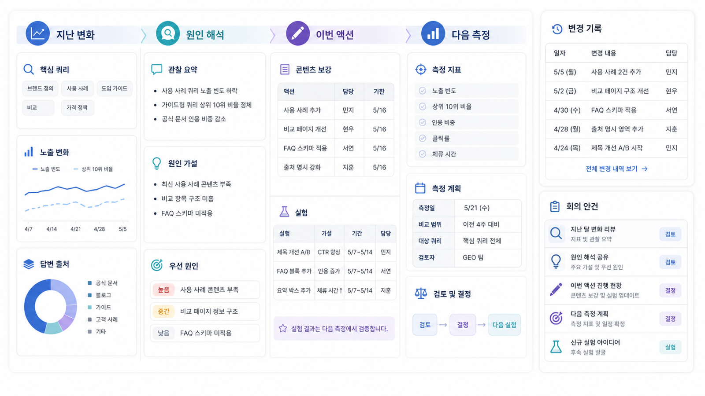

## GEO 리포트 운영: 브랜드 가시성을 매달 관리하는 법


GEO 리포트 운영은 매달 같은 표를 보내는 일이 아니라 브랜드 가시성 분석을 반복해서 관리하는 체계입니다. 질문셋 변화, AI 검색 모니터링 결과, 답변 근거(source)/화면 인용(citation) 변화, 경쟁사 변화, 실행 완료 여부가 함께 보여야 다음 달 액션을 정할 수 있습니다.

월간 GEO 리포트의 본질은 “점수 보고”가 아니라 “실행 운영 회의”입니다. 리포트가 콘텐츠팀, PR팀, 개발팀, 의사결정자의 다음 행동을 나눠야 읽고 끝나지 않습니다.

[TOC]

## 월간 GEO 리포트 구성

| 리포트 섹션 | 내용 | 연결되는 액션 |
|---|---|---|
| 요약 | 이번 달 가장 중요한 변화 3개 | 경영진 공유 |
| 질문셋 변화 | 새로 뜬 질문/빠진 질문/중요 질문 | 콘텐츠 우선순위 조정 |
| mention, 답변 근거(source), 화면 인용(citation) | 브랜드 언급과 인용 URL 변화 | 리라이트/source 보강 |
| 경쟁사 비교 | 경쟁사가 강한 질문과 출처 | 비교 콘텐츠/PR 과제 |
| 기술 이슈 | robots/sitemap/schema/rendering 이슈 | 개발팀 티켓 |
| 다음 액션 | 30일 실행 목록과 담당 | 운영 회의 아젠다 |



<small>월간 GEO 리포트는 이전 달 변화, 원인 해석, 이번 달 액션, 다음 측정 기준을 한 보드에서 관리해야 한다.</small>


## 월간 리포트가 계속 필요한 조건

| 조건 | 설명 | 없을 때 생기는 문제 |
|---|---|---|
| 같은 질문셋 | 전후 비교가 가능해야 함 | 매월 캡처만 쌓임 |
| 실행 로그 | 무엇을 고쳤는지 기록 | 변화 원인을 설명 못함 |
| 담당 분리 | 콘텐츠/PR/개발/경영진 액션 분리 | 리포트가 읽히고 끝남 |
| 리스크 알림 | 잘못된 답변/부정확한 출처/평판 변화 포착 | 문제를 늦게 발견 |
| 재측정 회의 | 다음 달 판단 기준 합의 | 계속 볼 이유가 약함 |

## 사례로 이해하기

금융/규제 산업의 독자는 AI 답변에서 부정확한 설명이 나오는지 지속적으로 봐야 합니다. 이 경우 월간 리포트는 단순 visibility보다 리스크 질문군, 공식 source 인용 여부, 위험 표현, 수정 필요 콘텐츠를 추적해야 합니다. 반복 운영의 근거는 “더 많이 노출”이 아니라 “오해를 줄이고 공식 설명을 안정화”하는 데 있습니다.

엔터프라이즈 뉴스룸은 매달 새 보도자료와 캠페인이 쌓입니다. 리포트는 새 콘텐츠가 AI 답변에 반영되는지, 이전 캠페인 URL이 끊기지 않았는지, 브랜드 설명이 최신으로 유지되는지 확인하는 운영 도구가 됩니다.

## 리포트 운영 회의 아젠다

```text
1. 이번 달 핵심 질문셋 변화 확인
2. mention, 답변 근거(source), 화면 인용(citation) 변화 중 중요한 항목 3개 선택
3. 경쟁사가 새로 잡힌 질문과 출처 확인
4. 콘텐츠/오프사이트/테크니컬 액션 완료 여부 확인
5. 다음 30일 실행 항목과 담당자 확정
6. 다음 측정 기준과 리포트 날짜 확정
```

## 월간 리포트에서 반드시 남길 변경 로그

월간 리포트는 결과만 남기면 다음 달 원인을 해석하기 어렵습니다. 어떤 URL을 고쳤고, 어떤 source를 추가했고, 어떤 기술 티켓이 처리됐는지 변경 로그가 필요합니다.

| 변경 유형 | 기록할 내용 | 다음 달 확인할 지표 |
|---|---|---|
| 콘텐츠 리라이트 | URL, 변경한 첫 문단/H2/FAQ | answer quality, citation |
| source 보강 | 외부 글/뉴스룸/디렉터리 URL | source diversity, consensus |
| 기술 수정 | canonical/schema/sitemap/robots | citation 안정성, 색인 상태 |
| 메시지 수정 | About/제품 설명/FAQ | 엔티티 정확도, co-mention |
| 질문셋 변경 | 추가/제외 질문과 이유 | 전월 비교 가능성 |

## 월간 의사결정 표

리포트 운영 회의에서는 모든 숫자를 다 보지 말고, 이번 달 의사결정에 필요한 항목만 뽑습니다.

| 의사결정 항목 | 확인 지표 | 판단 기준 | 다음 액션 |
|---|---|---|---|
| 콘텐츠를 새로 만들까 | 추천형/비교형 질문의 mention 감소 | 중요한 구매 질문에서 2개월 연속 빠짐 | 비교 콘텐츠 또는 선택 기준 페이지 작성 |
| 기존 글을 고칠까 | citation은 있으나 answer quality 낮음 | 링크는 보이지만 추천 이유가 약함 | 첫 문단/FAQ/표/schema 리라이트 |
| 외부 출처를 확보할까 | 경쟁사 source 반복 | 제3자 글/리뷰/뉴스가 경쟁사 중심 | 리뷰/파트너/언론/커뮤니티 출처 후보 정리 |
| 기술 이슈를 볼까 | 우리 URL citation 급감 | 페이지 구조 변경/robots/sitemap 이슈 의심 | 개발팀 점검 티켓 생성 |
| 리스크 대응이 필요한가 | 부정확한 답변 또는 위험 표현 반복 | 금융/의료/법률/평판 질문에서 오류 발생 | 공식 설명 보강과 위험 문구 수정 |

## 30일 액션 플랜 양식

| 우선순위 | 액션 | 담당 | 완료 기준 | 재측정 질문 |
|---|---|---|---|---|
| 1 |  | 콘텐츠팀/PR팀/개발팀 |  |  |
| 2 |  | 콘텐츠팀/PR팀/개발팀 |  |  |
| 3 |  | 콘텐츠팀/PR팀/개발팀 |  |  |

완료 기준에는 `글 발행`만 쓰지 않습니다. `비교형 질문 10개에서 mention/source/citation 재측정`, `AI Overviews 화면 인용 확인`, `경쟁사 source 변화 확인`처럼 다음 리포트에서 검증할 기준까지 적어야 합니다.

## 실습 정리표

| 입력 항목 | 작성 기준 |
|---|---|
| 리포트 주기 | 월간/분기/캠페인 단위 |
| 고정 질문셋 | 매번 비교할 핵심 질문 |
| 변화 지표 | mention, 답변 근거(source), 화면 인용(citation), 경쟁사/리스크 |
| 실행 로그 | 지난달 수정한 콘텐츠/출처/기술 과제 |
| 다음 액션 | 담당자와 마감일이 있는 30일 계획 |

## 정리 양식

```text
리포트 이름:
대상 브랜드/팀:
리포트 주기:
고정 질문셋:
핵심 지표:
월간 회의 아젠다:
계속 봐야 하는 이유:
다음 달 액션 예시:
```

## 적용 예시

| 입력 항목 | 적용 예시 |
|---|---|
| 리포트 주기 | 월간 |
| 고정 질문셋 | B2B SaaS GEO 도구 비교/가격/도입/리포트 자동화 40개 |
| 변화 지표 | AcmeGEO mention 5개 증가, 화면 인용은 공식 페이지 1개만 증가 |
| 실행 로그 | 비교 페이지 리라이트, FAQ 표 추가, schema 보강 |
| 다음 액션 | 외부 답변 근거 후보 3곳 확보, 가격 FAQ 보강, 4주 후 재측정 |

## 완료 기준

- 월간 리포트가 반복 회의 아젠다로 바로 쓰일 수 있습니다.
- 점수 변화보다 실행 로그와 다음 액션이 더 분명합니다.
- 다음 달에도 리포트를 봐야 하는 이유가 설명됩니다.

## 참고 링크 패키지

이 실습은 [HaloX 공식 사이트](https://haloxlabs.ai/), [09-02. mention/source/citation 지표는 어떻게 해석하나](https://wikidocs.net/346363), [10-04. 4주차: GEO 실행 리포트와 30일 액션 플랜](https://wikidocs.net/346368)과 함께 보면 좋습니다.

반복 리포트는 기존 검색 성과와 AI 답변 성과를 함께 봐야 설득력이 생깁니다. Google Search Console의 [성과 보고서 도움말](https://support.google.com/webmasters/answer/7576553)을 보조 기준으로 두고, HaloX 리포트에서는 AI 답변의 언급/출처/인용 변화를 더합니다.

## 흔한 질문

**Q. 월간 리포트는 자동화할 수 있나요?**

반복 측정과 표 생성은 자동화할 수 있습니다. 다만 우선순위 판단, 고객 상황 해석, 실행 담당 합의는 운영 회의에서 결정해야 합니다.

**Q. 고객이 매달 같은 질문셋을 지루해하지 않을까요?**

고정 질문셋은 비교 기준이고, 새 질문셋은 시장 변화 감지용입니다. 둘을 함께 운영하면 안정성과 새로움을 모두 만들 수 있습니다.

## 월간 GEO 리포트 예시 구조

매달 같은 형식으로 정리하면 GEO 리포트가 일회성 진단이 아니라 운영 문서가 됩니다.

| 섹션 | 들어갈 내용 | 예시 문장 |
|---|---|---|
| 이번 달 요약 | 가장 큰 변화 3개 | 추천형 질문에서 mention은 늘었지만 citation은 아직 약합니다 |
| 질문셋 변화 | 추가/삭제/유지 질문 | 커머스 비교 질문 5개를 새로 추가했습니다 |
| 핵심 지표 | mention/source/citation/경쟁 문맥 | 30개 질문 중 mention 11개, citation 4개입니다 |
| 원인 | 콘텐츠/출처/기술 병목 | 비교 기준 글은 있으나 schema와 내부 링크가 약합니다 |
| 실행 결과 | 지난달 액션의 완료 여부 | FAQ 2개 업데이트, sitemap 반영 완료 |
| 다음 30일 | 담당/기한/완료 기준 | 04-03 체크리스트로 리라이트 후보 3개를 수정합니다 |
| 재측정 계획 | 같은 질문셋으로 볼 날짜 | 다음 측정일은 30일 뒤로 고정합니다 |

이 구조는 도구 리포트, 내부 보고, 외부 파트너 검토에 모두 사용할 수 있습니다.

## 다음 흐름

이전: [09-04. GEO 제안서 비교: 과장된 약속은 어떻게 걸러낼까](https://wikidocs.net/346397) / 다음: [10. 4주 실행 로드맵과 GEO 리포트](https://wikidocs.net/346338)
