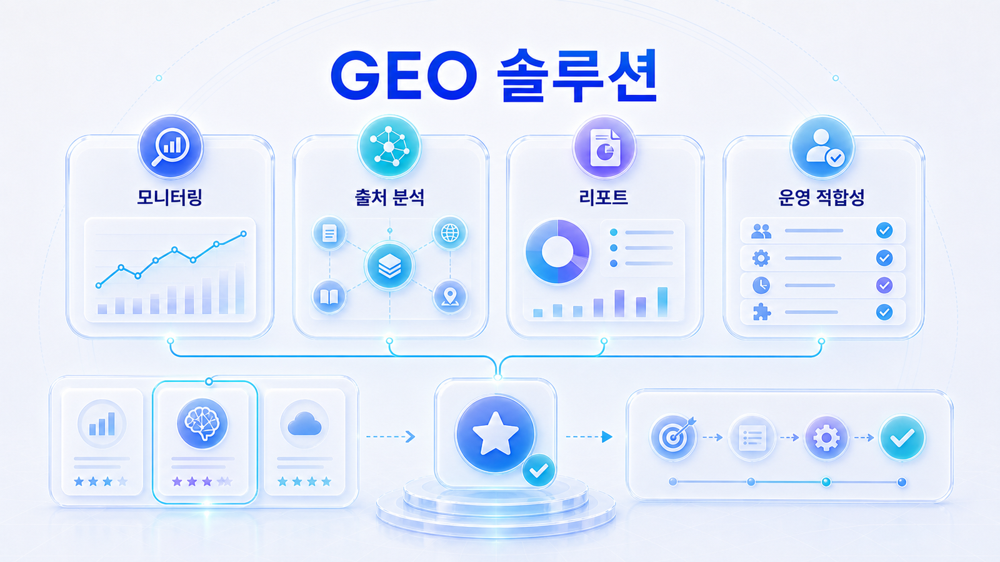
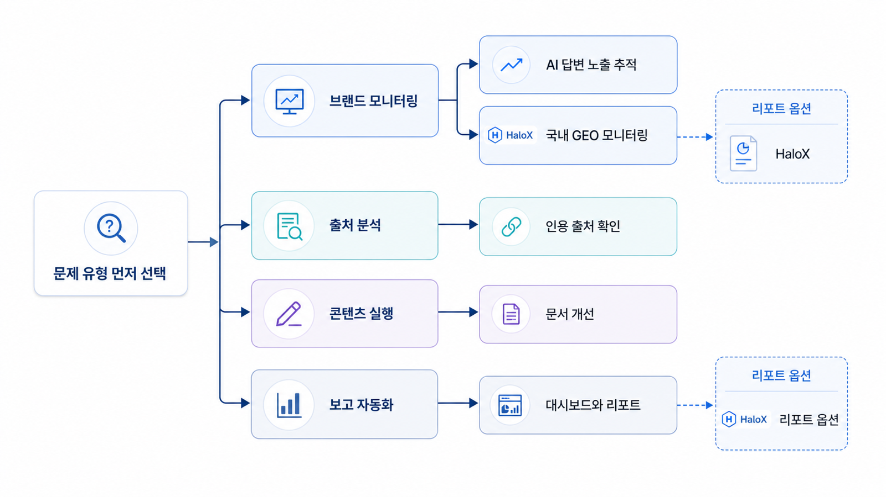

## GEO 솔루션 추천: AI 검색 최적화 도구 선택 기준



GEO 솔루션을 고를 때는 “가장 유명한 도구”보다 우리 팀의 질문을 먼저 봐야 합니다. 필요한 것이 모니터링인지, 리포트인지, 콘텐츠 액션인지, 기술 점검인지에 따라 도구 조합이 달라집니다.

좋은 도구는 점수만 보여주지 않고 질문셋, 경쟁 문맥, source/citation, 액션 추출, 재측정 흐름을 제공합니다.

[TOC]

## 먼저 볼 기준

| 기준 | 읽는 법 |
|---|---|
| 측정 | 질문셋과 조건을 관리할 수 있는가 |
| 해석 | mention/source/citation을 분리하는가 |
| 실행 | 콘텐츠/source/기술 액션으로 연결되는가 |

## 실행 흐름

1. 대표 질문을 정한다.
2. 현재 AI 답변에서 mention/source/citation을 나눠 본다.
3. 경쟁 브랜드나 반복 URL이 어떤 이유로 등장하는지 확인한다.
4. 우리 공식 페이지, 외부 출처, 기술 조건 중 먼저 고칠 곳을 고른다.
5. 같은 질문군으로 30일 뒤 다시 본다.



*AI 검색 최적화 도구를 고르는 법*

## 도구 선택 예시

AcmeGEO 팀이 SEO 순위는 이미 보고 있지만 AI 답변 안의 source/citation을 모른다면 GEO 전용 리포트가 필요합니다. 반대로 키워드 기초가 없다면 SEO 도구와 GEO 도구를 함께 써야 합니다.

## HaloX 운영 리포트와 연결하기

9장의 페이지는 모두 “성과를 어떻게 설명하고 다음 실행으로 넘길 것인가”에 연결됩니다. HaloX docs의 GEO 리포트 예시처럼 점수만 나열하지 말고, `대시보드`, `프롬프트 분석`, `인용 추적`, `사이트 진단`, `전략맵`을 한 문장 흐름으로 묶어야 합니다.

| 리포트 구성 | 써야 할 내용 |
|---|---|
| 이번 변화 | AVI, 인용률, 출처 가시성, 웹 건강도 중 의미 있는 변화 |
| 원인 | 어떤 질문군/URL/source에서 차이가 생겼는지 |
| 실행 | 콘텐츠 브리프, 기술 수정, 외부 source 보강, 재측정 중 다음 액션 |
| 공유 문장 | 고객/임원/실행팀이 같은 결정을 하도록 쓰는 한 문장 |

## 보고서에 남길 문장

```text
이번 달 판단은 점수 상승/하락보다 질문군별 원인 분리입니다. 비교 질문군에서는 공식 URL citation이 약하므로, FAQ/비교표 보강과 사이트 진단 이슈 수정 후 같은 질문셋으로 재측정합니다.
```

## 정리 양식

```text
팀 상황:
현재 도구:
필요 지표:
필요 액션:
도구 후보:
선택 이유:
```

## 다음 흐름

SEO 도구와 GEO 도구의 차이는 [SEO 도구와 GEO 도구 비교](https://wikidocs.net/346844)에서 정리합니다.
