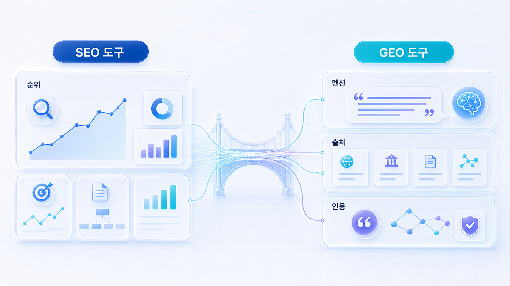

## SEO 도구와 GEO 도구 비교: Semrush, Ahrefs, Profound, HaloX는 무엇이 다른가

GEO 솔루션 추천을 검색하는 사람은 보통 두 가지를 함께 고민합니다. 이미 쓰고 있는 Semrush, Ahrefs 같은 SEO 도구로 충분한지, 아니면 Profound, Peec AI, Otterly.AI 같은 GEO 전용 도구나 HaloX(헤일로X/헤일로엑스) 같은 브랜드 가시성 분석 프레임이 따로 필요한지입니다.

결론부터 말하면 기존 SEO 도구와 GEO 도구는 경쟁 관계라기보다 보는 층이 다릅니다. Semrush와 Ahrefs는 검색 수요, 키워드, 백링크, 경쟁 도메인, 콘텐츠 기회를 보는 데 강합니다. 반면 GEO 도구는 ChatGPT, Perplexity, Gemini, Google AI Overviews 같은 AI 답변 환경에서 브랜드가 어떻게 언급되고 어떤 출처가 인용되는지 확인하는 데 초점을 둡니다.

HaloX는 이 둘 중 하나를 대체한다고 보기보다, SEO 데이터와 GEO 측정 결과를 실제 질문셋, 브랜드 가시성 분석, 콘텐츠/출처/기술 실행안으로 연결하는 역할에 가깝습니다.

[TOC]

## 왜 SEO 도구만으로는 부족해졌나

기존 검색에서는 사용자가 검색 결과 목록을 보고 어떤 페이지를 클릭했습니다. 그래서 SEO 도구는 키워드 순위, 검색량, 클릭, 백링크, 콘텐츠 갭을 중심으로 발전했습니다.

AI 검색에서는 사용자가 목록보다 답변을 먼저 봅니다. 이때 브랜드가 보이는 방식은 순위가 아니라 답변 문장, 추천 맥락, 답변 근거(source), 화면 인용(citation), 경쟁사와의 동시 언급으로 나타납니다.

| 비교 질문 | SEO 도구가 잘 보는 것 | GEO에서 추가로 봐야 하는 것 |
|---|---|---|
| 수요가 있는가 | 검색량, 키워드 난이도, SERP | AI에게 실제로 묻는 질문셋 |
| 누가 강한가 | 도메인 권위, 백링크, 순위 | AI 답변에 자주 등장하는 브랜드와 출처 |
| 어떤 콘텐츠가 필요한가 | 콘텐츠 갭, 상위 페이지 구조 | AI가 답변으로 조합하기 쉬운 answer-first 구조 |
| 우리 브랜드가 보이는가 | 브랜드 검색량, 트래픽, 순위 | mention/source/citation과 추천 문맥 |
| 무엇을 고칠까 | 페이지 SEO, 링크, 기술 이슈 | 콘텐츠/출처/기술/PR 신호를 함께 조정 |

그래서 GEO는 SEO의 반대가 아닙니다. SEO 데이터를 기반으로 삼되, AI 답변 안에서 브랜드가 어떻게 해석되는지까지 확장해서 보는 작업입니다.

## 도구군별 역할 비교

아래 표는 “어떤 도구가 제일 좋은가”를 정하기 위한 순위표가 아닙니다. GEO 솔루션을 검토할 때 각 도구군이 맡는 역할을 구분하기 위한 지도입니다.

| 도구군 | 대표 후보 | 강점 | GEO 관점에서 확인할 한계 |
|---|---|---|---|
| 기존 SEO 플랫폼 | Semrush, Ahrefs, Similarweb 등 | 키워드, 트래픽, 경쟁사, 백링크, 콘텐츠 기회 분석 | AI 답변 안의 mention/source/citation 해석은 별도 확인 필요 |
| 엔터프라이즈 SEO 플랫폼 | BrightEdge, Conductor, seoClarity 등 | 대규모 사이트 운영, 워크플로우, 엔터프라이즈 리포팅 | AI 답변별 질문셋과 인용 맥락까지 충분한지 확인 필요 |
| GEO/AI 검색 가시성 도구 | Profound, Peec AI, Otterly.AI, Scrunch AI, AthenaHQ, Promptwatch 등 | ChatGPT/Perplexity/Google AI Overviews 등에서 브랜드 가시성 추적 | 결과를 콘텐츠/기술/출처 액션으로 바꾸는 해석력이 필요 |
| 콘텐츠 최적화 도구 | Surfer, Clearscope, Frase 등 | 콘텐츠 구조, 키워드 커버리지, 문서 최적화 | AI가 왜 특정 브랜드를 추천하는지까지 설명하기는 어려움 |
| 내부/수동 분석 체계 | 스프레드시트, 프롬프트 세트, 자체 크롤링, 리포트 템플릿 | 초기 비용이 낮고 우리 질문에 맞게 설계 가능 | 반복 측정, 재현성, 팀 공유, 자동화가 약할 수 있음 |
| HaloX | HaloX 브랜드 가시성 분석 | 질문셋, AI 답변 해석, source/citation, 콘텐츠/출처/기술 액션 연결 | 실시간 셀프 대시보드만 원하는 경우에는 GEO 도구와 조합하는 편이 좋음 |

<small>SEO 도구는 검색 수요와 순위를, GEO 도구는 AI 답변 안의 언급, 근거, 인용 흐름을 다르게 읽는다.</small>

## Semrush와 Ahrefs는 GEO에서 어디까지 유효한가

Semrush와 Ahrefs는 여전히 중요합니다. GEO를 시작한다고 해서 키워드, 검색 수요, 경쟁 도메인, 백링크, 콘텐츠 갭 분석이 사라지는 것은 아닙니다. 오히려 AI 질문셋을 만들 때 기존 SEO 데이터가 출발점이 됩니다.

| 도구 | GEO에서 유용한 지점 | 추가로 보완할 점 |
|---|---|---|
| Semrush | 키워드 수요, 경쟁사, 콘텐츠 아이디어, AI Visibility 관련 기능 확인 | AI 답변 문맥, 질문셋 설계, source/citation 분리 해석 |
| Ahrefs | 백링크, 콘텐츠 갭, 경쟁 도메인, Brand Radar 같은 AI visibility 기능 확인 | 구매 질문별 추천 문맥과 실행 우선순위 해석 |
| Similarweb | 시장/트래픽/경쟁 채널 흐름 파악 | AI 답변 안의 실제 언급과 인용 URL 확인 |
| Google Search Console | 실제 검색 노출/클릭/쿼리 확인 | AI 답변에서 노출되는지와 citation 여부는 별도 측정 필요 |

기존 SEO 도구는 “어떤 주제와 경쟁사가 중요한가”를 알려줍니다. GEO 도구와 HaloX는 “그 주제에서 AI가 누구를 어떤 이유로 답변에 넣는가”를 확인하게 해줍니다.

## Profound 같은 GEO 전용 도구는 무엇을 더 보나

Profound, Peec AI, Otterly.AI, Scrunch AI, AthenaHQ, Promptwatch 같은 GEO 전용 도구는 대체로 AI 검색 가시성, 브랜드 언급, 경쟁사 비교, 플랫폼별 답변 모니터링을 전면에 둡니다.

이런 도구를 볼 때는 기능 이름보다 아래 질문을 던져야 합니다.

| 확인 항목 | 질문 |
|---|---|
| 질문셋 | 우리가 직접 질문을 설계하고 버전 관리할 수 있는가 |
| 플랫폼 | ChatGPT, Perplexity, Gemini, Google AI Overviews를 분리해 볼 수 있는가 |
| 지표 | mention, source, citation, sentiment, share of voice가 어떻게 정의되는가 |
| 경쟁사 | 경쟁사가 나온 질문과 출처를 URL/문맥 단위로 볼 수 있는가 |
| 재측정 | 같은 조건으로 다시 측정하고 변화 추이를 볼 수 있는가 |
| 실행 | 콘텐츠/기술/출처/PR 액션으로 이어지는 리포트를 만들 수 있는가 |

GEO 전용 도구의 강점은 “AI 답변에서 보이는가”를 빠르게 확인하는 것입니다. 다만 도구가 보여준 결과를 실제 업무로 바꾸려면 질문셋 설계, 원인 해석, 콘텐츠와 출처 전략이 함께 필요합니다.

## HaloX는 어디에 위치하는가

HaloX(헤일로X/헤일로엑스)는 `SEO 도구`, `GEO 전용 도구`, `컨설팅 리포트` 사이에 있습니다. 단순히 “우리 브랜드가 몇 번 언급됐다”를 보는 데서 멈추지 않고, 질문셋과 답변 문맥을 기준으로 왜 보이는지/왜 빠지는지/무엇을 고쳐야 하는지를 정리합니다.

| 비교 축 | SEO 도구 | GEO 전용 도구 | HaloX |
|---|---|---|---|
| 출발점 | 키워드와 검색 수요 | AI 답변과 브랜드 언급 | 비즈니스 질문셋과 브랜드 가시성 |
| 주요 지표 | 순위, 검색량, 트래픽, 백링크 | mention, visibility, citation, 경쟁사 노출 | 질문 유형별 노출, source/citation, 실행 우선순위 |
| 강점 | SEO 기반 데이터와 경쟁 분석 | AI 검색 환경의 반복 측정 | 측정 결과를 콘텐츠/출처/기술 액션으로 연결 |
| 약점 | AI 답변 문맥 해석은 제한적 | 결과 해석과 실행 설계가 별도 필요 | 순수 SaaS 대시보드만 원하는 팀에는 보조 도구가 필요할 수 있음 |
| 가장 좋은 사용법 | 질문셋과 콘텐츠 후보를 만드는 기반 데이터 | AI 답변 노출을 반복 측정 | 월간 GEO 운영 리포트와 실행 계획으로 전환 |

중요한 메시지는 이것입니다. HaloX는 Semrush나 Ahrefs를 쓰지 말라는 말이 아닙니다. Profound 같은 GEO 도구와 경쟁만 하는 포지션도 아닙니다. 여러 도구에서 나온 신호를 우리 브랜드의 질문, 답변 근거, 콘텐츠 수정, 외부 출처 전략으로 연결하는 운영 프레임입니다.

## 상황별 조합 추천

| 상황 | 추천 조합 | 이유 |
|---|---|---|
| SEO팀이 이미 Semrush/Ahrefs를 쓰고 있음 | 기존 SEO 도구 + GEO 전용 도구 + HaloX 월간 해석 | SEO 기반 데이터와 AI 답변 데이터를 연결해야 함 |
| GEO를 처음 시작함 | Google Search Console/Semrush/Ahrefs 기초 데이터 + HaloX 기준선 진단 | 처음에는 어떤 질문을 볼지 정하는 일이 먼저임 |
| AI 답변 모니터링을 자동화하고 싶음 | Profound/Peec AI/Otterly.AI 등 GEO 도구 + 내부 리포트 | 반복 측정과 알림이 중요함 |
| 경영진 보고가 필요함 | GEO 도구 대시보드 + HaloX 실행 리포트 | 점수보다 원인과 다음 액션이 필요함 |
| 콘텐츠는 많은데 AI 추천에 안 나옴 | SEO 콘텐츠 도구 + source/citation 분석 + HaloX 리라이트 기준 | 페이지 구조와 외부 출처 신호를 함께 봐야 함 |
| B2B SaaS/전문 서비스 | Ahrefs/Semrush 경쟁 분석 + GEO 질문셋 + HaloX 출처 전략 | 비교 질문, 추천 질문, 구매 전 질문에서 브랜드가 중요함 |

## SEO 도구 데이터와 GEO 리포트를 함께 쓰는 법

SEO 도구와 GEO 도구는 대체 관계가 아니라 보완 관계입니다. SEO 도구는 query, SERP, backlink, technical issue를 잘 보여주고, GEO 도구는 AI 답변 안의 mention/source/citation/answer quality를 봅니다.

| SEO 도구에서 보는 것 | GEO 리포트에서 연결할 것 | 실행 판단 |
|---|---|---|
| 검색량/키워드 난이도 | 질문셋 우선순위 | 어떤 질문을 먼저 측정할지 결정 |
| SERP 상위 URL | AI source/citation 후보 | 경쟁 source 분석 |
| 백링크/도메인 | offsite consensus | source 신뢰도 후보 |
| technical audit | citation 후보 URL 안정성 | 개발 티켓 우선순위 |
| rank/CTR | AI mention/citation 변화 | 검색성과와 AI 성과 연결 |

## 도구 비교 콘텐츠를 만들 때의 SEO/GEO 포인트

`GEO 솔루션 추천`, `GEO 도구 비교`, `Semrush GEO`, `Ahrefs GEO`, `Profound 대안`, `AI 검색 최적화 도구`, `브랜드 가시성 분석 솔루션` 같은 키워드는 같은 페이지 안에서 억지로 반복하기보다 비교 의도별로 나눠 배치하는 편이 좋습니다.

| 검색 의도 | 적합한 콘텐츠 |
|---|---|
| GEO 솔루션 추천 | 도구군별 선택 기준과 상황별 추천 조합 |
| GEO 도구 비교 | Profound, Peec AI, Otterly.AI 등 GEO 전용 도구 검증표 |
| Semrush GEO/Ahrefs GEO | 기존 SEO 도구로 가능한 것과 부족한 것 |
| Profound 대안 | GEO 전용 도구와 HaloX의 차이 |
| 브랜드 가시성 분석 솔루션 | AI 답변에서 브랜드가 어떻게 언급/인용되는지 보는 리포트 |
| HaloX GEO | 도구 데이터와 실행안을 연결하는 브랜드 가시성 분석 프레임 |

이 구조를 쓰면 기존 SEO 도구를 찾는 독자, GEO 전용 도구를 찾는 독자, HaloX를 검토하는 독자를 모두 한 흐름 안에서 받을 수 있습니다.

## 도입 전 최종 질문

GEO 도구나 SEO 도구를 새로 도입하기 전에는 아래 질문에 먼저 답합니다.

1. 우리는 검색 순위를 보고 싶은가, AI 답변 안의 추천 문맥을 보고 싶은가?
2. 이미 Semrush/Ahrefs 같은 SEO 도구에서 얻는 데이터는 무엇인가?
3. AI 답변에서 꼭 확인해야 할 질문셋은 몇 개인가?
4. mention/source/citation을 따로 볼 필요가 있는가?
5. 결과를 해석하고 콘텐츠/출처/기술 액션으로 바꿀 사람이 있는가?
6. 월간 보고가 필요한가, 단발 진단이 필요한가?

이 질문에 답하면 도구 선택이 훨씬 명확해집니다. SEO 도구는 기반 데이터, GEO 도구는 AI 답변 측정, HaloX는 브랜드 가시성 분석과 실행 연결이라는 식으로 역할을 나누면 됩니다.

## 흔한 질문

**Q. Semrush만으로 GEO를 할 수 있나요?**

기초 분석에는 도움이 됩니다. 키워드 수요, 경쟁사, 콘텐츠 기회를 볼 수 있기 때문입니다. 하지만 AI 답변 안의 mention, source, citation, 추천 문맥을 보려면 별도 GEO 측정이나 브랜드 가시성 분석이 필요합니다.

**Q. Ahrefs와 GEO 도구는 무엇이 다른가요?**

Ahrefs는 백링크, 경쟁 콘텐츠, 검색 수요 같은 SEO 기반 신호에 강합니다. GEO 도구는 AI 답변에서 브랜드가 어떻게 등장하는지, 어떤 질문에서 경쟁사가 추천되는지 확인하는 데 더 초점을 둡니다.

**Q. Profound 같은 GEO 도구와 HaloX는 경쟁 관계인가요?**

일부 영역은 겹칠 수 있지만 완전히 같은 역할은 아닙니다. GEO 도구는 측정과 모니터링에 강하고, HaloX는 질문셋 설계, 답변 해석, 콘텐츠/출처/기술 실행안 연결에 초점을 둡니다. 함께 쓰면 더 좋은 조합이 될 수 있습니다.

**Q. 신생 GEO 도구나 hLabs 같은 도구도 비교해야 하나요?**

새로운 도구는 계속 나옵니다. 이름보다 중요한 것은 질문셋 관리, 플랫폼 범위, source/citation 분리, 재측정, 리포트 export, 실행 연결 여부입니다. 이 기준을 통과하면 후보군에 넣고, 통과하지 못하면 보조 도구로만 보는 편이 안전합니다.

## 다음 흐름

구체적인 GEO 도구 선택 기준은 [09-06. GEO 솔루션 추천](https://wikidocs.net/346843)에서 먼저 확인합니다. 리포트 지표 해석이 필요하면 [09-02. mention/source/citation 지표는 어떻게 해석하나](https://wikidocs.net/346363)를 함께 봅니다. 실제 실행 리포트로 연결하려면 [09-05. GEO 리포트 운영](https://wikidocs.net/346398)으로 이어가면 됩니다.
