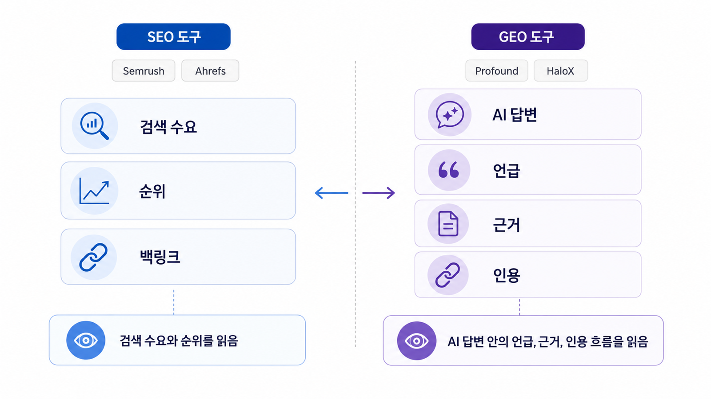

## SEO 도구와 GEO 도구 비교: Semrush/Ahrefs/Profound/HaloX


SEO 도구와 GEO 도구는 대체 관계가 아니라 역할이 다릅니다. Semrush/Ahrefs류 도구는 키워드, 백링크, SERP 분석에 강하고, GEO 도구는 AI 답변 안의 mention/source/citation과 경쟁 문맥을 봅니다.

GEO가 필요해졌다고 SEO 데이터가 사라지는 것은 아닙니다. 키워드와 SERP는 질문셋의 출발점이고, AI 답변 리포트는 그 질문이 답변 안에서 어떻게 바뀌는지 보여줍니다.

`AcmeGEO`라는 이름은 설명을 위한 가상 기업명이며, 실제 고객 사례가 아닙니다.

[TOC]

## 먼저 볼 기준

| 기준 | 읽는 법 |
|---|---|
| SEO 도구 | 키워드/순위/백링크/SERP를 본다 |
| GEO 도구 | AI 답변의 언급/근거/인용을 본다 |
| 통합 | SEO 질문을 GEO 질문셋으로 확장한다 |

## 실행 흐름

1. SEO 도구가 보는 키워드/백링크/트래픽과 GEO 도구가 보는 AI 답변을 분리한다.
2. 같은 주제에서 검색 순위와 AI citation이 다르게 움직이는 질문을 찾는다.
3. Semrush/Ahrefs 데이터는 SEO 기반, HaloX류 리포트는 AI 답변 기반으로 읽는다.
4. 두 도구의 결과를 콘텐츠/기술/출처 작업으로 합친다.
5. 다음 달에는 검색 성과와 AI 답변 변화를 함께 보고한다.



*검색 순위 데이터와 AI 답변 데이터를 함께 읽는 법*

## 도구 조합 예시

AcmeGEO 팀은 Semrush로 주요 키워드와 경쟁 SERP를 보고, HaloX 같은 GEO 리포트로 같은 주제의 AI 답변 mention/source/citation을 확인할 수 있습니다. 두 데이터가 만나야 실행 우선순위가 선명해집니다.

## 작성 예시와 완료 기준

| 질문 | SEO 도구로 볼 것 | GEO 도구로 볼 것 |
|---|---|---|
| 검색 수요가 있는가 | 검색량, SERP, 순위 | AI 질문셋으로 확장할 주제 |
| AI가 누구를 추천하는가 | 직접 확인 어려움 | mention/source/citation, 경쟁 브랜드 |
| 어떤 페이지를 고칠까 | 랜딩/블로그 성과 | AI 답변에서 빠지는 공식 URL |

완료 기준은 SEO 도구와 GEO 도구 중 하나만 고르는 것이 아닙니다. 검색 수요, AI 답변, 콘텐츠 수정 우선순위를 한 표에서 연결하는 것입니다.

## 정리 양식

```text
SEO 데이터:
GEO 질문셋:
AI 답변 결과:
겹치는 경쟁 URL:
수정할 페이지:
재측정 계획:
```

## 다음 흐름

이제 전체 흐름을 [1주차 GEO 기준선 진단](https://wikidocs.net/346365)부터 4주 실행 로드맵으로 정리합니다.
