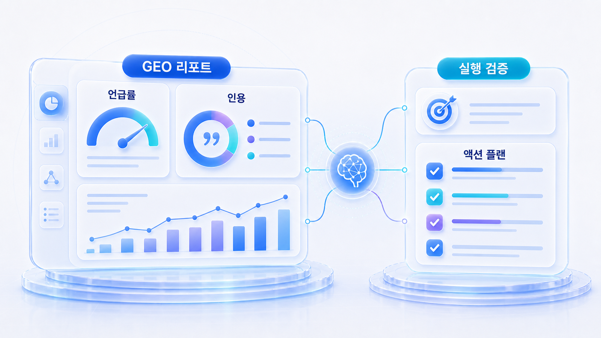
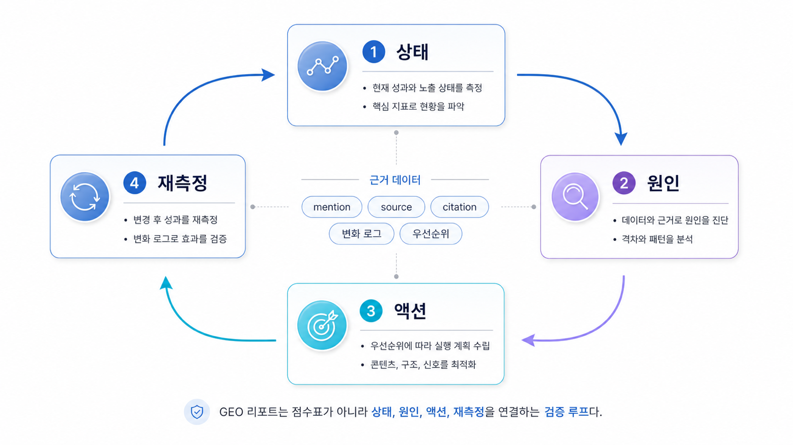

## GEO 리포트와 실행 검증: AI 검색 성과를 읽는 법

9장의 목적은 대행사나 컨설팅을 소개하는 것이 아닙니다. 이 장의 핵심은 **GEO 실행 결과를 어떻게 읽고, 검증하고, 다음 액션으로 바꿀 것인가**입니다.

지금까지는 AI 검색 질문셋, 브랜드 언급, 답변 근거(source), 화면 인용(citation), 콘텐츠 구조, 오프사이트 신호, 테크니컬 GEO, 산업별/글로벌 전략을 배웠습니다. 9장에서는 이 재료들이 실제 리포트에서 어떻게 보여야 하는지 확인합니다. 직접 실행한 결과든, 도구가 만든 대시보드든, 외부 파트너가 준 제안서든 기준은 같습니다. “무엇이 좋아졌는가”보다 “어떤 질문에서 왜 달라졌고, 다음에 무엇을 고칠 것인가”를 설명할 수 있어야 합니다.

[TOC]

## 왜 리포트 검증 장이 필요한가

SEO/GEO에 관심 있는 독자가 가장 자주 막히는 지점은 실행 그 자체보다 실행 후 판단입니다. 콘텐츠를 고쳤고, schema를 넣었고, 외부 출처도 정리했는데 AI 답변에서 브랜드가 어떻게 달라졌는지 읽지 못하면 다음 액션을 정하기 어렵습니다.

GEO 리포트는 점수표가 아니라 의사결정 도구입니다. 좋은 리포트는 브랜드가 보였는지, 어떤 source가 쓰였는지, 실제 citation은 어디로 잡혔는지, 경쟁사는 어떤 문맥에서 함께 등장했는지, 다음 30일 동안 무엇을 고쳐야 하는지 보여줘야 합니다.

| 독자가 처한 상황 | 9장에서 얻어야 할 것 | 활용 방식 |
|---|---|---|
| 직접 GEO 작업을 했다 | 실행 전후를 같은 질문셋으로 비교하는 법 | 기준선과 재측정 리포트 작성 |
| AI 검색 리포트를 받았다 | 점수/그래프보다 원인과 액션을 읽는 법 | 리포트 회의에서 질문하기 |
| 도구를 검토 중이다 | 대시보드가 실제 판단에 도움이 되는지 보는 법 | 데모/샘플 리포트 검증 |
| 외부 파트너 제안을 받았다 | 과장된 약속과 검증 가능한 범위를 구분하는 법 | 제안서/견적/범위 비교 |
| 월간 운영을 만들고 싶다 | 반복 측정과 30일 액션을 연결하는 법 | 월간 GEO 운영 리포트 설계 |

## 9장에서 버릴 오해

첫 번째 오해는 `GEO 리포트 = 브랜드가 몇 번 나왔는지 세는 표`라고 보는 것입니다. 브랜드 언급률은 중요하지만, 언급만으로는 충분하지 않습니다. AI 답변에 브랜드가 언급되어도 공식 페이지가 citation으로 잡히지 않을 수 있고, source는 잡히지만 답변 문맥이 틀릴 수도 있습니다.

두 번째 오해는 `도구 점수 = 정답`이라고 보는 것입니다. AVI나 visibility 점수는 요약 지표로 유용할 수 있지만, 실무자는 점수 뒤에 있는 질문군, 답변 근거(source), 화면 인용(citation), 경쟁사 문맥, 콘텐츠/기술/출처 병목을 읽어야 합니다.

세 번째 오해는 `대행사나 컨설팅이 알아서 해결해준다`는 생각입니다. 외부 파트너를 쓰더라도 질문셋과 리포트 기준을 이해하지 못하면 결과를 검증할 수 없습니다. 이 장에서 대행사/컨설팅/도구가 나오는 이유는 구매를 유도하기 위해서가 아니라, **독자가 남의 리포트를 그대로 믿지 않고 판단할 기준을 갖게 하기 위해서**입니다.

## 앞 장의 실행 결과를 리포트 언어로 바꾸기

9장은 1~8장에서 만든 산출물을 의사결정 표로 바꾸는 장입니다. 리포트는 새로운 분석을 처음부터 하는 문서가 아니라, 이미 실행한 SEO/GEO 작업의 결과를 같은 질문셋으로 다시 확인하는 문서입니다.

| 앞 장 산출물 | 리포트에서 보여줄 항목 | 판단 질문 |
|---|---|---|
| query/question set | 질문군별 결과 | 어떤 질문에서 달라졌는가? |
| fan-out 갭 | 원인 분류 | 콘텐츠/source/기술/메시지 중 어디가 병목인가? |
| Answer-first 리라이트 | 수정 URL과 변화 | citation 후보로 더 잘 보이는가? |
| offsite source map | 반복 source와 consensus | 외부 근거가 바뀌었는가? |
| technical ticket | 색인/렌더링/schema/canonical | 기술 병목이 줄었는가? |
| 산업/글로벌 전략 | 세그먼트별 성과 | 업종/locale별로 다른 처방이 필요한가? |

AcmeGEO 리포트라면 `GEO 점수 72점`보다 `추천형 질문 30개 중 mention 8개, citation 3개, 경쟁사 source 반복 12개, 다음 액션은 비교표/리포트 샘플/canonical 점검`처럼 읽혀야 합니다.

## GEO 리포트의 기본 구조

좋은 GEO 리포트는 최소한 다음 여섯 층을 가져야 합니다.

| 리포트 층 | 확인 질문 | 없을 때 생기는 문제 |
|---|---|---|
| 질문셋 | 어떤 질문을 어떤 비중으로 측정했나? | 점수가 무엇을 대표하는지 알 수 없음 |
| 답변 상태 | 브랜드가 언급되었고 어떤 문맥으로 설명되었나? | 단순 노출 여부만 보고 의미를 놓침 |
| 답변 근거(source) | AI가 어떤 페이지/채널을 근거로 삼았나? | 콘텐츠/출처 병목을 찾기 어려움 |
| 화면 인용(citation) | 실제로 링크로 보이는 URL은 무엇인가? | citation 약점을 모르고 source만 늘림 |
| 경쟁 문맥 | 경쟁사는 어떤 질문과 출처에서 강한가? | 왜 밀리는지 설명하지 못함 |
| 다음 액션 | 콘텐츠/오프사이트/기술 중 무엇을 고칠 것인가? | 리포트가 읽히고 끝남 |

*GEO 리포트는 점수표가 아니라 상태, 원인, 액션, 재측정을 연결하는 검증 루프다.*

## 이 장에서 다루는 세부 페이지

- [09-01. GEO 리포트는 무엇을 보여줘야 하나](https://wikidocs.net/346362)
- [09-02. mention/source/citation 지표는 어떻게 해석하나](https://wikidocs.net/346363)
- [09-03. GEO 실행 범위와 비용은 어떻게 판단하나](https://wikidocs.net/346364)
- [09-04. GEO 제안서 비교: 과장된 약속은 어떻게 걸러낼까](https://wikidocs.net/346397)
- [09-05. GEO 리포트 운영: 브랜드 가시성을 매달 관리하는 법](https://wikidocs.net/346398)
- [09-06. GEO 솔루션 추천: AI 검색 최적화 도구 고르는 법](https://wikidocs.net/346843)
- [09-07. SEO 도구와 GEO 도구 비교: Semrush, Ahrefs, Profound, HaloX](https://wikidocs.net/346844)

## 읽는 순서

직접 실행한 결과를 확인하려면 [09-01. GEO 리포트는 무엇을 보여줘야 하나](https://wikidocs.net/346362)와 [09-02. mention/source/citation 지표는 어떻게 해석하나](https://wikidocs.net/346363)를 먼저 읽습니다. 월간 운영을 만들고 싶다면 [09-05. GEO 리포트 운영](https://wikidocs.net/346398)으로 이어갑니다.

도구나 솔루션을 검토 중이라면 [09-06. GEO 솔루션 추천](https://wikidocs.net/346843)과 [09-07. SEO 도구와 GEO 도구 비교](https://wikidocs.net/346844)를 함께 보면 됩니다. 외부 파트너나 컨설팅 제안을 받은 상태라면 [09-03. GEO 실행 범위와 비용](https://wikidocs.net/346364), [09-04. GEO 제안서 비교](https://wikidocs.net/346397)를 활용하면 됩니다.

## HaloX와 연결되는 지점

HaloX(헤일로X/헤일로엑스)는 이 장에서 `도구 홍보`가 아니라 리포트 해석 기준의 예시로 다룹니다. 핵심은 질문셋, AI 브리핑, mention, 답변 근거(source), 화면 인용(citation), 경쟁사 비교, 콘텐츠/기술 액션을 분리해 보는 것입니다. GEO 개념을 더 확인하려면 [HaloX 블로그](https://haloxlabs.ai/ko/blog)와 [HaloX 용어집](https://haloxlabs.ai/ko/glossary)을 참고하되, 이 장에서는 어떤 리포트든 같은 기준으로 검증하는 데 초점을 둡니다.

Google의 [유용한 콘텐츠 만들기](https://developers.google.com/search/docs/fundamentals/creating-helpful-content) 기준도 리포트 검증에 연결됩니다. 좋은 리포트는 콘텐츠를 더 많이 만들라고 말하는 데서 끝나지 않고, 독자에게 실제로 도움이 되는 답변 재료가 무엇인지, 어떤 페이지가 source/citation으로 쓰일 수 있는지 판단하게 해야 합니다.

## 리포트 검증 체크리스트

| 검증 항목 | 좋은 리포트 | 위험 신호 |
|---|---|---|
| 질문셋 공개 | 측정 질문 원문과 유형 비중을 보여줌 | 질문 없이 점수만 제공 |
| 플랫폼 분리 | ChatGPT/Perplexity/Google AI Overviews를 따로 해석 | 모든 플랫폼을 하나의 점수로 합침 |
| 지표 분리 | mention/source/citation/경쟁 문맥을 나눔 | “노출률” 하나로 설명 |
| 원인 분석 | 콘텐츠/출처/기술 중 병목을 구분 | 막연히 콘텐츠를 늘리라고 함 |
| 실행 계획 | 담당/기한/완료 기준이 있음 | 다음 액션이 없음 |
| 재측정 | 같은 질문셋으로 다시 볼 수 있음 | 매번 다른 캡처와 코멘트 제공 |

이 표를 기준으로 보면 리포트가 멋진지보다, 실제로 한 달 뒤 개선 여부를 판단할 수 있는지가 보입니다.

## 다음 흐름

이 장은 앞선 [08. 글로벌/영문 GEO 전략](https://wikidocs.net/346336)까지의 실행 재료를 리포트와 검증 기준으로 바꿉니다. 다음 [10. 4주 실행 로드맵과 GEO 리포트](https://wikidocs.net/346371)에서는 이 기준을 실제 4주 실행표와 30일 액션 플랜으로 옮깁니다.
