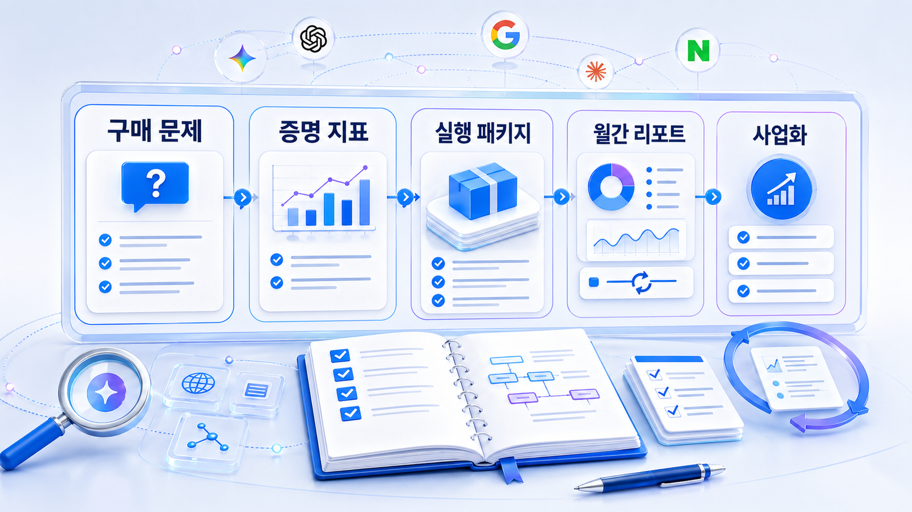

## GEO 도구/파트너/리포트 검증

GEO를 실제로 운영하려면 혼자 모든 것을 판단하기 어렵습니다. 도구를 써야 할 수도 있고, 외부 파트너의 제안서를 검토해야 할 수도 있고, 월간 리포트를 기준으로 팀의 실행 우선순위를 정해야 할 수도 있습니다.

이 장은 GEO를 “사는 사람”의 관점에서 씁니다. 독자는 대행사나 도구가 멋진 말을 하는지보다, 내 브랜드의 질문셋/답변 근거(source), 화면 인용(citation), 콘텐츠/기술 문제를 실제로 설명하고 다음 행동으로 연결하는지 확인해야 합니다.

직접 실행하려는 실무자는 10장의 4주 실행 로드맵을 먼저 읽고 이 장으로 돌아와도 됩니다. 반대로 예산, 도구, 외부 파트너를 먼저 검토해야 하는 의사결정자는 이 장을 먼저 읽는 편이 자연스럽습니다.

## 이 장의 핵심 질문

| 독자가 확인할 질문 | 왜 중요한가 | 위험 신호 |
|---|---|---|
| 어떤 질문을 측정하는가 | 질문셋이 틀리면 리포트도 틀립니다 | “AI에 많이 나오게”처럼 범위가 모호함 |
| 어떤 지표를 분리해서 보는가 | mention, 답변 근거(source), 화면 인용(citation)은 서로 다릅니다 | 단일 visibility 점수만 제시 |
| 무엇을 고치라고 말하는가 | 분석은 실행으로 이어져야 합니다 | 진단만 있고 수정안이 없음 |
| 같은 조건으로 다시 볼 수 있는가 | 재측정이 있어야 개선을 판단합니다 | 매달 다른 기준으로 캡처만 제공 |
| 우리 팀이 해야 할 일은 무엇인가 | 콘텐츠/PR/개발/의사결정 역할이 다릅니다 | 담당과 완료 기준이 없음 |

## 이 장에서 다루는 세부 페이지

- [09-01. GEO 파트너는 무엇을 증명해야 하나](https://wikidocs.net/346362)
- [09-02. GEO 도구와 리포트는 어떻게 검증할까](https://wikidocs.net/346363)
- [09-03. GEO 실행 범위와 예산은 어떻게 정할까](https://wikidocs.net/346364)
- [09-04. GEO 제안서는 어떻게 읽고 비교할까](https://wikidocs.net/346397)
- [09-05. 월간 GEO 리포트는 어떻게 활용할까](https://wikidocs.net/346398)

## 먼저 버려야 할 오해

첫 번째 오해는 GEO를 SEO의 이름만 바꾼 서비스로 보는 것입니다. 키워드 순위와 백링크만 설명하면 AI 답변에서 브랜드가 왜 빠지는지 설명하기 어렵습니다. GEO에서는 [질문셋 구성 비중](https://wikidocs.net/346341), [답변 근거(source)와 화면 인용(citation) 분리](https://wikidocs.net/346332), [테크니컬 접근성](https://wikidocs.net/346334)이 함께 움직입니다.

두 번째 오해는 도구 화면이 곧 답이라는 생각입니다. 도구는 시작점입니다. 독자에게 필요한 것은 “어떤 질문에서 빠졌고, 무엇을 고치면 되고, 다음 달에 어떻게 확인할지”입니다. 그래서 좋은 GEO 리포트는 분석표가 아니라 실행 판단표에 가까워야 합니다.

세 번째 오해는 외부 파트너가 알아서 전부 해결해준다는 생각입니다. GEO는 콘텐츠, 출처, 기술, 제품 메시지가 함께 움직입니다. 외부 파트너를 쓰더라도 우리 팀이 무엇을 확인하고 무엇을 실행해야 하는지 알아야 합니다.

## HaloX와 연결되는 지점

HaloX는 질문셋, AI 브리핑, mention, 답변 근거(source), 화면 인용(citation), 경쟁사 비교, 인용 안정성, 콘텐츠/기술 액션을 나눠 보게 만드는 GEO 분석 프레임입니다. 이 장에서는 HaloX를 기능 목록으로 소개하지 않고, 독자가 도구와 리포트를 읽을 때 무엇을 기준으로 판단해야 하는지 보여줍니다.

도구나 리포트를 검토할 때도 기본 원칙은 같습니다. Google의 [유용한 콘텐츠 만들기](https://developers.google.com/search/docs/fundamentals/creating-helpful-content)를 기준으로 두면 리포트가 지표 포장보다 실제 의사결정 지원에 초점을 맞추는지 확인할 수 있습니다. GEO 개념을 더 확인하려면 [HaloX 블로그](https://haloxlabs.ai/ko/blog)와 [HaloX 용어집](https://haloxlabs.ai/ko/glossary)을 함께 보면 좋습니다.

## 읽는 순서

처음 읽는다면 [09-01. GEO 파트너는 무엇을 증명해야 하나](https://wikidocs.net/346362)부터 읽습니다. 이미 도구나 리포트를 검토 중이라면 [09-02. GEO 도구와 리포트는 어떻게 검증할까](https://wikidocs.net/346363)를 먼저 봅니다. 실행 범위와 예산을 정해야 한다면 [09-03. GEO 실행 범위와 예산은 어떻게 정할까](https://wikidocs.net/346364)로 이어가면 됩니다.

## 다음 흐름

이 장은 앞선 [08. 글로벌/영문 GEO 전략](https://wikidocs.net/346336)을 실제 검토 기준으로 바꿉니다. 다음 장에서는 이 기준을 4주 실행 로드맵으로 옮겨, 독자가 자기 브랜드의 실행 리포트를 만들 수 있게 합니다.
