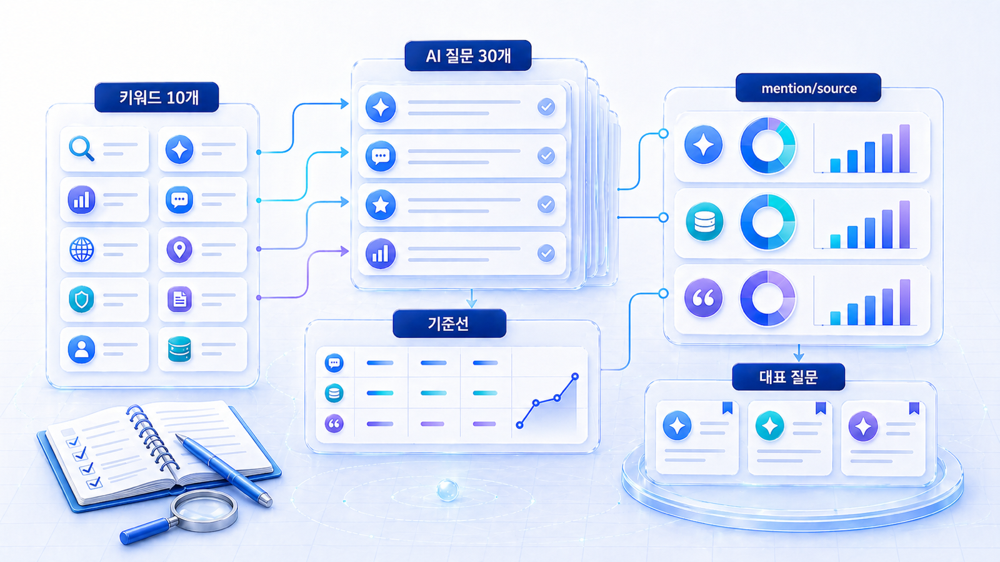
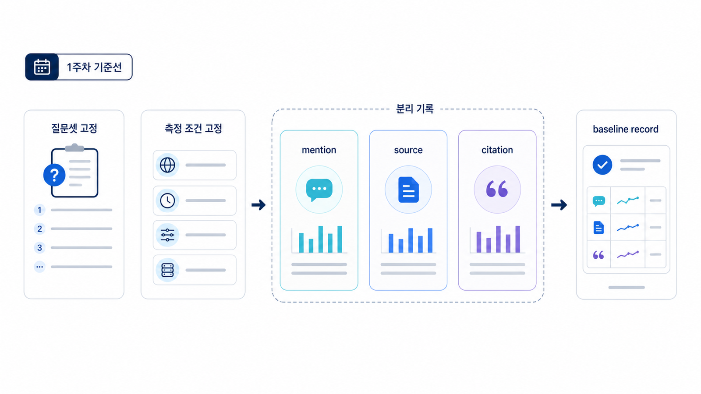

## 1주차: GEO 기준선 진단



1주차는 브랜드 키워드를 AI 질문으로 바꾸고 현재 mention, 답변 근거(source), 화면 인용(citation) 상태를 기록하는 단계입니다. 목표는 좋은 결과를 만드는 것이 아니라, 4주 동안 같은 기준으로 비교할 수 있는 출발선을 만드는 것입니다.

기준선이 없으면 개선도 설명할 수 없습니다. “AI 답변에 안 나온다”는 말은 문제의 시작일 뿐입니다. 어떤 질문에서 빠지는지, 어떤 경쟁사가 함께 나오는지, 자사 페이지가 답변 근거로 쓰이는지, 화면 인용 URL은 어디로 가는지를 기록해야 다음 행동이 보입니다.

[TOC]

## 1주차 목표

| 목표 | 설명 | 산출물 |
|---|---|---|
| 키워드 정리 | 브랜드/제품/경쟁/문제 키워드를 모은다 | 키워드 10개 |
| 질문 전환 | 키워드를 실제 질문 문장으로 바꾼다 | AI 질문 30개 |
| 기준선 측정 | AI 답변에서 mention, 답변 근거(source), 화면 인용(citation)을 기록한다 | 기준선 표 |
| 대표 질문 선정 | 2주차 Fan-out에 쓸 질문을 고른다 | 대표 질문 3개 |

## 기준선은 무엇을 뜻하나

GEO 기준선은 “현재 우리 브랜드가 AI 답변 시장에서 어떤 상태인가”를 같은 형식으로 기록한 첫 표입니다. SEO에서 Search Console의 노출/클릭/평균 순위를 보는 것처럼, GEO에서는 질문별 AI 답변 상태를 기록해야 합니다.

| SEO 기준선 | GEO 기준선 |
|---|---|
| 검색어 | AI 질문/프롬프트 |
| 노출 | AI 답변 안의 mention |
| 클릭 | 화면 인용(citation) 또는 방문 가능한 URL |
| 순위 | 추천 순서/비교 맥락/경쟁사와의 위치 |
| 랜딩 페이지 | 답변 근거(source)로 쓰이는 페이지 |
| 개선 대상 | 제목/본문/링크/기술/출처/리뷰/비교표 |

Google Search Console의 [성과 보고서](https://support.google.com/webmasters/answer/7576553)는 기존 검색 성과를 읽는 기준입니다. 1주차에서는 여기에 AI 답변 관측값을 덧붙입니다. 기존 검색에서 잘 보이는 페이지가 AI 답변에서는 빠질 수 있고, 검색 순위는 낮아도 AI 답변의 근거로 반복 인용되는 페이지가 있을 수 있기 때문입니다.

## 질문셋을 어떻게 구성할까

질문셋은 GEO 리포트의 핵심입니다. 질문이 한쪽으로 치우치면 리포트도 왜곡됩니다. 예를 들어 브랜드명 질문만 보면 이미 아는 사람의 검색만 측정하게 되고, 추천형 질문만 보면 브랜드 인지도와 출처 신뢰를 분리하기 어렵습니다.

| 질문 유형 | 예시 | 확인하려는 것 | 권장 비중 |
|---|---|---|---|
| 브랜드형 | HaloX는 어떤 서비스야? | AI가 브랜드를 정확히 설명하는가 | 20% |
| 카테고리형 | GEO 도구는 무엇을 봐야 해? | 카테고리 설명 안에 브랜드가 들어오는가 | 20% |
| 비교형 | GEO 도구 추천해줘 | 경쟁사와 함께 후보군에 들어가는가 | 25% |
| 문제해결형 | AI 답변에 우리 브랜드가 안 나올 때 어떻게 해야 해? | 실무 문제에서 솔루션으로 연결되는가 | 20% |
| 리스크형 | GEO 대행사 제안이 과장인지 어떻게 봐? | 신뢰/검증 맥락에서 언급되는가 | 15% |

처음에는 30개 질문을 목표로 합니다. 시간이 부족하면 15개로 시작해도 되지만, 위 다섯 유형 중 최소 세 유형은 포함해야 합니다.

## 측정할 때 남길 조건

AI 답변은 변동성이 있습니다. 그래서 결과만 남기면 나중에 비교가 어렵습니다. 아래 조건을 함께 기록해야 합니다.

| 조건 | 기록 예시 | 이유 |
|---|---|---|
| 날짜/시간 | 2026-04-30 10:00 KST | 답변 변동 해석 |
| 모델/서비스 | ChatGPT/Perplexity/Gemini/Google AI 기능 | 플랫폼별 차이 확인 |
| 질문 원문 | B2B SaaS용 GEO 도구 추천해줘 | 같은 질문으로 재측정 |
| 지역/언어 | 한국어/한국 시장 | 로컬/언어 차이 확인 |
| 로그인/개인화 여부 | 로그인 상태/비로그인 상태 | 개인화 영향 분리 |
| 결과 요약 | 브랜드 언급 없음/경쟁사 3개 등장 | 빠른 리포트 작성 |
| 원문 스냅샷 | 답변 일부/URL/캡처 위치 | 나중에 검수 |

모든 플랫폼에서 citation이 보이는 것은 아닙니다. ChatGPT처럼 답변 안의 출처 노출 방식이 상황에 따라 달라지는 환경과, Perplexity처럼 화면 인용 링크가 비교적 분명한 환경은 따로 기록해야 합니다.

## mention/source/citation을 분리해서 보기

1주차에서 가장 중요한 실수는 mention, 답변 근거(source), 화면 인용(citation)을 섞는 것입니다.

| 항목 | 의미 | 좋은 신호 | 주의할 점 |
|---|---|---|---|
| mention | 답변 안에 브랜드명이 등장함 | 후보군/추천/비교 맥락에 들어감 | 단순 나열은 성과로 과대평가하지 않음 |
| 답변 근거(source) | AI가 답을 만들 때 참고한 것으로 보이는 정보 | 자사 페이지/공식 문서/신뢰 출처가 답변 근거가 됨 | 추정이므로 화면 인용과 분리 |
| 화면 인용(citation) | 답변 화면에 링크로 노출된 URL | 자사 URL 또는 우호적 외부 URL이 반복 노출됨 | citation이 없어도 mention은 가능 |
| 경쟁사/대안 | 함께 언급되는 브랜드나 방법 | 시장 후보군을 알 수 있음 | 경쟁사 언급 자체보다 이유를 봄 |

이 구분은 [02-03. 브랜드 언급률, 답변 근거, 화면 인용은 어떻게 나눠 읽나](https://wikidocs.net/346354)와 연결됩니다.


<small>1주차 기준선은 질문셋과 측정 조건을 고정한 뒤 mention, source, citation을 분리해 기록하는 단계다.</small>


## 따라 해보는 순서

| 단계 | 할 일 | 확인할 것 |
|---|---|---|
| 1 | 브랜드/제품/문제/경쟁 키워드 10개 작성 | 검색어가 아니라 질문 재료로 본다 |
| 2 | 키워드를 질문 유형별로 바꾸기 | 브랜드형/카테고리형/비교형/문제해결형/리스크형 분리 |
| 3 | 질문 30개 작성 | 실제 고객이 말할 문장인지 확인 |
| 4 | AI 답변 기준선 기록 | mention/source/citation/경쟁사/URL을 분리 |
| 5 | 기존 SEO 지표와 비교 | Search Console 노출/클릭과 AI 답변 상태 차이 확인 |
| 6 | 대표 질문 3개 선정 | 2주차 Fan-out 입력값 확정 |

## 1주차 샘플 질문 포트폴리오

1주차 질문셋은 브랜드 질문만 모으면 안 됩니다. 시장에서 새로 발견될 수 있는 비브랜드 추천형/비교형 질문이 반드시 들어가야 합니다.

| 질문군 | 예시 | 확인할 지표 |
|---|---|---|
| 브랜드 | AcmeGEO는 어떤 도구인가? | answer accuracy, entity |
| 카테고리 | GEO 도구는 무엇을 측정해야 하나? | source, citation |
| 비교 | GEO 도구와 SEO 도구 차이는? | co-mention, answer quality |
| 추천 | B2B SaaS 팀에 맞는 GEO 도구 추천 | mention, 경쟁사 |
| 검증 | GEO 리포트가 믿을 만한지 보는 법 | source trust, citation |
| 실행 | ChatGPT 브랜드 노출을 확인하는 첫 30일 계획 | actionability |

## 기준선 기록표

| 질문 | 유형 | 모델 | 우리 브랜드 mention | 답변 근거(source) | 화면 인용 URL | 경쟁사/대안 | 다음 해석 |
|---|---|---|---|---|---|---|---|
| GEO 도구 추천해줘 | 비교형 | ChatGPT | 없음 | 경쟁사 블로그 추정 | 없음 | A사/B사 | 비교표 부족 |
| AI 답변에 인용되는 콘텐츠는 어떻게 써? | 문제해결형 | Perplexity | 있음 | HaloX 블로그 | haloxlabs.ai/ko/blog/... | C사 | 콘텐츠 구조 강점 |
| HaloX는 어떤 서비스야? | 브랜드형 | Gemini | 있음 | 공식 사이트 추정 | 없음 | 없음 | 브랜드 설명 문장 점검 |

## 기준선 해석 규칙

| 관측 결과 | 가능한 원인 | 2주차로 넘길 질문 |
|---|---|---|
| 브랜드가 아예 언급되지 않음 | 카테고리 자산/비교 콘텐츠/외부 출처 부족 | 어떤 하위 질문에서 후보군에 들어갈 수 있나? |
| mention은 있으나 citation 없음 | 화면 인용 가능한 URL 구조/외부 출처 부족 | 어떤 URL이 인용 후보가 되어야 하나? |
| 경쟁사만 반복 등장 | 비교 기준/리뷰/디렉터리/PR 신호 부족 | 경쟁사가 왜 선택되는가? |
| 브랜드 설명이 부정확함 | 공식 한 줄 정의/프로필/소개 문장 불일치 | 어떤 문장을 기준 정의로 고칠 것인가? |
| 검색 성과는 좋은데 AI 답변은 약함 | 페이지 구조/source/citation 후보 부족 | SEO 페이지를 GEO 답변 재료로 바꿀 수 있나? |

## 정리 양식

```text
브랜드명:
측정 날짜:
측정 모델:
키워드 10개:
AI 질문 30개:
질문 유형별 비중:
우리 브랜드가 언급된 질문 수:
답변 근거(source)가 확인된 질문 수:
화면 인용(citation)이 확인된 URL:
자주 등장한 경쟁사/대안:
2주차에 확장할 대표 질문 3개:
1주차 인사이트 3개:
```

## 작성 예시

| 입력 항목 | 작성 예시 |
|---|---|
| 브랜드 | AcmeGEO |
| 질문 | B2B SaaS용 GEO 도구 추천해줘 |
| 모델 | ChatGPT/Perplexity/Gemini |
| 결과 | 경쟁사 3곳은 언급, AcmeGEO는 미언급, citation 없음 |
| 해석 | 비교 기준 콘텐츠와 외부 출처가 부족하다 |
| 다음 질문 | “B2B SaaS GEO 도구를 고를 때 어떤 지표를 봐야 하나?”로 Fan-out |

## 완료 기준

- 키워드 10개와 AI 질문 30개가 작성되어 있습니다.
- 최소 10개 질문에 대해 mention, 답변 근거(source), 화면 인용(citation)을 기록했습니다.
- 질문 유형이 한쪽으로 치우치지 않았습니다.
- 2주차에 확장할 대표 질문 3개가 정해졌습니다.
- 기준선 표에 모델/날짜/질문 원문이 남아 있습니다.

## 참고 링크 패키지

이 실습은 [GEO란 무엇인가](https://wikidocs.net/346308), [01-05. 1주차 실습: 내 브랜드 GEO 기준선 진단](https://wikidocs.net/346341), [02. AI 검색 모니터링: 브랜드 언급률, 답변 근거, 화면 인용 읽는 법](https://wikidocs.net/346342), HaloX의 [SEO/GEO 키워드 전략 프레임워크](https://haloxlabs.ai/ko/blog/seo-geo-keyword-strategy-framework)와 함께 보면 좋습니다.

## 흔한 질문

**Q. 질문 30개를 꼭 채워야 하나요?**

처음에는 15개로 시작해도 됩니다. 다만 브랜드형/카테고리형/비교형/문제해결형/리스크형 질문이 한쪽으로 치우치지 않게 나눠야 합니다.

**Q. AI 답변은 매번 달라지는데 기준선이 의미 있나요?**

그래서 질문, 모델, 날짜, 조건을 함께 기록합니다. 완벽한 진실이 아니라 반복 비교의 기준선을 만드는 것이 목적입니다.

**Q. 검색 순위가 높은 페이지부터 보면 되나요?**

반은 맞고 반은 부족합니다. 검색 성과가 높은 페이지는 후보가 될 수 있지만, AI 답변에서는 첫 답변 구조, 표/FAQ, source/citation 후보, 외부 신호가 함께 필요합니다.

## 다음 흐름

이전: [10. 4주 실행 로드맵과 GEO 리포트](https://wikidocs.net/346338) / 다음: [10-02. 2주차: Fan-out 질문맵과 콘텐츠 갭](https://wikidocs.net/346366)
