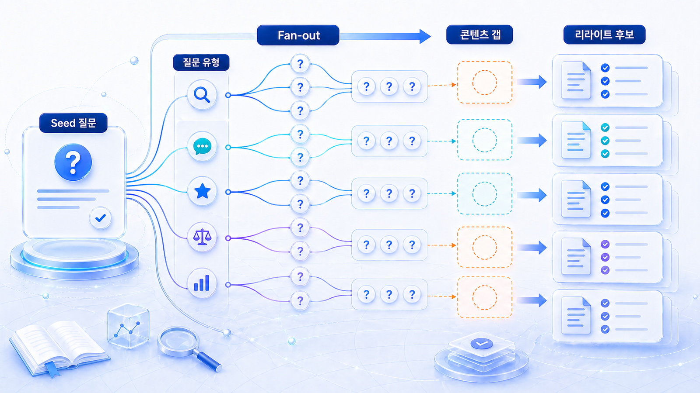
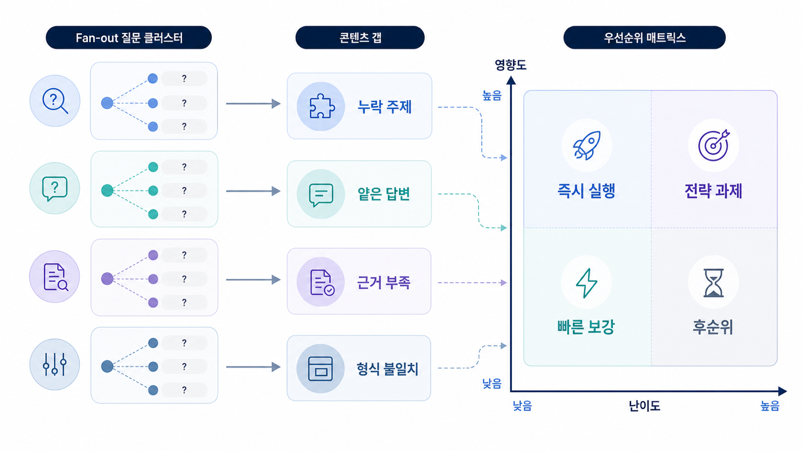

## 2주차 Fan-out 질문맵과 콘텐츠 갭 분석



2주차의 목표는 1주차 질문셋에서 AI가 반복해서 확인하는 하위 판단을 찾는 것입니다. 이를 Fan-out 질문맵으로 정리하면 콘텐츠, source, 기술 갭이 보입니다.

질문을 더 많이 만드는 것만으로는 부족합니다. AI가 답변을 만들 때 어떤 비교 기준과 근거를 반복해서 쓰는지 봐야 다음 액션이 나옵니다.

`AcmeGEO`라는 이름은 설명을 위한 가상 기업명이며, 실제 고객 사례가 아닙니다.

[TOC]

## 먼저 볼 기준

| 기준 | 읽는 법 |
|---|---|
| Fan-out | 답변에 반복되는 하위 판단을 표시한다 |
| 갭 | 우리 URL이 답하지 못하는 기준을 찾는다 |
| 우선순위 | 중요 질문군과 경쟁 URL이 겹치는 곳부터 고른다 |

## 실행 흐름

1. 1주차 기준선에서 브랜드가 빠진 질문을 먼저 고른다.
2. AI가 내부에서 확장할 하위 질문을 문제/비교/검증/실행형으로 나눈다.
3. 우리 콘텐츠가 답하지 못한 질문과 경쟁사가 답한 질문을 표시한다.
4. 새 글, 기존 글 수정, FAQ, 표, schema 중 필요한 작업을 정한다.
5. 3주차에 고칠 source와 콘텐츠 후보를 넘긴다.



*질문 패턴에서 콘텐츠 갭을 찾는 흐름*

## 2주차 예시

AcmeGEO는 “GEO 도구 추천” 답변에서 리포트 예시, citation 추적, 경쟁 도구 비교가 반복됨을 발견합니다. 제품 페이지에는 이 중 두 가지가 약하므로 다음 주 리라이트 대상으로 넘깁니다.

## 작성 예시와 완료 기준

| 발견한 하위 질문 | 콘텐츠 갭 |
|---|---|
| GEO 리포트에는 어떤 지표가 들어가야 하는가 | 리포트 예시 페이지 없음 |
| mention/source/citation은 어떻게 다른가 | 지표 구분 표 부족 |
| SEO 도구와 GEO 도구는 무엇이 다른가 | 비교 기준 페이지 부족 |

완료 기준은 “질문을 많이 찾았다”가 아닙니다. 3주차에 고칠 URL과 새로 만들 URL이 정해져야 합니다.

## 정리 양식

```text
대표 질문:
반복 fan-out 기준:
경쟁 URL:
우리 URL:
갭 유형:
다음 수정 대상:
```

## 다음 흐름

3주차는 [3주차 콘텐츠/source 설계](https://wikidocs.net/346367)에서 콘텐츠와 출처를 고칩니다.
