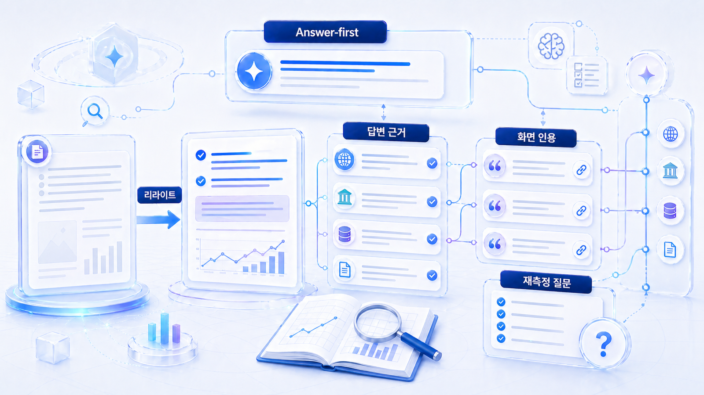
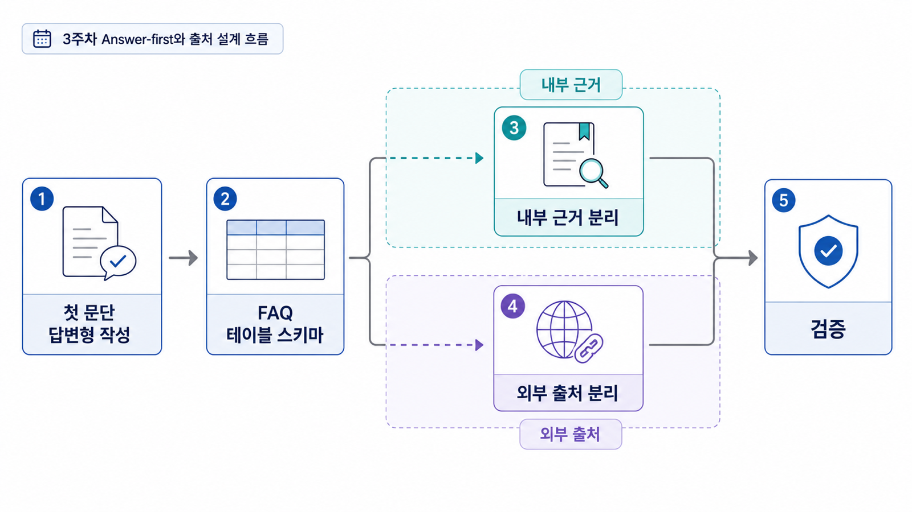

## 3주차: 콘텐츠 리라이트와 출처 설계



3주차는 2주차에서 고른 콘텐츠 하나를 Answer-first 구조로 고치고, 답변 근거(source)/화면 인용(citation) 후보를 함께 설계하는 단계입니다. GEO 콘텐츠는 글만 고치는 작업이 아니라 AI가 답변에 쓸 수 있는 근거와 구조를 정리하는 작업입니다.

콘텐츠만 고치면 자사 주장에 머물 수 있고, 외부 신호만 만들면 답변 재료가 약할 수 있습니다. 둘을 함께 설계해야 합니다. 여기에 06장의 기술 점검까지 붙어야 “좋은 글”이 아니라 “발견되고 읽히고 인용될 수 있는 URL”이 됩니다.

[TOC]

## 3주차 목표

| 목표 | 설명 | 산출물 |
|---|---|---|
| 리라이트 대상 확정 | 2주차 갭에서 고칠 페이지를 고른다 | 대상 URL/문서 |
| 첫 답변 수정 | 질문에 바로 답하는 opening을 쓴다 | Answer-first 첫 문단 |
| 구조 보강 | FAQ/표/schema 후보를 정리한다 | 구조화 초안 |
| 출처 설계 | 내부/외부 답변 근거 후보를 분리한다 | 답변 근거 맵 |
| 기술 요청 | 크롤링/렌더링/schema/canonical 점검 항목을 만든다 | 개발/운영 요청 |
| 재측정 질문 확정 | 수정 후 다시 볼 질문을 정한다 | 재측정 질문셋 |

## 리라이트는 문장 교정이 아니다

GEO 리라이트는 문장을 예쁘게 다듬는 작업이 아닙니다. AI 답변이 가져갈 수 있는 판단 재료를 앞쪽에 놓고, 사람이 읽어도 빠르게 이해할 수 있는 구조로 바꾸는 작업입니다.

| 일반 리라이트 | GEO 리라이트 |
|---|---|
| 문장을 자연스럽게 고친다 | 질문에 바로 답하는 첫 문단을 만든다 |
| 소제목을 정리한다 | AI가 판단할 기준을 H2/H3로 분리한다 |
| 사례를 추가한다 | 비교/선택/주의 기준을 표로 만든다 |
| FAQ를 붙인다 | 실제 AI 질문셋에 대응하는 Q/A를 넣는다 |
| 참고 링크를 단다 | 답변 근거(source)와 화면 인용(citation) 후보를 분리한다 |
| 발행 후 끝낸다 | 같은 질문셋으로 재측정한다 |

## Answer-first 첫 문단 만드는 법

첫 문단은 배경 설명보다 답을 먼저 줘야 합니다. AI 검색과 일반 독자 모두 긴 서론보다 “그래서 무엇을 해야 하는가”를 먼저 확인합니다.

| 구성 | 질문 | 예시 |
|---|---|---|
| 한 줄 정의 | 이것은 무엇인가? | GEO 리포트는 AI 답변에서 브랜드가 어떻게 언급/인용되는지 기록하고 다음 실행을 정하는 운영 문서입니다. |
| 판단 기준 | 무엇을 봐야 하는가? | mention, 답변 근거(source), 화면 인용(citation), 경쟁사, 다음 액션을 분리해 봅니다. |
| 실행 방향 | 무엇을 해야 하는가? | 같은 질문셋으로 기준선을 잡고 30일 뒤 재측정합니다. |
| 주의점 | 무엇을 착각하면 안 되는가? | 단순 언급률을 citation 성과로 해석하면 안 됩니다. |

이 구조는 HaloX의 [AI에게 인용되는 콘텐츠 가이드](https://haloxlabs.ai/ko/blog/how-to-get-cited-by-ai), [GEO 콘텐츠 구조화 가이드](https://haloxlabs.ai/ko/blog/geo-content-structure)와 연결됩니다.

## Before/After 예시

| 항목 | Before | After |
|---|---|---|
| 첫 문단 | 최근 AI 검색이 중요해지고 있습니다. 기업은 새로운 검색 환경에 대응해야 합니다. | GEO 리포트는 AI 답변에서 브랜드 mention, 답변 근거(source), 화면 인용(citation), 경쟁사 맥락을 기록하고 다음 30일 액션을 정하는 문서입니다. |
| 비교 기준 | 여러 요소를 고려해야 합니다. | 질문셋, 플랫폼, mention, source, citation, 경쟁사, 실행 액션을 분리해 비교합니다. |
| FAQ | GEO가 뭔가요? | Q. mention은 있는데 citation이 없으면 어떻게 해석하나요? A. 브랜드는 답변 후보에 들어왔지만 인용 가능한 URL 신호가 약할 수 있습니다. |
| 표 | 없음 | 질문 유형별 갭/필요 콘텐츠/출처 후보/기술 점검 항목 표 |
| 다음 액션 | 문의하세요 | 30일 안에 수정할 URL 3개와 재측정 질문셋을 정합니다. |

## FAQ/표/schema는 언제 붙이나

구조화 요소는 많을수록 좋은 것이 아닙니다. 질문의 성격에 맞아야 합니다.

| 요소 | 적합한 상황 | GEO에서의 역할 | 주의점 |
|---|---|---|---|
| FAQ | 질문/답변 형태가 실제 검색 의도와 맞을 때 | AI 질문셋에 직접 대응 | 본문에 없는 내용을 schema에만 넣지 않음 |
| 표 | 비교/선택/기준이 필요한 글 | AI가 기준을 분리해 이해하기 쉬움 | 표만 있고 설명이 없으면 약함 |
| HowTo 단계 | 절차가 중요한 글 | 실행 순서를 답변 재료로 제공 | 억지 단계화 금지 |
| Organization/Person schema | 브랜드/대표/전문가 신뢰가 중요한 페이지 | 엔티티 이해 보조 | 실제 본문/프로필과 일치해야 함 |
| Article/NewsArticle schema | 블로그/뉴스룸/보도자료 | 발행 주체/날짜/제목 명확화 | 뉴스가 아닌 글에 NewsArticle 남용 금지 |
| Product schema | 상품/서비스/커머스 페이지 | 가격/재고/리뷰/상품 정보 보조 | 실제 상품 정보와 불일치하면 위험 |

Schema는 06장의 [Schema 타입별 실전 점검표](https://wikidocs.net/346390)와 함께 확인합니다. Google의 [구조화된 데이터 소개](https://developers.google.com/search/docs/appearance/structured-data/intro-structured-data)와 [리치 결과 테스트](https://search.google.com/test/rich-results)도 참고합니다.

## 출처 설계는 내부/외부를 분리한다

AI가 답변에 쓸 수 있는 근거는 자사 페이지 하나로 끝나지 않습니다. 내부 근거와 외부 근거를 분리해야 합니다.

| 출처 유형 | 예시 | 역할 | 3주차 액션 |
|---|---|---|---|
| 공식 페이지 | 브랜드 소개/제품 페이지/가격 페이지 | 기준 정의와 최신 정보 | 한 줄 정의/주요 기능/대상 고객 정렬 |
| 블로그/가이드 | GEO 정의/콘텐츠 구조/키워드 전략 글 | 설명형 답변 재료 | 첫 문단/표/FAQ 보강 |
| 용어집 | GEO/AEO/AIO/LLMO/AVI | 개념 정의 | 짧고 일관된 정의 문장 정리 |
| 외부 리뷰/디렉터리 | 카테고리 목록/프로필/파트너 페이지 | 후보군/신뢰 신호 | 정보 일관성 확인 |
| PR/뉴스룸 | 보도자료/인터뷰/기고 | 엔티티 신뢰/시의성 | 사실/날짜/주체 명확화 |
| 커뮤니티/후기 | Reddit/포럼/지도 리뷰/사용 후기 | 실사용 맥락 | 조작 없이 실제 문제 해결 맥락만 활용 |

이 분리는 [05. 답변 근거, 화면 인용, 엔티티 전략](https://wikidocs.net/346333)의 핵심 기준으로 봅니다.



<small>3주차 작업은 첫 문단을 답변형으로 바꾸고 내부 근거와 외부 출처를 분리해 AI가 읽을 수 있게 만드는 단계다.</small>


## 3주차 작업 완료 기준

3주차는 “글을 고쳤다”가 아니라 “재측정 가능한 URL과 source를 만들었다”가 완료 기준입니다.

| 완료 항목 | 확인 질문 |
|---|---|
| Answer-first | 첫 2~4문단에서 질문에 직접 답하는가? |
| 구조화 | H2/표/FAQ가 fan-out 노드에 답하는가? |
| source | 공식/외부 근거 후보가 연결되어 있는가? |
| 기술 | canonical/schema/sitemap/렌더링 점검 요청이 있는가? |
| 로그 | 수정한 URL과 변경 이유를 기록했는가? |
| 재측정 | 같은 질문셋으로 다시 볼 날짜가 정해졌는가? |

## 따라 해보는 순서

| 단계 | 할 일 | 확인할 것 |
|---|---|---|
| 1 | 2주차 갭과 리라이트 후보 확인 | 이번 단계에서는 글 하나를 실제로 고친다 |
| 2 | 목표 질문 3개 확정 | 어떤 질문에 답하게 만들 것인지 정한다 |
| 3 | 첫 문단 작성 | 정의/기준/실행 방향/주의점을 2~4문단 안에 넣는다 |
| 4 | 표/FAQ/schema 후보 작성 | 질문 유형에 맞는 구조만 고른다 |
| 5 | 내부/외부 source map 작성 | 자사 주장과 외부 신뢰 신호를 분리한다 |
| 6 | 기술 점검 요청 만들기 | HTML/canonical/schema/internal link/sitemap 확인 |
| 7 | 재측정 질문과 날짜 확정 | 4주차 리포트 입력값으로 넘긴다 |

## 실습 정리표

| 입력 항목 | 작성 기준 |
|---|---|
| 리라이트 대상 | URL 또는 문서명 |
| 목표 질문 | AI 답변에서 잡고 싶은 질문 3개 |
| 첫 답변 | 수정한 opening |
| 추가 구조 | FAQ/표/schema/비교 기준 |
| 내부 출처 | 자사 페이지/블로그/용어집/제품 문서 |
| 외부 출처 | 디렉터리/리뷰/PR/커뮤니티/공식 자료 |
| 기술 점검 | crawl/render/schema/canonical/internal link |
| 검수 | AI가 인용할 만한 문장 |

## 기술팀에 넘길 요청 예시

| 점검 항목 | 요청 문장 | 완료 기준 |
|---|---|---|
| HTML 본문 | 핵심 답변 문장이 렌더링 후 HTML 텍스트로 확인되는지 봐주세요 | JS 없이도 주요 본문이 읽힘 |
| canonical | 대표 URL과 canonical이 충돌하지 않는지 확인해주세요 | 중복 URL이 대표 URL로 정리됨 |
| schema | 본문과 일치하는 Organization/Article/FAQ schema만 남겨주세요 | 리치 결과 테스트 오류 없음 |
| 내부 링크 | 관련 글에서 이 URL로 가는 crawlable href가 있는지 확인해주세요 | 핵심 허브/관련 글에서 링크 확인 |
| sitemap | 수정 URL이 sitemap에 포함되어 있는지 확인해주세요 | Search Console에서 확인 가능 |

## 정리 양식

```text
대상 콘텐츠:
목표 질문 3개:
바꾼 첫 문단:
추가 FAQ:
추가 표/비교 기준:
schema 후보:
내부 답변 근거 후보:
외부 답변 근거 후보:
기술 점검 요청:
재측정 질문:
발행 전 체크:
```

## 완료 기준

- 리라이트 대상 콘텐츠 1개가 정해졌습니다.
- 첫 문단, 표/FAQ, 답변 근거 후보, 재측정 질문이 함께 작성되었습니다.
- 내부 출처와 외부 출처가 분리되어 있습니다.
- 기술 점검 요청이 구체적인 URL/문제/완료 기준으로 작성되어 있습니다.
- 발행 후 4주차 리포트에 넣을 실행 로그가 남아 있습니다.

## 참고 링크 패키지

이 실습은 [04-01. AI가 인용하는 Answer-first 콘텐츠는 어떻게 쓰는가](https://wikidocs.net/346347), [05-01. 답변 근거(source)와 화면 인용(citation)은 무엇이 다른가](https://wikidocs.net/346350), HaloX의 [AI에게 인용되는 콘텐츠 가이드](https://haloxlabs.ai/ko/blog/how-to-get-cited-by-ai)와 함께 보면 좋습니다.

콘텐츠 리라이트와 출처 설계는 크롤러가 링크를 발견할 수 있을 때 더 의미가 있습니다. 답변 근거 후보 페이지를 점검할 때는 Google의 [크롤 가능한 링크 가이드](https://developers.google.com/search/docs/crawling-indexing/links-crawlable)를 함께 참고합니다.

## 흔한 질문

**Q. 기존 글을 완전히 새로 써야 하나요?**

아닙니다. 먼저 첫 문단, 핵심 표, FAQ, 답변 근거 후보를 고치는 것만으로도 1차 실험이 됩니다. 새 글은 기존 URL로 답하기 어려울 때 선택합니다.

**Q. 외부 출처는 꼭 만들어야 하나요?**

모든 페이지에 필요한 것은 아닙니다. 다만 AI가 신뢰할 근거가 자사 페이지 안에만 갇혀 있으면 화면 인용 안정성이 약해질 수 있습니다. 비교/추천/리스크 질문에서는 외부 출처가 특히 먼저 봐야 합니다.

**Q. schema를 넣으면 바로 AI 답변에 인용되나요?**

아닙니다. schema는 이해를 돕는 보조 신호이지 인용을 보장하는 장치가 아닙니다. 본문 내용, 내부 링크, 외부 출처, 기술 접근성이 함께 맞아야 합니다.

## 다음 흐름

이전: [10-02. 2주차: Fan-out 질문맵과 콘텐츠 갭](https://wikidocs.net/346366) / 다음: [10-04. 4주차: GEO 실행 리포트와 30일 액션 플랜](https://wikidocs.net/346368)
