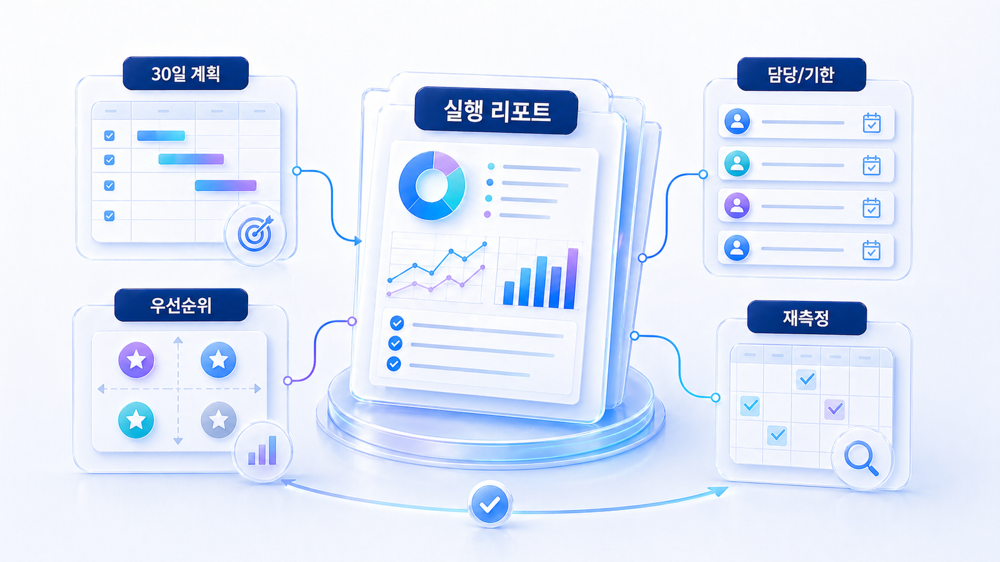
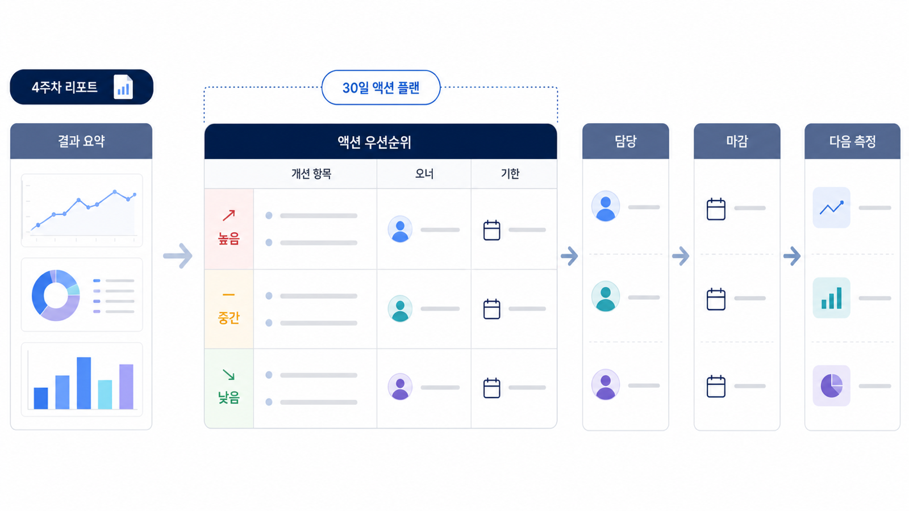

## 4주차: GEO 실행 리포트와 30일 액션 플랜



4주차의 목표는 한 달 동안 확인한 기준선, Fan-out 갭, 콘텐츠/source 수정 결과를 하나의 GEO 실행 리포트로 묶는 것입니다. 리포트는 지식 정리가 아니라 다음 30일 행동을 정하는 문서입니다.

좋은 실행 리포트는 “무엇을 배웠는가”보다 “다음 달 무엇을 고칠 것인가”를 분명히 합니다. 질문군별 변화, 경쟁 URL, 남은 리스크, 담당 액션이 보여야 합니다.

[TOC]

## 먼저 볼 기준

| 기준 | 읽는 법 |
|---|---|
| 요약 | 5줄 안에 상태/원인/액션을 말한다 |
| 우선순위 | 영향도와 실행 가능성을 함께 본다 |
| 반복 | 다음 측정 질문과 날짜를 고정한다 |

## 실행 흐름

1. 대표 질문을 정한다.
2. 현재 AI 답변에서 mention/source/citation을 나눠 본다.
3. 경쟁 브랜드나 반복 URL이 어떤 이유로 등장하는지 확인한다.
4. 우리 공식 페이지, 외부 출처, 기술 조건 중 먼저 고칠 곳을 고른다.
5. 같은 질문군으로 30일 뒤 다시 본다.



*30일 액션 플랜으로 마무리하는 흐름*

## 4주차 예시

AcmeGEO는 추천형 질문에서 mention은 늘었지만 citation은 아직 약하다고 정리합니다. 다음 30일 액션은 리포트 예시 URL 보강, 외부 비교 글 확보, 같은 질문군 재측정입니다.

## 정리 양식

```text
이번 달 결론:
좋아진 질문군:
약한 지표:
반복 경쟁 URL:
30일 액션:
다음 측정일:
```

## 다음 흐름

4주 흐름이 끝나면 [월간 GEO 리포트 운영](https://wikidocs.net/346398)의 월간 리포트 운영으로 반복합니다.
