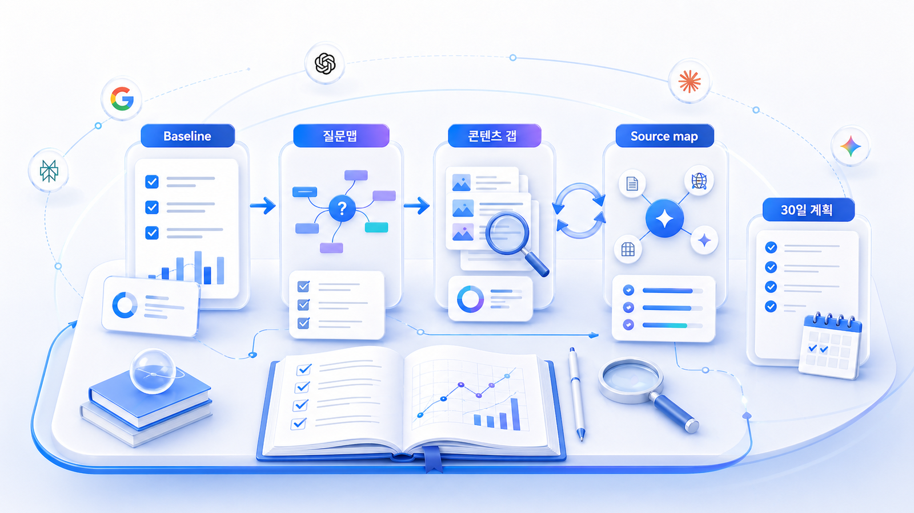

## 4주 실행 로드맵과 GEO 리포트

이 장은 독자가 GEO를 읽고 끝내지 않도록 4주 실행 순서로 정리합니다. GEO 교육이나 GEO 강의를 찾는 독자에게도 목표는 과정을 듣는 것이 아니라, 자기 브랜드의 질문 시장을 만들고 기준선을 측정한 뒤 콘텐츠/출처/기술 액션으로 이어지는 실행 리포트를 완성하는 것입니다.

결과물은 지식 노트가 아니라 `GEO 실행 리포트`입니다. 1주차에는 현재 상태를 기록하고, 2주차에는 질문맵과 콘텐츠 갭을 만들고, 3주차에는 콘텐츠와 답변 근거(source)/화면 인용(citation) 설계를 실행하고, 4주차에는 30일 액션 플랜과 재측정 기준을 확정합니다.

## 4주 실행 흐름

| 주차 | 핵심 질문 | 남길 산출물 | 다음 입력값 |
|---|---|---|---|
| 1주차 | 우리 브랜드는 AI 답변에 어떻게 보이는가 | 기준선 리포트/질문셋/경쟁사 표 | 대표 질문 3개 |
| 2주차 | 어떤 질문에서 콘텐츠 갭이 생기는가 | Fan-out 질문맵/콘텐츠 갭 리스트 | 리라이트 후보 1~3개 |
| 3주차 | 어떤 콘텐츠와 출처를 고쳐야 하는가 | Answer-first 리라이트/답변 근거 맵 | 실행 우선순위 |
| 4주차 | 30일 동안 무엇을 실행하고 다시 볼 것인가 | 실행 리포트/30일 액션 플랜 | 월간 리포트 또는 다음 실험 |

## 이 장에서 다루는 세부 페이지

- [10-01. 1주차: GEO 기준선 진단](https://wikidocs.net/346365)
- [10-02. 2주차: Fan-out 질문맵과 콘텐츠 갭](https://wikidocs.net/346366)
- [10-03. 3주차: 콘텐츠 리라이트와 출처 설계](https://wikidocs.net/346367)
- [10-04. 4주차: GEO 실행 리포트와 30일 액션 플랜](https://wikidocs.net/346368)

## 주차별 적용 방법

각 주차는 한 장의 산출물을 남기는 방식으로 읽으면 됩니다. 시간이 짧다면 설명을 모두 따라가기보다 질문셋/측정표/액션 플랜처럼 다음 행동을 정하는 항목만 먼저 남깁니다.

| 단계 | 할 일 | 목적 |
|---|---|---|
| 1 | 지난 실행 결과와 이번 주 산출물 확인 | 목표를 산출물로 고정 |
| 2 | 핵심 개념과 사례 읽기 | 왜 이 작업이 필요한지 이해 |
| 3 | 자기 브랜드 기준으로 작성 | 질문셋/진단표/액션 작성 |
| 4 | 다른 사례와 비교 | 질문/근거/액션 연결 확인 |
| 5 | 정리 양식 마무리 | 다음 단계 입력값 확정 |
| 6 | 다음 실행 항목 정리 | 실행과 재측정 일정 고정 |

## 산출물 점검 기준

| 평가 항목 | 통과 기준 | 보완 질문 |
|---|---|---|
| 질문 명확성 | 실제 사용자가 물을 법한 문장이다 | 이 질문을 고객이 그대로 말할까? |
| 측정 가능성 | mention, 답변 근거(source), 화면 인용(citation), 경쟁사 중 지표가 정해져 있다 | 무엇이 변하면 좋아진 것인가? |
| 실행 연결 | 콘텐츠/오프사이트/기술 액션으로 이어진다 | 누가 무엇을 고쳐야 하는가? |
| 근거 품질 | 내부 자산과 외부 출처가 분리되어 있다 | AI가 참고할 신뢰 가능한 출처가 있는가? |
| 반복성 | 같은 질문셋으로 다시 측정할 수 있다 | 30일 뒤 같은 조건으로 비교 가능한가? |

## HaloX와 연결되는 지점

4주 실행 로드맵에서 HaloX는 기능 소개용 화면이 아니라 분석과 리포트의 기준으로 사용합니다. 1주차에는 질문셋과 AI 브리핑으로 기준선을 잡고, 2주차에는 질문별 콘텐츠 갭을 찾고, 3주차에는 답변 근거(source)/화면 인용(citation)과 콘텐츠 구조를 연결하고, 4주차에는 [09-05. GEO 리포트 운영: 브랜드 가시성을 매달 관리하는 법](https://wikidocs.net/346398)의 흐름으로 확장합니다.

실행 로드맵에서 만든 결과물은 HaloX의 [GEO 블로그](https://haloxlabs.ai/ko/blog)와 연결해 개념을 더 깊게 확인할 수 있습니다. 표를 채우는 것이 목적이 아니라 실제 독자나 고객의 문제를 해결하는 콘텐츠 운영 기준을 만드는 것이 목적입니다. Google의 [유용한 콘텐츠 만들기](https://developers.google.com/search/docs/fundamentals/creating-helpful-content)를 공통 기준으로 두면 각 주차 산출물이 왜 필요한지 설명하기 쉽습니다.

## 주차별 산출물 정리 방식

독자가 남겨야 할 것은 긴 보고서가 아닙니다. 매주 한 장짜리 산출물만 정리하면 됩니다.

| 주차 | 산출물 | 확인할 것 |
|---|---|---|
| 1주차 | 브랜드 기준선 표 | 질문이 실제적인지, 지표가 비어 있지 않은지 |
| 2주차 | Fan-out 질문맵 | 질문이 너무 넓지 않은지, 콘텐츠 갭이 보이는지 |
| 3주차 | 리라이트 초안/답변 근거 맵 | 첫 답변과 출처 후보가 연결되는지 |
| 4주차 | 실행 리포트/30일 계획 | 담당/기한/재측정 기준이 있는지 |

## 4주 결과물을 하나의 리포트로 합치는 법

10장의 목표는 매주 산출물을 따로 남기는 것이 아니라 마지막에 하나의 GEO 실행 리포트로 합치는 것입니다.

| 리포트 섹션 | 1~4주차 입력값 | 최종 문장 예시 |
|---|---|---|
| 현재 상태 | 1주차 기준선 | 우리 브랜드는 정보형 질문에서는 언급되지만 추천형 질문에서는 빠집니다 |
| 핵심 원인 | 2주차 Fan-out/갭 | 비교 기준과 외부 출처가 부족해 후보군에 들어가지 못합니다 |
| 실행 내용 | 3주차 리라이트/출처 설계 | Answer-first 구조로 3개 글을 수정하고 FAQ/schema 점검을 요청했습니다 |
| 기술 점검 | 6장 체크리스트 | 핵심 URL 2개는 sitemap에는 있지만 내부 링크가 약했습니다 |
| 다음 30일 | 4주차 액션 플랜 | 비교표 2개, 외부 출처 3개, schema 수정 2건을 완료합니다 |
| 재측정 | 같은 질문셋 | 30일 뒤 같은 30개 질문으로 mention/source/citation을 다시 봅니다 |

이 리포트가 있어야 4주 실행이 학습으로 끝나지 않고 다음 달 운영으로 이어집니다.

## 다음 흐름

이 장은 앞선 [09. GEO 대행사/컨설팅/도구 검증: AI 검색 리포트 읽는 법](https://wikidocs.net/346337)의 판단 기준을 실제 실행 계획으로 바꿉니다. 4주 실행 로드맵을 마친 뒤에는 [90. 산업별 GEO 케이스북](https://wikidocs.net/346381)을 참고해 업종별로 어떤 질문과 출처를 더 봐야 하는지 확인합니다.
