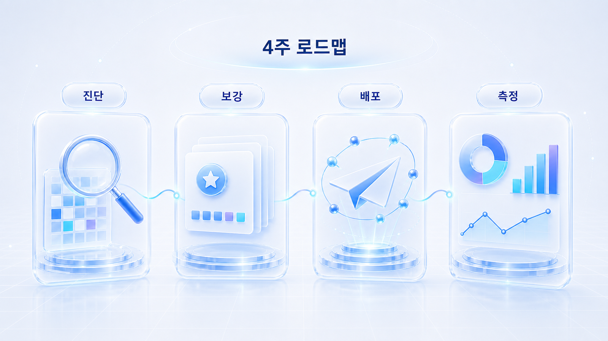
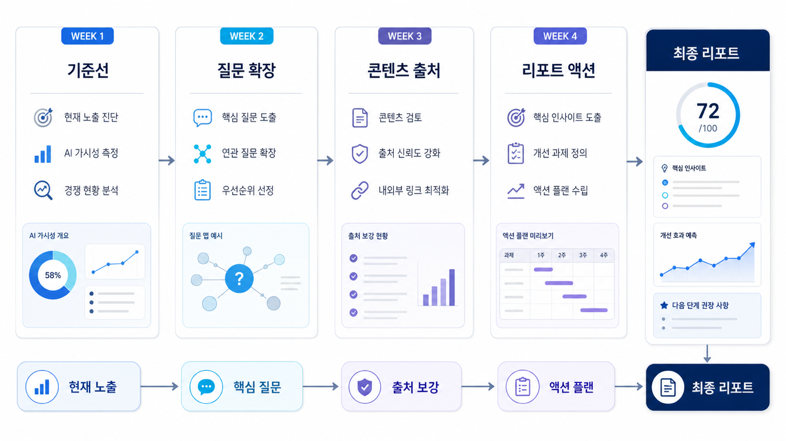

## GEO 워크플로우: 4주 실행 로드맵과 리포트

10장은 앞에서 배운 GEO 개념을 하나의 실행 워크플로우와 운영 리포트로 바꾸는 장입니다. GEO를 배우려는 독자에게도 최종 목표는 개념을 아는 데서 멈추지 않고, 자기 브랜드가 AI 검색에서 어떻게 보이고 무엇을 고쳐야 하는지 설명할 수 있는 `GEO 실행 리포트`를 만드는 것입니다.

GEO 실행은 한 번의 점수 확인으로 끝나지 않습니다. 같은 질문셋으로 기준선을 남기고, AI가 답변을 만들 때 필요한 질문/출처/기술 조건을 나눠 보고, 콘텐츠/오프사이트/개발 액션을 30일 단위로 실행한 뒤 다시 측정해야 합니다. 이 반복 구조가 없으면 “AI 답변에 우리 브랜드가 안 나온다”는 감상만 남고, 실제 업무는 움직이지 않습니다.

[TOC]

## 이 장의 최종 산출물

10장의 산출물은 긴 발표자료가 아니라 실무자가 바로 실행할 수 있는 한 장짜리 GEO 리포트입니다. 리포트에는 네 가지가 반드시 들어가야 합니다.

| 구성 요소 | 묻는 질문 | 남겨야 할 증거 | 다음 액션 |
|---|---|---|---|
| 기준선 | 지금 AI 답변에서 우리 브랜드는 어떻게 보이는가? | 질문셋/모델/날짜/mention/source/citation/경쟁사 | 같은 조건으로 재측정 |
| 질문맵 | 어떤 질문에서 답변 재료가 부족한가? | Seed 질문/Fan-out 질문/질문 유형/콘텐츠 갭 | 리라이트 후보 선정 |
| 실행 로그 | 무엇을 실제로 고쳤는가? | 수정 URL/첫 문단/표/FAQ/schema/source 후보 | 발행/기술 점검 |
| 30일 계획 | 다음 달 무엇을 우선 실행할 것인가? | 담당/기한/완료 기준/재측정 날짜 | 월간 GEO 리포트로 반복 |

이 네 가지가 연결되어야 GEO가 “새로운 마케팅 용어”가 아니라 운영 체계가 됩니다.

## 4주 로드맵을 1~9장과 연결하기

10장은 앞 장을 요약하는 장이 아니라 실제 운영 순서로 묶는 장입니다. 각 주차는 특정 장의 산출물을 받아 다음 주차 입력값으로 넘깁니다.

| 주차 | 입력 장 | 핵심 산출물 | 다음 주차로 넘기는 것 |
|---|---|---|---|
| 1주차 | 01~02장 | query/question set, 기준선 리포트 | 약한 질문군과 대표 seed question |
| 2주차 | 03장 | fan-out map, gap list | 리라이트/source/기술 후보 |
| 3주차 | 04~06장 | Answer-first URL, source map, 기술 티켓 | 수정 로그와 재측정 질문 |
| 4주차 | 07~09장 | 산업별 해석, 실행 리포트, 30일 계획 | 월간 운영 백로그 |

AcmeGEO의 4주 실행도 이 흐름을 따릅니다. 첫 주에는 추천형 질문에서 빠지는지 확인하고, 둘째 주에는 AI가 어떤 기준으로 도구를 비교하는지 분해하고, 셋째 주에는 비교표/리포트 샘플/canonical을 고치고, 넷째 주에는 재측정 결과를 팀별 액션으로 나눕니다.

## GEO 워크플로우를 4주로 나누는 법

| 주차 | 핵심 질문 | 남길 산출물 | 연결되는 앞 장 |
|---|---|---|---|
| 1주차 | 우리 브랜드는 AI 답변에 어떻게 보이는가? | 기준선 리포트/질문셋/경쟁사 표 | 01장/02장 |
| 2주차 | 어떤 질문에서 콘텐츠 갭이 생기는가? | Fan-out 질문맵/콘텐츠 갭 리스트 | 03장 |
| 3주차 | 어떤 콘텐츠와 출처를 고쳐야 하는가? | Answer-first 리라이트/source map/기술 요청 | 04장/05장/06장 |
| 4주차 | 30일 동안 무엇을 실행하고 다시 볼 것인가? | 실행 리포트/30일 액션 플랜/재측정 기준 | 09장/90장 |

1주차는 측정, 2주차는 진단, 3주차는 수정, 4주차는 운영 계획입니다. 순서를 바꾸면 리포트가 약해집니다. 예를 들어 기준선 없이 리라이트부터 하면 무엇이 좋아졌는지 설명하기 어렵고, 질문맵 없이 출처를 늘리면 왜 그 출처가 필요한지 판단하기 어렵습니다.

<small>4주 GEO 워크플로우는 기준선, 질문 확장, 콘텐츠와 출처 개선, 리포트 액션 플랜으로 이어진다.</small>

## GEO 실행 리포트는 점수표와 무엇이 다른가

GEO 리포트가 흔히 약해지는 이유는 점수만 보여주고 다음 행동을 정하지 않기 때문입니다. 좋은 리포트는 “몇 점”보다 “어떤 질문에서, 어떤 근거가 부족해서, 누가 무엇을 고쳐야 하는가”를 보여줍니다.

| 약한 리포트 | 실행 가능한 리포트 |
|---|---|
| 브랜드 언급률 20% | 구매형 질문 10개 중 2개에서만 언급됨. 비교 기준 콘텐츠와 외부 리뷰 출처가 부족함 |
| citation 없음 | AI 답변에는 브랜드가 언급되지만 화면 인용 URL은 경쟁사 블로그와 디렉터리에 몰림 |
| 콘텐츠 보강 필요 | `GEO 도구 추천` 질문군에 맞춰 비교표/가격 기준/도입 사례/FAQ를 2주 안에 보강 |
| 기술 점검 필요 | 핵심 URL 3개는 sitemap에는 있으나 내부 링크가 약하고 Organization schema가 실제 본문과 불일치 |
| 다음 달 재확인 | 같은 30개 질문으로 ChatGPT/Perplexity/Google AI 기능을 같은 날짜에 재측정 |

이 차이를 이해해야 10장을 제대로 사용할 수 있습니다. 10장은 설명을 더 읽는 장이 아니라, 앞 장의 개념을 `무엇을 먼저 하고, 무엇을 기록하고, 무엇을 다시 측정할지`로 바꾸는 GEO 워크플로우 장입니다.

## 이 장에서 다루는 세부 페이지

- [10-01. 1주차: GEO 기준선 진단](https://wikidocs.net/346365)
- [10-02. 2주차: Fan-out 질문맵과 콘텐츠 갭](https://wikidocs.net/346366)
- [10-03. 3주차: 콘텐츠 리라이트와 출처 설계](https://wikidocs.net/346367)
- [10-04. 4주차: GEO 실행 리포트와 30일 액션 플랜](https://wikidocs.net/346368)

## 리포트에 들어갈 최소 데이터

처음부터 복잡한 대시보드를 만들 필요는 없습니다. 다만 아래 항목은 빠지면 안 됩니다.

| 데이터 | 왜 필요한가 | 기록 기준 |
|---|---|---|
| 질문셋 | AI 답변 변화를 비교할 기준 | 정보형/비교형/추천형/문제해결형/브랜드형을 섞는다 |
| 측정 환경 | 답변 변동을 해석할 조건 | 모델/날짜/지역/로그인 여부/프롬프트 문장 |
| mention | 답변 안에 브랜드가 등장하는지 | 단순 언급과 추천 맥락을 구분한다 |
| 답변 근거(source) | AI가 답을 만들 때 참고한 것으로 보이는 근거 | 자사 페이지/외부 페이지/공식 문서/리뷰를 분리한다 |
| 화면 인용(citation) | 실제 화면에 링크로 드러난 URL | Perplexity/Google AI 기능처럼 화면 링크가 보이는 환경에서 별도 기록한다 |
| 경쟁사/대안 | AI가 함께 비교하는 후보 | 반복 등장 후보와 일회성 후보를 나눈다 |
| 다음 액션 | 리포트를 실행으로 바꾸는 항목 | 콘텐츠/source/기술/제품/PR 액션으로 분류한다 |

mention, 답변 근거(source), 화면 인용(citation)은 [02. AI 검색 모니터링](https://wikidocs.net/346342)에서 배운 기준을 그대로 사용합니다. 기존 SEO 지표와 함께 보려면 Google Search Console의 [성과 보고서 도움말](https://support.google.com/webmasters/answer/7576553)을 참고해 검색 노출/클릭과 AI 답변 노출을 분리해 해석합니다.

## 4주 결과물을 하나의 리포트로 합치는 법

| 리포트 섹션 | 1~4주차 입력값 | 최종 문장 예시 |
|---|---|---|
| 현재 상태 | 1주차 기준선 | 우리 브랜드는 정보형 질문에서는 언급되지만 추천형 질문에서는 빠집니다 |
| 핵심 원인 | 2주차 Fan-out/갭 | 비교 기준과 외부 출처가 부족해 후보군에 들어가지 못합니다 |
| 실행 내용 | 3주차 리라이트/source 설계 | Answer-first 구조로 3개 글을 수정하고 FAQ/schema 점검을 요청했습니다 |
| 기술 점검 | 6장 체크리스트 | 핵심 URL 2개는 sitemap에는 있지만 내부 링크와 canonical 신호가 약했습니다 |
| 다음 30일 | 4주차 액션 플랜 | 비교표 2개, 외부 출처 3개, schema 수정 2건을 완료합니다 |
| 재측정 | 같은 질문셋 | 30일 뒤 같은 30개 질문으로 mention/source/citation을 다시 봅니다 |

좋은 리포트는 “우리가 무엇을 했다”보다 “다음 측정에서 무엇이 달라져야 하는가”를 분명히 합니다.

## HaloX와 연결되는 지점

4주 실행 로드맵에서 HaloX는 기능 소개용 화면이 아니라 분석과 리포트의 기준으로 사용합니다. 1주차에는 질문셋과 AI 브리핑으로 기준선을 잡고, 2주차에는 질문별 콘텐츠 갭을 찾고, 3주차에는 답변 근거(source)/화면 인용(citation)과 콘텐츠 구조를 연결하고, 4주차에는 [09-05. GEO 리포트 운영: 브랜드 가시성을 매달 관리하는 법](https://wikidocs.net/346398)의 흐름으로 확장합니다.

실행 로드맵에서 만든 결과물은 HaloX의 [GEO 블로그](https://haloxlabs.ai/ko/blog)와 연결해 개념을 더 깊게 확인할 수 있습니다. 특히 [GEO란 무엇인가](https://haloxlabs.ai/ko/blog/what-is-geo-optimization), [SEO/GEO 키워드 전략](https://haloxlabs.ai/ko/blog/seo-geo-keyword-strategy-framework), [AI에게 인용되는 콘텐츠 가이드](https://haloxlabs.ai/ko/blog/how-to-get-cited-by-ai), [GEO 콘텐츠 구조화 가이드](https://haloxlabs.ai/ko/blog/geo-content-structure)는 1~3주차 판단 기준으로 함께 보기 좋습니다.

## 운영 기준 체크리스트

- 질문셋은 최소 30개를 목표로 하되, 처음에는 15개로 시작해도 됩니다.
- 모델/날짜/질문 문장은 반드시 남깁니다.
- mention과 citation을 같은 지표로 섞지 않습니다.
- 콘텐츠 액션과 기술 액션을 한 담당자에게 뭉뚱그리지 않습니다.
- 30일 액션은 3~5개로 줄입니다.
- 재측정 질문셋은 중간에 임의로 바꾸지 않습니다.
- 리포트는 점수보다 원인/근거/다음 행동을 먼저 보여줍니다.

## 흔한 질문

**Q. 4주를 꼭 지켜야 하나요?**

반드시 4주일 필요는 없습니다. 다만 `기준선 → 질문맵 → 실행 → 리포트` 순서는 지켜야 합니다. 시간이 짧다면 각 단계를 하루씩 압축할 수 있고, 시간이 길다면 2주 단위로 깊게 운영할 수 있습니다.

**Q. 도구 없이도 할 수 있나요?**

가능합니다. 처음에는 스프레드시트로 질문/답변/출처/경쟁사를 기록해도 됩니다. 다만 질문이 늘고 월간 리포트가 반복되면 수동 기록만으로는 누락이 생기기 쉬워 도구 기반 모니터링이 필요해집니다.

**Q. 좋은 점수가 나오면 끝인가요?**

아닙니다. AI 답변은 질문/모델/시간/출처 변화에 따라 달라집니다. 좋은 점수보다 중요한 것은 반복 측정과 실행 로그입니다.

## 다음 흐름

이 장은 앞선 [09. GEO 리포트와 실행 검증: AI 검색 성과를 읽는 법](https://wikidocs.net/346337)의 판단 기준을 실제 실행 계획으로 바꿉니다. 4주 실행 로드맵을 마친 뒤에는 [90. 산업별 GEO 케이스북](https://wikidocs.net/346381)을 참고해 업종별로 어떤 질문과 출처를 더 봐야 하는지 확인합니다.
