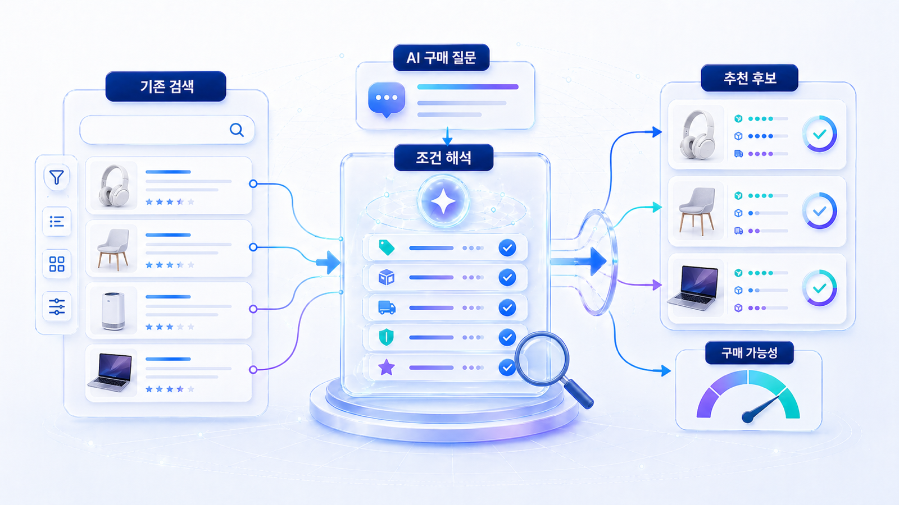
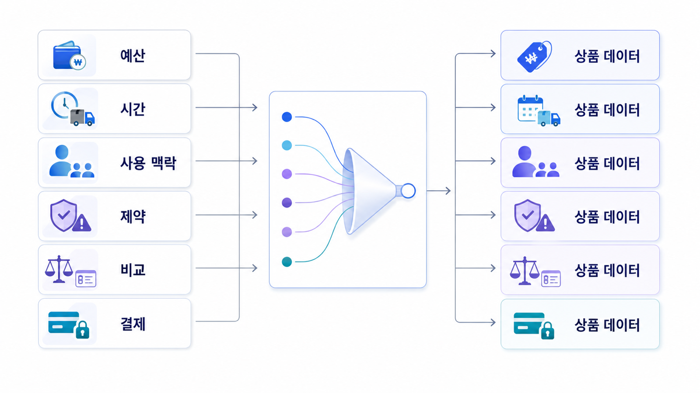

## AI 구매 에이전트와 커머스 GEO 검색 변화



AI 구매 에이전트가 들어오면 커머스 검색은 “상품명을 찾는 과정”에서 “조건에 맞는 후보를 좁히는 과정”으로 바뀝니다. 사용자는 예산, 용도, 배송, 리뷰, 반품 조건을 한 번에 말하고, AI는 상품 상세와 feed, schema, 리뷰, 정책 문서를 비교해 추천 이유를 만듭니다.

이때 GEO의 목표는 AI가 상품을 억지로 추천하게 만드는 것이 아닙니다. AI가 비교할 수 있는 데이터를 정확하게 제공하고, 잘못된 가격/재고/혜택/리뷰 해석을 줄이는 것입니다.

[TOC]

## 검색어보다 구매 조건이 중요해진다

기존 커머스 SEO는 카테고리 키워드, 상품명, 브랜드명, 리뷰 키워드가 중심이었습니다. AI 구매 질문은 더 복합적입니다. “가벼운 여행용 유모차 추천”이라는 질문 안에는 무게, 접이식 구조, 기내 반입 가능성, 가격, AS, 리뷰, 배송 가능성이 같이 들어갑니다.

상품 정보가 충분해도 각 데이터가 서로 다르면 추천 후보에서 밀릴 수 있습니다. 상세 페이지는 “당일 발송”인데 feed는 재고 없음으로 표시되고, schema에는 리뷰 값이 빠져 있으며, FAQ에는 반품 조건이 없으면 AI는 더 안정적인 다른 상품을 고릅니다.

| 구매 질문 요소 | 필요한 데이터 | 운영 담당 |
|---|---|---|
| 예산/가격 | 현재 가격, 할인 조건, 쿠폰 적용 범위 | MD/상품 운영 |
| 사용 상황 | 용도, 호환성, 사이즈, 재질 | 콘텐츠/상품 기획 |
| 신뢰 | 리뷰, 평점, 반품/교환, AS | CS/운영 |
| 접근성 | 재고, 배송, 옵션, 구매 가능 URL | 개발/플랫폼 |

## HaloX 리포트로 확인할 변화

프롬프트 분석에서는 상품명 질문보다 조건형 구매 질문을 넣습니다. “러닝화 추천”보다 “발볼 넓은 초보 러너용 10만 원대 러닝화 추천”이 실제 AI 구매 에이전트 흐름에 가깝습니다.

인용 추적에서는 어떤 URL이 추천 근거가 되는지 봅니다. 자사 상품이 언급되지만 citation이 외부 리뷰나 마켓플레이스에 몰리면 공식 상세 페이지가 충분한 근거를 제공하지 못하는 상태일 수 있습니다.

사이트 진단에서는 상품 URL, 카테고리 URL, 정책 URL을 따로 확인합니다. Product schema, merchant feed, canonical, 품절 처리, 내부 링크가 맞아야 AI가 상품을 안정적으로 읽고 비교할 수 있습니다.



*AI 구매 질문은 곧 상품 데이터 요구사항이다. 질문에 들어간 조건을 상품 정보 구조로 다시 풀어야 한다.*

## 가상 기업 AcmeStore 예시

AcmeStore가 “재택근무용 조용한 키보드 추천” 질문에서 빠졌다고 가정합니다. 상품 상세에는 저소음 문구가 있지만, 소음 수준을 비교할 수 있는 수치나 구조 설명은 없고, 리뷰는 장점/단점으로 정리되어 있지 않습니다.

이때 필요한 작업은 “추천 키워드”를 더 넣는 것이 아닙니다. AI가 비교한 속성인 소음, 키감, 연결 방식, 호환 기기, 반품 조건을 상품 상세와 schema/feed/FAQ에서 일관되게 맞추는 것입니다.

## 정리 양식

```text
대표 구매 질문:
질문에 포함된 조건:
AI가 비교한 상품 속성:
현재 추천 후보:
자사 상품/카테고리 URL:
부족한 상세 정보:
schema/feed 불일치:
재측정 질문:
```

## 다음 흐름

다음 페이지에서는 상품 상세를 AI가 읽을 수 있는 구조로 바꾸는 기준을 봅니다. 이어서 [커머스 GEO 상품 정보 구조화](https://wikidocs.net/346598)를 읽어보세요.
