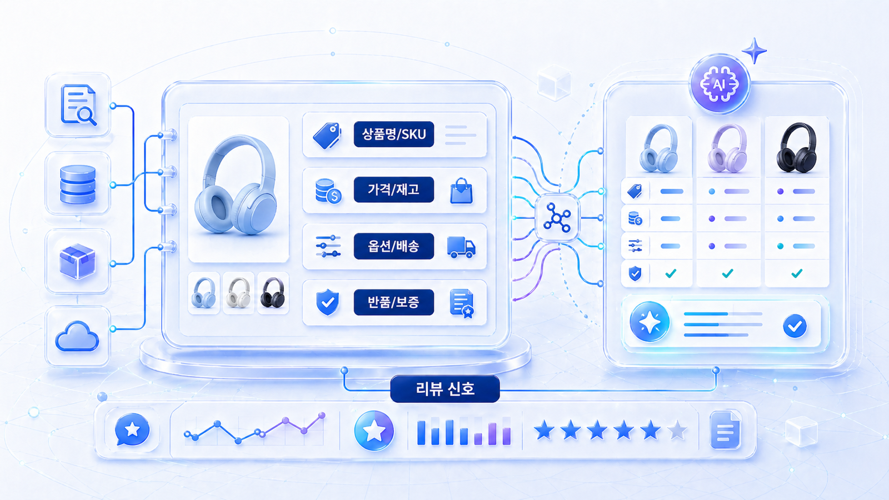

## AI 고객을 위한 상품 정보 구조화

AI 고객은 화면을 감상하는 사용자가 아니라 조건을 확인하는 대리인에 가깝습니다. 예쁜 배너와 감성 카피도 중요하지만, AI가 구매 후보를 고를 때는 상품명, 가격, 재고, 옵션, 배송, 반품, 리뷰, 정책 같은 확인 가능한 정보가 더 중요해집니다.

이 페이지의 기준은 단순합니다. `사람이 눈치껏 이해하는 정보`를 `AI가 비교하고 설명할 수 있는 정보`로 바꾸는 것입니다.

[TOC]

## AI 고객이 구매 전에 확인하는 7가지

| 구분 | AI 고객이 확인하는 질문 | 준비해야 할 정보 |
|---|---|---|
| 상품 정체성 | 이 상품이 정확히 무엇인가 | 상품명, 브랜드명, 카테고리, 모델명, SKU, GTIN |
| 가격 | 내 조건에서 실제 결제 가격은 얼마인가 | 정상가, 할인가, 쿠폰 조건, 배송비, 세금, 구독 가격 |
| 재고와 옵션 | 원하는 옵션을 지금 살 수 있는가 | 색상, 사이즈, 용량, 번들, 옵션별 재고, 품절 상태 |
| 배송 | 언제 어디까지 받을 수 있는가 | 배송 가능 지역, 예상 도착일, 무료배송 조건, 마감 시간 |
| 반품과 보증 | 구매 후 문제가 생기면 어떻게 되는가 | 반품 기간, 교환 조건, 환불 제외 조건, 보증 기간, AS 경로 |
| 비교 기준 | 왜 이 상품을 골라야 하는가 | 추천 대상, 사용 맥락, 경쟁 상품 대비 장단점, 핵심 스펙 |
| 신뢰 근거 | 이 설명을 믿을 수 있는가 | 리뷰, 평점, 외부 비교 글, 인증, 업데이트 이력 |

이 표의 빈칸은 단순한 콘텐츠 부족이 아닙니다. AI가 상품을 추천할 때 설명할 근거가 사라지는 지점입니다. 특히 `내일까지 받을 수 있는`, `반품이 쉬운`, `법인카드 결제가 가능한`, `아이에게 안전한`처럼 조건이 붙을수록 빈칸의 영향은 커집니다.

## 사람용 랜딩페이지와 AI 고객용 데이터의 차이

| 항목 | 사람용 랜딩페이지 | AI 고객용 상품 데이터 |
|---|---|---|
| 목표 | 관심과 클릭 유도 | 조건 충족 여부 판단 |
| 중심 요소 | 이미지, 카피, 배너, 후기 노출 | 구조화 데이터, 최신 가격, 재고, 정책 |
| 할인 표현 | 이벤트 이미지와 강조 문구 | 적용 조건, 기간, 제외 상품, 최종가 |
| 옵션 표현 | 드롭다운 또는 상세 이미지 | 옵션별 식별자, 가격 차이, 재고 상태 |
| 정책 표현 | 하단 고지나 별도 페이지 | 구매 결정에 필요한 조건별 요약과 원문 연결 |
| 리뷰 활용 | 사회적 증거 | 품질 평가, 장단점, 사용 맥락의 근거 |

AI 고객에게 친절한 상품 페이지는 사람에게도 대체로 더 친절합니다. 가격, 재고, 배송, 반품, 옵션이 명확한 페이지는 전환율에도 도움이 됩니다. 그래서 이 작업은 미래 대비만이 아니라 현재 커머스 운영 개선이기도 합니다.

## 상품 정보는 4곳에서 일치해야 한다

커머스 GEO에서 가장 위험한 것은 정보가 없는 상태보다 정보가 충돌하는 상태입니다.

| 정보 | 상세페이지 | Product schema | merchant feed | 정책/운영 문서 |
|---|---|---|---|---|
| 상품명 | 페이지 제목/상품명 영역 | `name` | `title` | 고객센터/주문 내역 표기 |
| 브랜드 | 로고/브랜드명/제조사 | `brand` | `brand` | 회사/판매자 정보 |
| 식별자 | SKU/모델명/옵션명 | `sku`/`gtin` | `id`/`item_group_id`/`gtin` | 재고/CS 시스템 |
| 가격 | 정상가/할인가/쿠폰 | `offers.price` | `price`/`sale_price` | 프로모션 정책 |
| 재고 | 구매 가능/품절/예약 | `availability` | `availability` | 물류/주문 시스템 |
| 배송 | 배송비/도착 예정/지역 | `shippingDetails` 후보 | `shipping` | 배송 정책 페이지 |
| 반품 | 반품 기간/예외/비용 | `hasMerchantReturnPolicy` 후보 | return 관련 설정 | 반품/환불 정책 |

이 표는 개발팀만 보는 문서가 아닙니다. MD, 콘텐츠, 운영, CS, 광고 담당자가 함께 봐야 합니다. 예를 들어 광고 배너에는 30% 할인이 보이지만 feed에는 정상가가 남아 있으면 AI는 최종 가격을 잘못 설명할 수 있습니다.

## AI가 읽기 좋은 상품 상세 구조

| 섹션 | 넣어야 할 내용 | GEO 기준 |
|---|---|---|
| 첫 문단 | 상품 정체성, 대표 용도, 대상 고객 | 한 문단만 읽어도 무엇인지 알 수 있음 |
| 핵심 스펙 표 | 크기, 무게, 성분, 호환성, 구성품 | 비교 질문에 바로 쓰일 수 있음 |
| 가격/옵션 표 | 옵션별 가격, 재고, 구성 차이 | 옵션 혼동을 줄임 |
| 배송/반품 요약 | 배송비, 도착 예정, 반품 기간, 예외 | 정책형 질문에 대응 |
| 추천/비추천 대상 | 누구에게 맞고 맞지 않는지 | 과장 추천을 줄임 |
| 리뷰 요약 | 자주 언급되는 장점/단점/사용 맥락 | 신뢰와 리스크를 함께 보여줌 |
| FAQ | 구매 전 반복 질문 | AI 질문셋과 연결 |
| 정책 원문 링크 | 배송/반품/보증/AS/결제 | 화면 인용과 확인 경로 제공 |

## 상품 상세를 Answer-first로 바꾸는 예

커머스 상세페이지도 첫 문단에서 상품의 정체성과 적합 조건을 말해야 합니다. 감성 카피만 있으면 AI가 조건형 질문에 답하기 어렵습니다.

| 약한 첫 화면 | AI가 읽기 좋은 첫 답변 |
|---|---|
| 최고의 프리미엄 헤드폰을 경험하세요 | 이 헤드폰은 20만 원대 노이즈 캔슬링 무선 헤드폰으로, 재택근무와 출퇴근용에 적합하며 최대 30시간 배터리와 2년 보증을 제공합니다. |
| 우리 아이를 위한 건강한 간식 | 이 제품은 저당 단백질 간식으로, 견과류 알레르기 여부와 권장 연령을 확인해야 하며, 1회 제공량당 단백질 8g을 제공합니다. |
| 기업을 위한 보안 솔루션 | 이 SaaS는 50~300명 규모 팀을 위한 보안 관리 도구이며, 월 구독/법인카드 결제/SSO 연동을 지원합니다. |

## 상품 정보 구조화 체크리스트

- 상품명, 브랜드명, 모델명, SKU가 페이지와 feed에서 일관적인가?
- 가격, 쿠폰, 배송비, 세금, 구독 가격이 최종 결제 기준으로 설명되는가?
- 색상, 사이즈, 용량, 패키지 구성별 재고가 구분되어 있는가?
- 배송 가능 지역, 예상 도착일, 주문 마감 시간이 텍스트로 설명되어 있는가?
- 반품, 교환, 환불, 보증 조건이 상품 단위로 연결되어 있는가?
- 리뷰 수, 평점, 작성일, 구매 인증, 사용 맥락이 확인되는가?
- 이 상품이 누구에게 적합하고 누구에게는 맞지 않는지 설명하는가?
- 이미지 안의 할인/제외/주의 조건이 텍스트로도 제공되는가?

## 흔한 실수

가장 흔한 실수는 중요한 조건을 이미지나 팝업 안에만 두는 것입니다. 사람은 배너를 보고 이해할 수 있지만 AI는 이미지 안의 할인 조건, 제외 상품, 최소 주문 금액을 안정적으로 해석하지 못할 수 있습니다.

또 다른 실수는 페이지마다 상품명이 다르게 쓰이는 것입니다. 페이지 제목은 A, schema는 B, feed는 C라면 AI는 같은 상품을 다르게 묶거나 잘못 비교할 수 있습니다. 커머스 GEO에서 정보 충돌은 정보 부족보다 더 위험할 때가 많습니다.

## 작성 예시

| 약한 표현 | AI가 읽기 좋은 표현 |
|---|---|
| 프리미엄 사운드와 감각적인 디자인 | 40mm 드라이버, ANC 지원, 250g 무게의 블루투스 헤드폰입니다. 출퇴근/재택근무용으로 적합합니다. |
| 오늘만 특가 | 2026년 5월 3일 23:59까지 20% 할인, 쿠폰 중복 불가, 제주/도서산간 배송비 별도 |
| 빠른 배송 | 서울/수도권 기준 평일 14시 이전 주문 시 다음 영업일 도착 가능 |
| 쉬운 반품 | 수령 후 7일 이내 미개봉 상품 반품 가능, 왕복 배송비 고객 부담, 개봉 후 단순 변심 반품 불가 |
| 좋은 리뷰가 많아요 | 최근 90일 구매 인증 리뷰 320건, 평균 4.7점, 장점은 착용감/배터리, 단점은 여름철 통기성 |

## 완료 기준

- 상품 상세페이지의 핵심 정보가 텍스트로 확인됩니다.
- 상품명/브랜드/SKU/가격/재고/배송/반품 값이 페이지, schema, feed, 정책 문서에서 충돌하지 않습니다.
- 조건형 AI 구매 질문에 답할 수 있는 표/FAQ/정책 링크가 있습니다.
- 추천 대상과 비추천 대상이 과장 없이 정리되어 있습니다.

## 더 읽기

상품 정보 구조화의 실전 체크리스트는 HaloX의 [AI 고객을 위한 상품 정보 구조화](https://haloxlabs.ai/ko/blog/ai-customer-product-info-structure)를 참고하세요. 콘텐츠 구조 자체를 먼저 다듬고 싶다면 [AI가 인용하는 Answer-first 콘텐츠](https://wikidocs.net/346347)와 함께 읽으면 좋습니다.

## 다음 흐름

다음 페이지에서는 이 상품 정보가 Product schema와 merchant feed에서 어떻게 표현되어야 하는지, 어디서 충돌이 생기는지 점검합니다.
