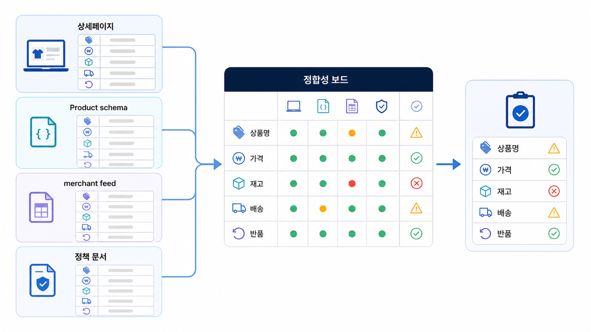

## 커머스 GEO 상품 정보 구조화


AI 고객은 실제 사람이 아니라, 사람의 구매 조건을 대신 읽는 답변 시스템입니다. 이 시스템은 멋진 문장보다 정리된 상품 속성과 일관된 데이터에 더 민감합니다.

상품 상세, 카테고리 설명, 리뷰 요약, schema, merchant feed가 서로 다른 말을 하면 AI는 안전한 후보를 고릅니다. 커머스 GEO의 첫 작업은 더 많은 문구가 아니라 같은 정보를 같은 의미로 맞추는 일입니다.

[TOC]

## 먼저 볼 기준

| 기준 | 읽는 법 |
|---|---|
| 상품 속성 | 구매자가 비교하는 기준을 필드로 분리한다 |
| 정합성 | 상세/리뷰/feed/schema의 값이 충돌하지 않게 맞춘다 |
| 설명 | 사용 상황과 제한 조건을 짧게 붙인다 |

## 정리 흐름

1. 대표 상품군을 하나 고른다
2. 구매 질문에서 반복되는 속성을 뽑는다
3. 상품 상세와 feed/schema의 값을 나란히 본다
4. 리뷰에서 반복되는 장점/불만을 상품 설명에 반영한다
5. AI 답변에서 누락되는 비교 기준을 재측정한다



*상품 정보 4곳 정합성 보드*

## 상품 데이터 예시

AcmeStore는 “아이와 함께 쓰는 공기청정기” 질문에서 필터 등급, 소음, 권장 평수, 교체 주기, 안전 인증을 핵심 속성으로 잡습니다. 이 다섯 값이 상세 페이지와 feed에서 다르면 AI 답변은 경쟁 상품을 더 안정적인 후보로 볼 수 있습니다.

## 커머스 리포트에서 확인할 것

커머스 GEO는 콘텐츠 문장보다 상품 데이터의 일관성이 먼저 흔들릴 때가 많습니다. Product schema, merchant feed, 상세페이지 HTML, 리뷰, 배송/반품/정책 정보가 서로 다르면 AI 구매 에이전트와 AI 검색 답변이 상품을 안정적으로 설명하기 어렵습니다.

| 점검 축 | 확인할 것 |
|---|---|
| 상품 정보 | 이름, 가격, 옵션, 재고, 배송/반품 정보가 일관적인가 |
| 구조화 데이터 | Product schema와 merchant feed가 상세페이지와 맞는가 |
| 질문셋 | 비교/추천/구매 전 질문에서 어떤 상품 속성이 반복되는가 |
| citation | 카테고리/상품/정책 URL 중 어떤 URL이 인용 후보가 되는가 |

## 보고서에 남길 문장

```text
커머스 GEO의 우선순위는 새 콘텐츠 발행보다 상품 데이터와 구조화 신호의 정합성입니다. 상세페이지, Product schema, merchant feed, 정책 문서를 맞춘 뒤 구매 전 질문셋에서 citation 변화를 확인합니다.
```

## 정리 양식

```text
상품군:
반복 구매 질문:
필수 속성:
충돌하는 데이터 위치:
보강할 설명:
재측정 질문:
```

## 다음 흐름

Product schema와 merchant feed 점검은 [Product schema와 merchant feed 점검법](https://wikidocs.net/346599)에서 봅니다.
