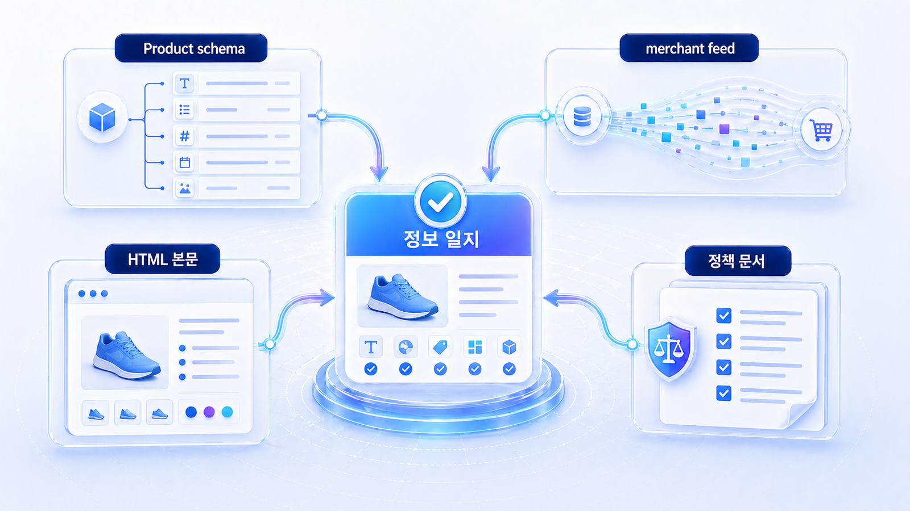
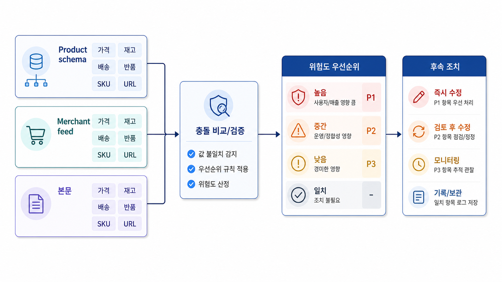

## Product schema와 merchant feed 점검



Product schema와 merchant feed는 상품 정보를 검색엔진과 AI가 읽는 두 개의 통로입니다. 하나는 페이지 안의 구조화 데이터이고, 하나는 상품 목록을 공급하는 데이터 파일에 가깝습니다.

둘 중 하나만 맞아도 충분하지 않습니다. 가격, 재고, 배송, 브랜드, 식별자, 리뷰 값이 서로 어긋나면 AI 답변은 해당 상품을 확신하기 어렵습니다.

[TOC]

## 먼저 볼 기준

| 기준 | 읽는 법 |
|---|---|
| 식별자 | SKU/GTIN/브랜드/상품명이 같은 상품을 가리키는지 본다 |
| 상태값 | 가격/재고/배송/반품 조건이 최신인지 본다 |
| 충돌 | 페이지와 feed 값이 다를 때 어느 쪽을 고칠지 정한다 |

## 점검 흐름

1. 대표 상품 5개를 고른다
2. 상세 페이지의 Product schema를 확인한다
3. merchant feed의 같은 상품 값을 대조한다
4. 가격/재고/옵션/리뷰 충돌을 우선순위로 나눈다
5. 수정 후 리치 결과와 AI 답변을 함께 확인한다



*schema와 feed 충돌 우선순위 맵*

## 충돌 예시

AcmeStore의 상세 페이지에는 “무료배송”이 있지만 feed에는 배송비가 남아 있다면, AI는 가격 비교 질문에서 해당 상품을 불리하게 설명할 수 있습니다. 이런 문제는 카피 수정이 아니라 데이터 정합성 문제로 다뤄야 합니다.

## 정리 양식

```text
대표 상품:
schema 값:
feed 값:
충돌 항목:
수정 담당:
검증 방법:
```

## 다음 흐름

커머스 리스크는 [커머스 GEO 리스크와 2주 점검 체크리스트](https://wikidocs.net/346600)에서 묶어 봅니다.
