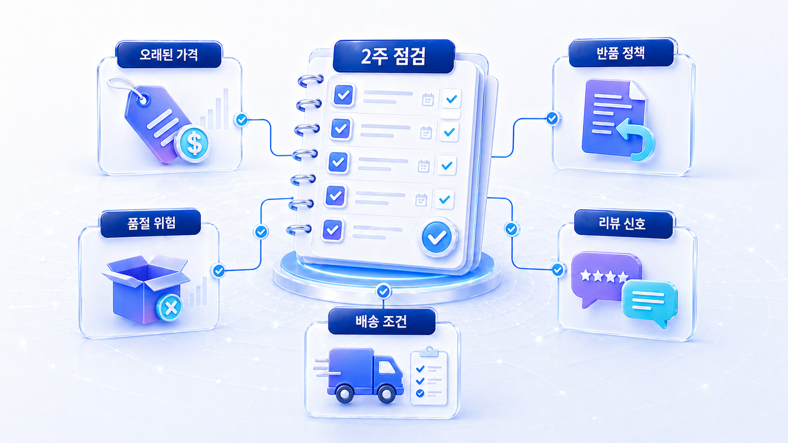
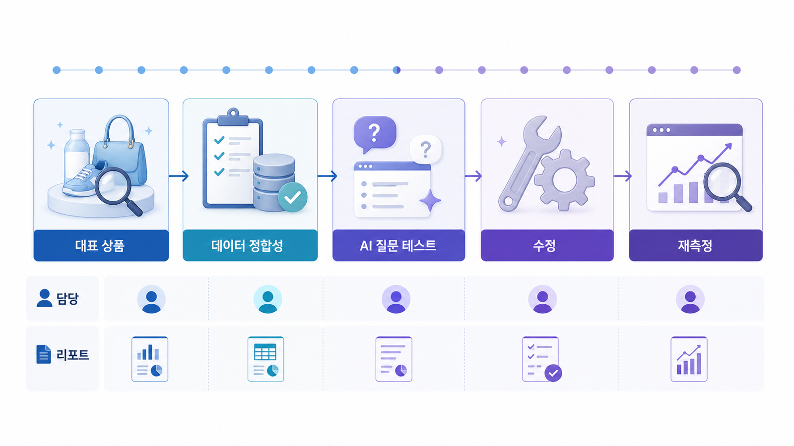

## 커머스 GEO 리스크 2주 점검



커머스 GEO 리스크는 AI가 상품을 모르는 문제가 아니라, 잘못 이해한 상태로 비교하는 문제에서 자주 생깁니다. 가격, 재고, 옵션, 리뷰, 배송 조건이 어긋나면 추천 문맥이 흔들립니다.

2주 점검은 모든 상품을 한 번에 고치는 프로젝트가 아닙니다. 매출이나 문의에 영향이 큰 대표 상품군을 고르고, AI 답변에서 실제로 쓰이는 비교 기준부터 정리합니다.

[TOC]

## 먼저 볼 기준

| 기준 | 읽는 법 |
|---|---|
| 영향도 | 매출/마진/검색 수요가 큰 상품군부터 본다 |
| 오해 가능성 | 가격/재고/옵션/배송처럼 틀리면 손해가 큰 값을 본다 |
| 반복성 | 한 번 수정으로 여러 상품에 적용되는 구조를 찾는다 |

## 2주 점검 흐름

1. 1~2일차에 대표 상품군과 질문셋을 정한다
2. 3~5일차에 AI 답변과 경쟁 상품을 기록한다
3. 6~8일차에 상세/schema/feed/review 충돌을 고친다
4. 9~11일차에 카테고리 설명과 FAQ를 보강한다
5. 12~14일차에 같은 질문으로 재측정하고 다음 상품군을 정한다



*커머스 GEO 2주 리스크 점검 스프린트*

## 2주 점검 예시

AcmeStore는 생활가전 카테고리에서 “원룸용 제습기 추천” 질문을 먼저 봅니다. AI 답변이 물통 용량과 소음 기준을 반복한다면, 상세 설명보다 해당 속성의 구조화와 리뷰 근거를 먼저 보강합니다.

## 정리 양식

```text
대표 상품군:
핵심 구매 질문:
가장 큰 오해 리스크:
수정할 데이터 위치:
2주 안에 끝낼 작업:
재측정 기준:
```

## 다음 흐름

로컬 업종의 SEO/GEO 차이는 [로컬 SEO와 로컬 GEO](https://wikidocs.net/346607)에서 이어집니다.
