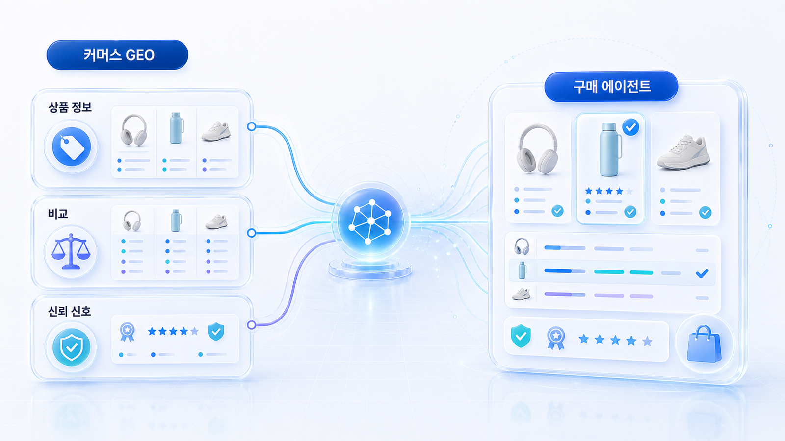
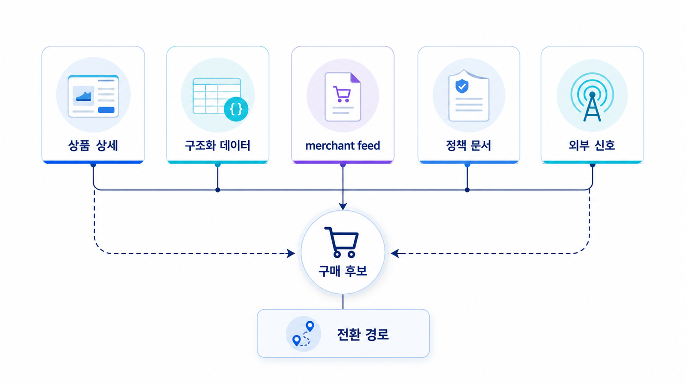

## 커머스 GEO와 AI 구매 에이전트

커머스 GEO는 AI 답변에 브랜드가 언급되는 문제에서 한 걸음 더 나아갑니다. AI가 상품을 발견하고, 조건을 비교하고, 구매 후보로 설명할 수 있는지까지 봐야 합니다.

기존 SEO가 검색 결과 페이지에서 사람의 클릭을 얻는 일이었다면, 커머스 GEO는 AI 고객이 상품명, 가격, 재고, 옵션, 배송, 반품, 리뷰, 결제 조건을 읽고 판단할 수 있게 만드는 일입니다. 그래서 이 장은 콘텐츠 구조뿐 아니라 상품 데이터, Product schema, merchant feed, 정책 문서, 리뷰 신호, 결제 흐름까지 함께 다룹니다.

[커머스와 플랫폼 AIO](https://wikidocs.net/346357)를 읽었다면 여기서는 더 구체적으로 들어갑니다. 산업별 관점이 아니라 실제 상품 페이지와 상품 데이터가 AI 구매 에이전트에게 어떻게 읽히는지를 봅니다.

[TOC]

## 이 장에서 답하는 질문

| 질문 | 이 장에서 다루는 기준 |
|---|---|
| 커머스 GEO는 일반 GEO와 무엇이 다른가 | 답변 인용에서 구매 후보와 거래 가능성으로 확장되는 흐름 |
| AI 고객은 상품 페이지에서 무엇을 확인하는가 | 상품 정체성, 가격, 재고, 옵션, 배송, 반품, 리뷰, 정책 |
| Product schema만 넣으면 충분한가 | schema, feed, HTML 본문, 정책 문서의 의미 일치 여부 |
| merchant feed는 GEO와 무슨 관련이 있는가 | 최신 가격/재고/URL/배송 조건을 플랫폼과 AI가 이해할 수 있게 하는 운영 데이터 |
| 무엇부터 점검해야 하는가 | 매출 상위 상품군, 구매 의도 질문, 데이터 충돌, 정책 검색성 |

## 커머스 GEO의 핵심 관점

커머스에서 AI는 단순히 “이 브랜드가 좋은가”를 묻지 않습니다. 사용자의 조건에 맞는 후보를 고르려 합니다. 예를 들어 `20만 원 이하`, `이번 주말 전 배송`, `반품 쉬움`, `입문자용`, `법인카드 결제 가능` 같은 조건이 붙으면 AI는 상품 설명보다 거래 조건을 먼저 확인해야 합니다.

그래서 커머스 GEO의 실패는 노출 부족만이 아닙니다. AI가 오래된 가격을 말하거나, 품절 상품을 추천하거나, 반품 불가 조건을 놓치는 것도 실패입니다. 좋은 커머스 GEO는 AI를 속이는 일이 아니라 AI가 오해하지 않도록 상품 정보를 정직하고 일관되게 제공하는 일입니다.

## 커머스 GEO를 리포트로 읽는 기준

커머스 GEO는 mention/source/citation만으로 끝나지 않습니다. AI가 실제 구매 조건을 정확히 이해하는지까지 봐야 합니다.

| 리포트 항목 | 확인 질문 | 위험 신호 |
|---|---|---|
| product mention | 상품/브랜드가 조건형 질문에 등장하는가? | 브랜드는 나오지만 상품명이 틀림 |
| product source | 어떤 페이지/피드/리뷰를 근거로 삼는가? | 오래된 리뷰나 외부 복제본 의존 |
| price/availability accuracy | 가격/재고/옵션이 맞는가? | 품절/가격 오류 추천 |
| policy accuracy | 배송/반품/보증 조건이 정확한가? | 고객 피해 가능성 |
| conversion path | 사용자가 실제 구매 가능한 URL로 가는가? | 단종 URL/캠페인 URL로 연결 |

AcmeGEO가 커머스 브랜드라면 `우리 상품이 추천됐는가`보다 `조건형 구매 질문에서 정확한 상품/가격/정책/source로 설명됐는가`를 봐야 합니다.

## 커머스 GEO가 보는 5개 층

커머스에서는 한 페이지의 본문만 잘 써도 충분하지 않습니다. 상품을 둘러싼 여러 데이터 층이 같은 말을 해야 합니다.

| 층 | 대표 자산 | AI가 확인하려는 것 | 실패 예시 |
|---|---|---|---|
| 상품 상세페이지 | 제목/본문/이미지/표/FAQ | 이 상품이 무엇이고 누구에게 맞는가 | 이미지 안에만 할인 조건이 있음 |
| 구조화 데이터 | Product/Offer/Review/AggregateRating/ReturnPolicy/ShippingDetails | 상품 정보가 기계가 읽기 좋은 형식으로 정리됐는가 | schema 가격이 본문 가격과 다름 |
| merchant feed | id/title/price/availability/link/shipping/return | 플랫폼에 전달되는 최신 운영 데이터가 맞는가 | feed는 품절인데 페이지는 구매 가능으로 보임 |
| 정책 문서 | 배송/반품/환불/보증/결제 안내 | 구매 조건과 예외가 설명되는가 | 반품 제외 조건이 하단 이미지에만 있음 |
| 외부 신호 | 리뷰/비교 글/디렉터리/커뮤니티/PR | 이 상품을 믿고 비교할 근거가 있는가 | 리뷰가 오래됐거나 다른 옵션 리뷰가 섞임 |

이 다섯 층이 맞지 않으면 AI는 상품을 추천하기보다 더 안전하게 설명할 수 있는 경쟁 상품을 고를 수 있습니다.

<small>커머스 GEO는 상품 상세페이지, 구조화 데이터, 피드, 정책 문서, 외부 신호가 함께 맞아야 구매 후보와 전환 경로가 안정적으로 연결된다.</small>

## 읽는 순서

1. [11-01](https://wikidocs.net/346597)에서는 SEO/SERP, AIO, GPT/Claude/Perplexity 답변 시장이 커머스에서 어떻게 갈라지는지 봅니다.
2. [11-02](https://wikidocs.net/346598)에서는 AI 고객이 상품 정보를 어떤 순서로 확인하는지 정리합니다.
3. [11-03](https://wikidocs.net/346599)에서는 Product schema와 merchant feed가 무엇을 보완하고 어디서 충돌하는지 봅니다.
4. [11-04](https://wikidocs.net/346600)에서는 리스크와 2주 점검 체크리스트로 실제 실행 순서를 만듭니다.

## 커머스 GEO 우선순위

모든 상품을 동시에 고치려고 하면 범위가 너무 커집니다. 먼저 AI 답변에 들어갈 가능성이 높거나 오류가 났을 때 비용이 큰 상품군부터 봅니다.

| 우선순위 | 상품군 | 이유 | 먼저 볼 것 |
|---|---|---|---|
| 1 | 매출 상위 상품 | 오류가 매출에 바로 영향을 줌 | 가격/재고/배송/schema/feed |
| 2 | 광고 집행 상품 | 외부 노출과 구매 의도가 이미 있음 | 랜딩 URL/canonical/가격 충돌 |
| 3 | 비교가 잦은 상품 | AI 추천/비교 답변에 들어갈 가능성이 높음 | 비교표/리뷰/경쟁 상품 기준 |
| 4 | 반품/문의 많은 상품 | 정책 오해가 분쟁으로 이어짐 | 반품/보증/FAQ/CS 문서 |
| 5 | 신제품/캠페인 상품 | 정보 불일치가 자주 생김 | 출시일/가격/옵션/종료 URL |

## 이 장의 최종 산출물

11장을 읽고 나면 아래 네 가지가 남아야 합니다.

| 산출물 | 내용 | 쓰임 |
|---|---|---|
| AI 구매 질문셋 | 조건형/비교형/정책형/리스크형 질문 | 상품이 AI 답변에서 어떻게 설명되는지 측정 |
| 상품 정보 정합성 표 | 페이지/schema/feed/정책 문서의 값 비교 | 가격/재고/배송/반품 충돌 확인 |
| Product schema/feed 점검표 | Product/Offer/Review/Shipping/Return/merchant feed 항목 | 개발/MD/운영 요청으로 전환 |
| 2주 실행 리포트 | 수정 항목/담당/완료 기준/재측정 질문 | 10장의 GEO 실행 리포트로 연결 |

## HaloX 자료로 더 보기

커머스 GEO의 배경은 HaloX의 [AI 구매 에이전트 시대, 커머스는 무엇을 준비해야 할까](https://haloxlabs.ai/ko/blog/agentic-commerce-geo)와 [AI 고객을 위한 상품 정보 구조화](https://haloxlabs.ai/ko/blog/ai-customer-product-info-structure)를 함께 보면 좋습니다. 개념 정의가 더 필요하다면 [GEO 용어집](https://haloxlabs.ai/ko/glossary)과 [스키마 마크업](https://haloxlabs.ai/ko/glossary/schema-markup)도 참고할 수 있습니다.

구현 기준은 Google의 [Product structured data](https://developers.google.com/search/docs/appearance/structured-data/product), [Merchant Center 제품 데이터 사양](https://support.google.com/merchants/answer/7052112), schema.org의 [Product](https://schema.org/Product), [Offer](https://schema.org/Offer), [MerchantReturnPolicy](https://schema.org/MerchantReturnPolicy)를 함께 확인합니다. 이 장에서는 공식 문서를 그대로 옮기기보다 실무자가 어떤 값을 서로 맞춰야 하는지에 집중합니다.

## 다음 흐름

이 장은 [06. 테크니컬 GEO와 사이트 구조](https://wikidocs.net/346334)의 schema/크롤링 기준을 커머스 상품 데이터로 확장합니다. 이후 오프라인 매장, 병원, 지점처럼 위치/리뷰/방문 전환이 중요한 업종은 [12. 병원/오프라인 매장 SEO/GEO 전략](https://wikidocs.net/346606)에서 이어 봅니다.
