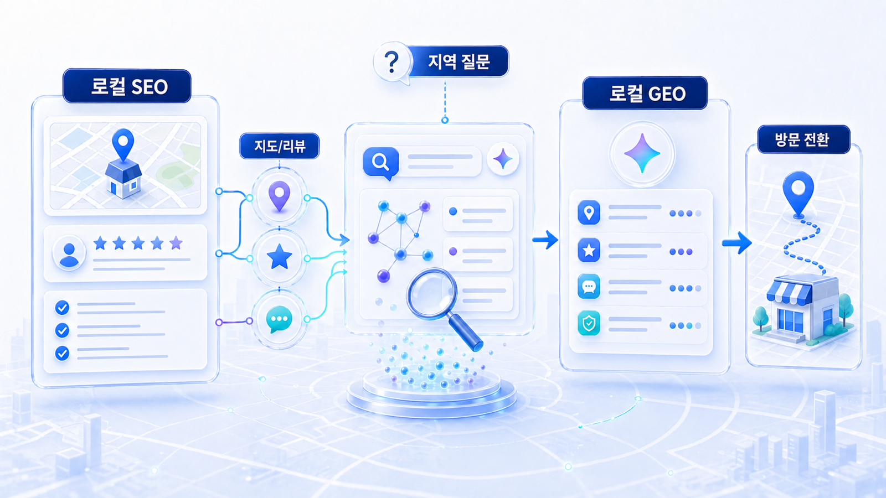
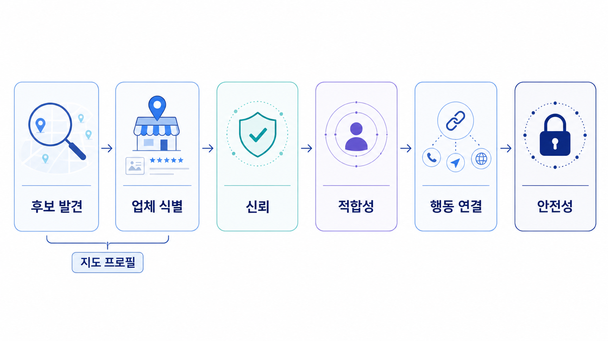

## 로컬 SEO와 로컬 GEO는 무엇이 다른가

로컬 SEO는 검색 결과와 지도에서 특정 지역의 업체가 잘 발견되도록 만드는 일입니다. 로컬 GEO는 ChatGPT, Perplexity, Gemini, 네이버 AI 브리핑, Google AI Overviews 같은 AI 답변에서 지역 업체가 어떤 기준으로 언급되고 추천되는지 보는 일입니다.

두 영역은 분리되지 않습니다. 로컬 GEO가 작동하려면 먼저 로컬 SEO 신호가 정리되어 있어야 합니다. 이름/주소/전화번호, 지도 등록, 카테고리, 영업시간, 리뷰, 사진, 지점 페이지, 외부 권위가 흩어져 있으면 AI도 안정적인 추천 근거를 만들기 어렵습니다.

[TOC]

## 질문이 다르다

일반 SEO 질문은 `피부과 보톡스 가격`, `도수치료 효과`, `영어학원 추천`처럼 정보 탐색으로 시작합니다. 로컬 검색은 여기에 지역과 행동 의도가 붙습니다.

| 질문 유형 | 예시 | 봐야 할 신호 |
|---|---|---|
| 지역+서비스 | 강남 피부과 보톡스 추천 | 지점 페이지, 플레이스, 리뷰 |
| 근처+상황 | 내 근처 야간 진료 치과 | 영업시간, 진료시간, 지도 정보 |
| 비교 | 분당 도수치료 병원 어디가 좋아? | 후기, 전문성, 외부 권위 |
| 방문 전환 | 홍대 왁싱샵 예약 전 확인할 것 | 예약 방법, 가격 범위, 주차/접근성 |
| 신뢰 확인 | 이 병원 후기 믿을 만한가? | 리뷰 분포, 외부 후기, 의료진/전문가 프로필 |

## 로컬 SEO가 먼저인 이유

AI 답변은 새로운 검색면이지만, 로컬 업종에서는 후보군 자체가 지도/리뷰/로컬 프로필에서 만들어지는 경우가 많습니다. 홈페이지 본문에 좋은 설명이 있어도, 네이버 플레이스나 Google Business Profile의 카테고리와 영업시간이 틀리면 실제 추천 문맥에서 빠질 수 있습니다.

따라서 순서는 `지도와 사업자 정보 정리 → 지점별 페이지 정리 → 리뷰와 외부 권위 보강 → 지역 질문셋 구성 → AI 답변 모니터링`이 자연스럽습니다.

## 업종별로 우선순위가 달라진다

로컬 SEO/GEO는 모든 오프라인 업종에 같은 순서로 적용되지 않습니다. 사용자가 방문 전에 걱정하는 지점이 다르기 때문입니다. 병원은 안전성과 전문성, 학원은 운영자와 커리큘럼, 매장은 위치와 재고/가격, 식당은 메뉴/대기/주차, 전문 서비스는 자격과 상담 가능 여부가 먼저 보입니다.

| 업종 | 먼저 정리할 신호 | AI 답변에서 자주 생기는 질문 |
|---|---|---|
| 병원/클리닉 | 진료과목, 의료진, 위치, 예약, 후기 표현 리스크 | `이 지역에서 어떤 기준으로 병원을 고르면 좋을까?` |
| 학원/교육 | 과정, 대상, 운영자, 시간표, 상담/레벨 테스트 | `초등/중등/성인에게 맞는 학원은 어디일까?` |
| 오프라인 매장 | 위치, 영업시간, 재고/가격 범위, 주차, 사진 | `지금 방문하기 좋은 매장은 어디일까?` |
| 프랜차이즈/지점형 | 지점별 NAP, 지점 URL, 리뷰 분리, 지역 콘텐츠 | `가까운 지점과 특정 서비스 가능 지점은 어떻게 다를까?` |
| 전문 서비스 | 자격, 상담 범위, 사례 유형, 비용 범위, 외부 권위 | `믿을 만한 전문가를 고를 때 무엇을 봐야 할까?` |

이 표는 우선순위를 정하기 위한 출발점입니다. 같은 `강남 피부과`라도 사용자가 가격을 묻는지, 야간 진료를 묻는지, 의료진 전문성을 묻는지에 따라 필요한 신호가 달라집니다.

## 로컬 SEO와 로컬 GEO 비교표

| 구분 | 로컬 SEO | 로컬 GEO |
|---|---|---|
| 주요 화면 | 검색 결과, 지도, 로컬 팩, 플레이스 | AI 답변, AI 브리핑, 추천 문장 |
| 핵심 데이터 | NAP, 카테고리, 영업시간, 리뷰, 사진 | 추천 이유, 답변 근거, 비교 문맥, 반복 언급 |
| 대표 질문 | 지역명+서비스명 검색 | 이 지역에서 어디가 좋은지 묻는 질문 |
| 우선 작업 | 지도/플레이스 정확도와 리뷰 관리 | 질문셋, 답변 근거, 화면 인용 추적 |
| 위험 | 잘못된 정보, 중복 지점, 리뷰 방치 | 부정확한 추천, 경쟁사 중심 답변, 규제 표현 |

## 로컬 GEO에서 답변이 만들어지는 흐름

AI가 지역 추천 질문에 답할 때는 보통 한 출처만 보지 않습니다. 플랫폼마다 세부 방식은 다르지만, 실무에서는 아래 흐름으로 이해하면 점검이 쉬워집니다.

| 흐름 | AI가 확인하려는 것 | 점검 자산 |
|---|---|---|
| 후보 발견 | 이 지역/서비스에 해당하는 업체가 누구인가 | 지도 프로필, 카테고리, 지점 페이지 |
| 업체 식별 | 같은 업체/지점이 맞는가 | NAP, 브랜드명, 지점명, URL |
| 신뢰 판단 | 후기가 실제적이고 최근성이 있는가 | 리뷰, 영수증 리뷰, 외부 후기, 답변 품질 |
| 적합성 판단 | 사용자의 상황에 맞는가 | 서비스 설명, 가격 범위, 시간, 주차, 전문성 |
| 행동 연결 | 예약/전화/방문이 가능한가 | 예약 URL, 전화번호, 영업시간, 길찾기 |
| 안전성 판단 | 과장/규제/개인정보 리스크가 없는가 | 의료광고 표현, 후기 답변, 전후 사진 설명 |

이 흐름에서 앞 단계가 흔들리면 뒤 단계의 콘텐츠가 좋아도 추천 근거가 약해집니다.

<small>로컬 SEO는 지도와 검색의 정확도를 먼저 만들고, 로컬 GEO는 그 신호가 AI 답변의 추천 이유와 행동 정보로 이어지는지 본다.</small>

## 실무 판단 기준

로컬 업종은 콘텐츠 발행량보다 기본 신호의 정합성이 먼저입니다. 특히 여러 지점이 있는 병원, 학원, 프랜차이즈, 매장형 서비스는 지점별 정보가 섞이지 않아야 합니다.

다음 질문에 답하지 못하면 GEO보다 로컬 SEO부터 정리해야 합니다.

- 공식 상호명, 주소, 전화번호가 채널마다 같은가?
- 네이버 플레이스, Google Business Profile, 카카오맵, Apple Maps의 카테고리가 맞는가?
- 대표 서비스와 지점별 서비스가 구분되어 있는가?
- 리뷰가 특정 플랫폼에만 몰려 있거나 오래 멈춰 있지 않은가?
- 예약/전화/길찾기/주차/영업시간 정보가 최신인가?

## 로컬 SEO부터 해야 하는 경우와 GEO 측정으로 넘어갈 수 있는 경우

| 상태 | 판단 | 다음 행동 |
|---|---|---|
| NAP가 채널마다 다름 | 로컬 SEO 선행 | 12-02 NAP 표준표부터 작성 |
| 지도 카테고리/영업시간이 틀림 | 로컬 SEO 선행 | 12-03 지도 프로필 수정 |
| 리뷰가 오래됐고 답변 기준이 없음 | 로컬 신뢰 신호 선행 | 12-04 리뷰 운영 프로세스 정리 |
| 지점 페이지와 예약 정보가 명확함 | GEO 측정 가능 | 12-05 지역 질문셋으로 기준선 측정 |
| 병원/전문 서비스 표현이 공격적임 | 리스크 점검 선행 | 12-06 위험 표현 정리 |

## 로컬 SEO의 기본 이론: 관련성/거리/인지도

로컬 SEO는 보통 `관련성`, `거리`, `인지도`라는 세 축으로 이해하면 쉽습니다. 검색엔진과 지도 서비스는 사용자의 검색어와 업체 정보가 맞는지, 사용자가 찾는 지역과 실제 위치가 맞는지, 그리고 리뷰/외부 언급/링크/프로필 같은 신뢰 신호가 충분한지 함께 봅니다.

| 축 | 실무 의미 | 병원/매장 예시 | GEO에서의 확장 |
|---|---|---|---|
| 관련성 | 이 업체가 해당 서비스를 제공하는가 | 피부과/치과/도수치료/왁싱/수선 등 카테고리와 서비스 설명 | AI가 추천 이유를 만들 때 서비스 적합성으로 사용 |
| 거리 | 사용자가 찾는 지역과 실제 위치가 맞는가 | 강남역 3번 출구, 판교역 근처, 주차 가능 지점 | `내 근처`, `회사 근처`, `주차 쉬운 곳` 질문에 사용 |
| 인지도 | 실제 평판과 외부 신호가 충분한가 | 리뷰 수/평점/최근성, 지역 매체, 협회, 전문 프로필 | AI가 후보를 비교할 때 신뢰 근거로 사용 |

이 세 축을 모르면 로컬 SEO를 단순히 `지역 키워드 많이 넣기`로 오해하기 쉽습니다. 하지만 실제 작업은 지역명 반복보다 데이터 정합성, 카테고리 정확도, 리뷰/외부 신호, 지점별 페이지 품질을 맞추는 일에 가깝습니다.

## 검색 화면별로 필요한 SEO 자산

로컬 업종은 검색 화면이 하나가 아닙니다. 같은 사용자가 네이버 통합검색, 네이버 플레이스, Google 검색, Google 지도, 카카오맵, AI 답변을 오가며 후보를 좁힙니다.

| 화면 | 사용자의 행동 | 필요한 자산 | 흔한 실패 |
|---|---|---|---|
| 일반 검색결과 | 지역+서비스를 검색한다 | 지역 랜딩페이지, 서비스 설명, title/meta description | 블로그 글만 있고 공식 지점 페이지가 없음 |
| 지도/플레이스 | 후보 위치와 후기를 본다 | NAP, 카테고리, 영업시간, 사진, 리뷰 | 영업시간/전화번호/카테고리가 채널마다 다름 |
| 로컬 팩 | 검색결과 상단 지도 후보를 비교한다 | 지도 최적화, 리뷰 최신성, 거리 정보 | 후보에는 보이지만 선택 이유가 약함 |
| AI 답변 | 조건에 맞는 곳을 추천받는다 | 질문셋, 답변 근거, 외부 권위, 전환 정보 | AI가 일반론만 답하고 특정 업체를 설명하지 못함 |

따라서 12장의 작업은 `웹페이지 SEO`와 `지도 SEO`와 `AI 답변 모니터링`을 한 줄로 잇는 일입니다.

## SEO와 GEO를 같이 읽는 운영 지표

| 지표 | SEO에서 보는 것 | GEO에서 보는 것 | 해석 |
|---|---|---|---|
| 지역 키워드 노출 | 검색결과/지도에서 보이는가 | AI 답변 후보군에 들어가는가 | 발견 가능성 |
| 클릭/전화/길찾기 | 사용자가 행동했는가 | 답변 뒤 행동 정보가 충분한가 | 전환 가능성 |
| 리뷰 수/최근성 | 선택 신뢰가 있는가 | 추천 근거로 쓰일 만한가 | 평판 신호 |
| 브랜드 언급률 | 검색량/브랜드 검색이 있는가 | AI 답변에 반복 언급되는가 | 인지도 신호 |
| source/citation | 검색엔진이 페이지를 발견하는가 | AI가 어떤 근거를 참조하는가 | 근거 품질 |

로컬 GEO 측정 결과를 볼 때도 이 지표를 함께 봐야 합니다. AI 답변에 안 나온다고 바로 콘텐츠만 늘릴 것이 아니라, 지도 후보군에 들어가는지, 리뷰 신호가 충분한지, 지점 페이지가 색인되는지부터 확인해야 합니다.

## 참고 링크

Google의 [비즈니스 프로필 소개](https://support.google.com/business/answer/7091)와 [LocalBusiness structured data](https://developers.google.com/search/docs/appearance/structured-data/local-business)는 로컬 정보가 검색에서 어떻게 구조화되는지 볼 때 유용합니다. 한국 시장에서는 [네이버 스마트플레이스](https://smartplace.naver.com/)를 함께 확인해야 합니다.

GEO 측정 관점은 [02장 AI 검색 모니터링](https://wikidocs.net/346342)에서 먼저 잡고, 로컬 업종에서는 이 장의 기준으로 지도/리뷰/지점 정보를 별도 축으로 추가합니다. HaloX의 [GEO 용어 정리](https://haloxlabs.ai/ko/glossary)는 답변 근거, 화면 인용, 브랜드 언급률 같은 지표를 다시 확인할 때 참고합니다.

## 다음 흐름

다음 페이지에서는 로컬 SEO의 가장 기본이 되는 [NAP, 즉 이름/주소/전화번호 일관성](https://wikidocs.net/346608)을 점검합니다.
